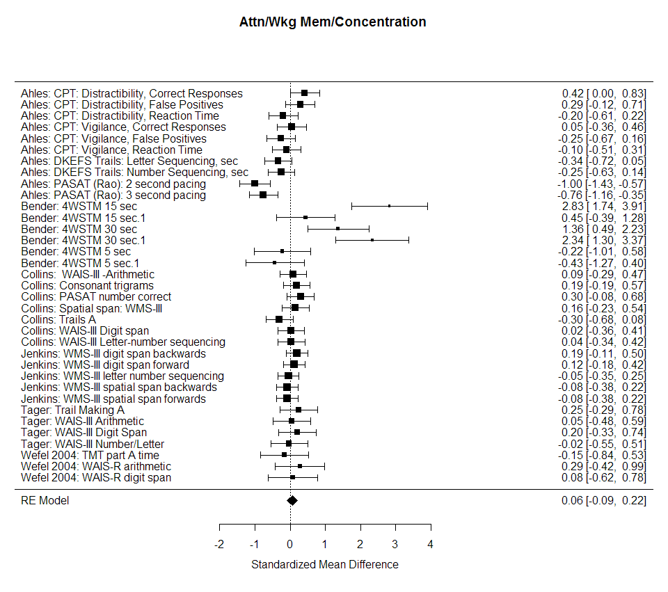
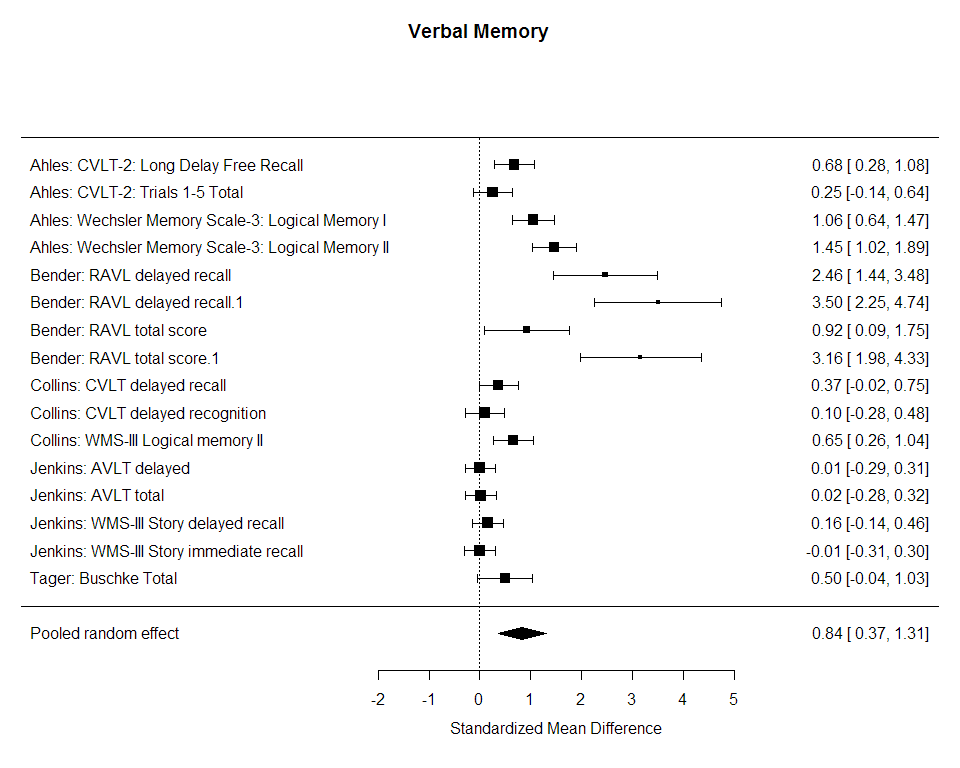
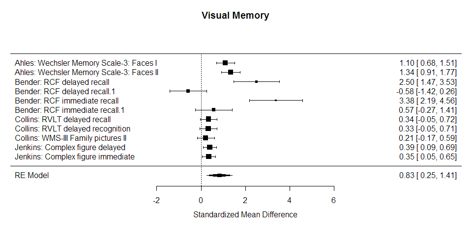
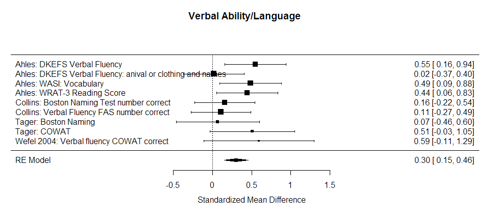
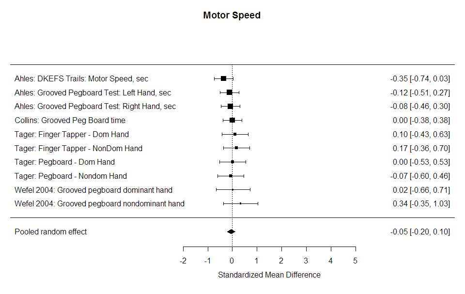
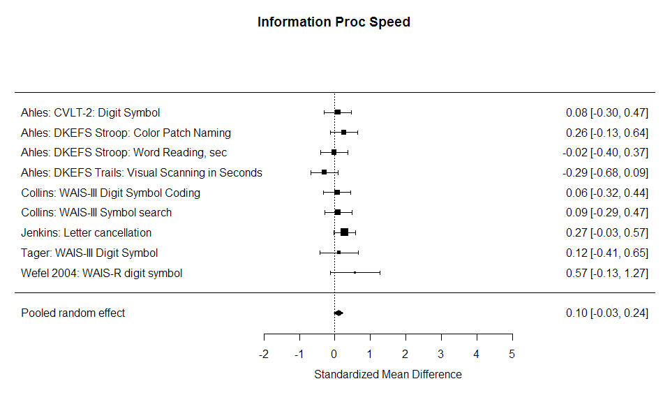
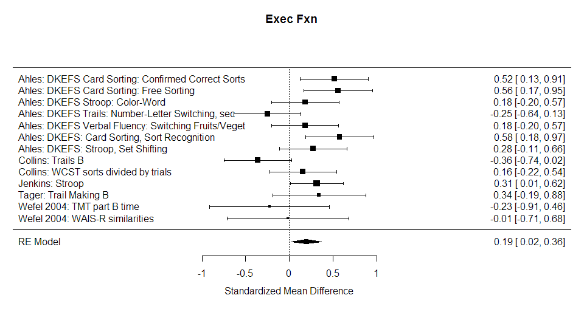
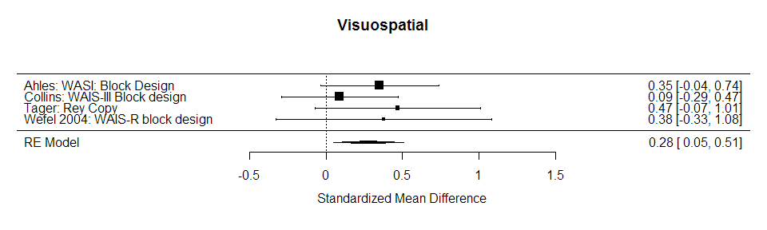

# Cognitive Impairment
[Benjamin Chan](http://careers.stackoverflow.com/benjaminchan)  
`r Sys.time()`  

`source` the R script, `make.R` to generate the project document.

```
> source("make.R")
```

# Project background

* [GitHub](https://github.com/benjamin-chan/AEAfterBreastCaACT) repository
* [Wiki](https://github.com/benjamin-chan/AEAfterBreastCaACT/wiki)
* [Issues](https://github.com/benjamin-chan/AEAfterBreastCaACT/issues)

This document is for the **Cognitive Impairment** topic.

For other topics, see links from the project [repository](https://github.com/benjamin-chan/AEAfterBreastCaACT).


# Scripts

Sequence of scripts:

<!--html_preserve--><div id="htmlwidget-9182" style="width:192px;height:480px;" class="grViz"></div>
<script type="application/json" data-for="htmlwidget-9182">{ "x": {
 "diagram": "digraph {\n\ngraph [layout=dot]\n\nnode [fontname=\"Lato\"]\n\n  \"a\" [label = \"prologue.Rmd\", style = \"filled\", fontcolor = \"white\", color = \"#014386ff\", shape = \"oval\"] \n  \"b\" [label = \"replicateOno.Rmd\", style = \"filled\", fontcolor = \"white\", color = \"#014386ff\", shape = \"oval\"] \n  \"c\" [label = \"readAhles.Rmd\", style = \"filled\", fontcolor = \"white\", color = \"#014386ff\", shape = \"oval\"] \n  \"d\" [label = \"readTager.Rmd\", style = \"filled\", fontcolor = \"white\", color = \"#014386ff\", shape = \"oval\"] \n  \"e\" [label = \"reshapeOno.Rmd\", style = \"filled\", fontcolor = \"white\", color = \"#014386ff\", shape = \"oval\"] \n  \"f\" [label = \"combineData.Rmd\", style = \"filled\", fontcolor = \"white\", color = \"#014386ff\", shape = \"oval\"] \n  \"g\" [label = \"runMetaAnalysis.Rmd\", style = \"filled\", fontcolor = \"white\", color = \"#014386ff\", shape = \"oval\"] \n  \"h\" [label = \"epilogue.Rmd\", style = \"filled\", fontcolor = \"white\", color = \"#014386ff\", shape = \"oval\"] \n  \"a\"->\"b\" \n  \"b\"->\"c\" \n  \"c\"->\"d\" \n  \"d\"->\"e\" \n  \"e\"->\"f\" \n  \"f\"->\"g\" \n  \"g\"->\"h\" \n}",
"config": {
 "engine": "dot",
"options": null 
} 
},"evals": [  ] }</script><!--/html_preserve-->


# Prologue

1. Set path of input data sources
1. Load [`devtools`](https://github.com/hadley/devtools)
1. Source the [`loadPkg`](https://gist.github.com/benjamin-chan/3b59313e8347fffea425) function
1. Load packages
1. Source the [`makeMetadata`](https://gist.github.com/benjamin-chan/091209ab4eee1f171540) function
1. Start the job timer


```
## Sourcing https://gist.githubusercontent.com/benjamin-chan/3b59313e8347fffea425/raw/84a146f3cde6330b901521710d513fa9d0b96951/loadPkg.R
## SHA-1 hash of file is 7bdcd4569a86aa9fff8ced241327992c550a16ce
## Sourcing https://gist.githubusercontent.com/benjamin-chan/091209ab4eee1f171540/raw/156a5e29111d0da6ec5693f5a881628e10fb9613/makeMetadata.R
## SHA-1 hash of file is 8b07ca14d3606ec83f76e636e7f9088e73a003b0
```

# Replicate Ono

Replicate data from 
[Ono, Miyuki, et al.](http://www.ncbi.nlm.nih.gov/pmc/articles/PMC4354286/)
"A Meta-Analysis of Cognitive Impairment and Decline Associated with Adjuvant Chemotherapy in Women with Breast Cancer."
*Front Oncol.* 
2015; 5: 59. 

Data file was requested and received from the co-author, [James Ogilvie](https://www.griffith.edu.au/health/school-applied-psychology/rhd-students/james-ogilvie), in October 2015.

The `DOMAINFORMETAkvd` field (column AG) was coded by Kathleen Van Dyk <KVanDyk@mednet.ucla.edu>.

```
From: Van Dyk, Kathleen [KVanDyk@mednet.ucla.edu]
Sent: Tuesday, November 03, 2015 5:08 PM
To: Ayse Tezcan
Cc: Benjamin Chan
Subject: RE: Cognitive impairment draft paper

Hi,
 
Attached is the Ono spreadsheet with a new column with my suggestions for
domains and domains for each Ahles test is in sheet 2.  I've highlighted tests
that we may want to exclude if we want to consistently keep one or two
measures per test.  Ben --- does it matter statistically if there is more than
one measure from the same test (for example delayed recall and delayed
recognition) in the same domain?  In almost every case we have total and delay
for memory tests but if we add in more measures (Trial 6, Supraspan,
Recognition) does this confound analyses because these are likely highly
correlated measures within the same test?  Would all of the studies need to
use the same measures in each test (i.e., every study uses Total and Delay)?
I might not be asking this clearly --- let me know what you think.
```

Read data file.


```r
f <- sprintf("%s/%s", pathIn, "Requested Chemo Data domains kvd 11.19.15 2.xlsx")
echoFile(f)
```

```
## File: StudyDocuments/Requested Chemo Data domains kvd 11.19.15 2.xlsx
## Modification date: 2015-11-19 20:36:53
## File size: 178.9 KB
```

```r
D0 <- read.xlsx(f, sheet=1, check.names=TRUE)
D0 <- data.table(D0)
```

Show a map of the column names and locations.


```r
colNames <- data.frame(colNum = 1:ncol(D0),
                       colCell = c(LETTERS,
                                   sprintf("%s%s", LETTERS[1], LETTERS),
                                   sprintf("%s%s", LETTERS[2], LETTERS),
                                   sprintf("%s%s", LETTERS[3], LETTERS))[1:ncol(D0)],
                       varName = names(D0))
colNames
```

```
##    colNum colCell                  varName
## 1       1       A               First.Auth
## 2       2       B                Study.Ref
## 3       3       C                 Pub.Year
## 4       4       D                 Cog.Test
## 5       5       E    DOMAIN.FOR.META..kvd.
## 6       6       F                  Journal
## 7       7       G                 Pre.Meta
## 8       8       H                   Design
## 9       9       I                 Comp.Grp
## 10     10       J            Healthy_GROUP
## 11     11       K                   Tx.Grp
## 12     12       L   Pre.Post.Time.Interval
## 13     13       M                  Time.SD
## 14     14       N                     Tx.N
## 15     15       O                    Ctl.N
## 16     16       P                  Total.N
## 17     17       Q                   Tx.Age
## 18     18       R                Tx.Age.SD
## 19     19       S                  Ctl.Age
## 20     20       T               Ctl.Age.SD
## 21     21       U                    Tx.IQ
## 22     22       V                 Tx.IQ.SD
## 23     23       W                   Ctl.IQ
## 24     24       X                Ctl.IQ.SD
## 25     25       Y                  IQ.Note
## 26     26       Z                   Tx.EDU
## 27     27      AA                Tx.EDU.SD
## 28     28      AB                  Ctl.EDU
## 29     29      AC               Ctl.EDU.SD
## 30     30      AD                 EDU.Note
## 31     31      AE             Tx.Chem.Time
## 32     32      AF          Tx.Chem.Time.SD
## 33     33      AG Cognitive.Domain.Primary
## 34     34      AH                Score.Typ
## 35     35      AI                     Tx.M
## 36     36      AJ                    Tx.SD
## 37     37      AK                    Ctl.M
## 38     38      AL                   Ctl.SD
## 39     39      AM             Direct.Notes
## 40     40      AN                    X1.X2
## 41     41      AO                   Tx.N.1
## 42     42      AP                  Ctl.N.1
## 43     43      AQ                  Tx.SD.2
## 44     44      AR                 Ctl.SD.2
## 45     45      AS                  Spooled
## 46     46      AT                Cohen.s.d
## 47     47      AU                 Hedges.g
## 48     48      AV                     Var1
## 49     49      AW                     Var2
## 50     50      AX                 Variance
## 51     51      AY           Standard.Error
## 52     52      AZ                   Weight
## 53     53      BA                     w.ES
## 54     54      BB                   w.ES.2
## 55     55      BC                      w.2
## 56     56      BD                  StudyES
## 57     57      BE                  StudySE
## 58     58      BF                        z
## 59     59      BG                  LowerCI
## 60     60      BH                  UpperCI
## 61     61      BI                        Q
## 62     62      BJ                       df
## 63     63      BK               Q.Critical
## 64     64      BL           Q.Sig...p..05.
## 65     65      BM            RANDOM.EFFECT
## 66     66      BN                     RE_w
## 67     67      BO                   w.ES.1
## 68     68      BP                 w.ES.2.1
## 69     69      BQ                    w.2.1
## 70     70      BR                StudyES.1
## 71     71      BS                StudySE.1
## 72     72      BT                      z.1
## 73     73      BU                LowerCI.1
## 74     74      BV                UpperCI.1
## 75     75      BW                      Q.1
## 76     76      BX                     df.1
## 77     77      BY             Q.Critical.1
## 78     78      BZ         Q.Sig...p..05..1
## 79     79      CA                I.2.Fixed
## 80     80      CB               I.2.Random
```

Put the summary rows in a separate data table, `DOno`.


```r
DOno <- D0[is.na(First.Auth) & !is.na(Weight), c(52:ncol(D0)), with=FALSE]
```

Put the instrument-level rows in a separate data table, `D`.
Only keep the columns needed to calculate fixed and random effects statistics.

The `RANDOM.EFFECT` column was specific to the Ono analysis.
The value in the Ono spreadsheet will be different for our use.

```
From: James Ogilvie [j.ogilvie@griffith.edu.au]
Sent: Sunday, October 18, 2015 5:42 PM
To: Benjamin Chan
Cc: 'jamelnikow@ucdavis.edu'; 'm.ono@griffith.edu.au';
'd.shum@griffith.edu.au'; Ayse Tezcan (aztezcan@ucdavis.edu); Meghan Soulsby
(masoulsby@ucdavis.edu)
Subject: Re: Fwd: request for data from your recently published meta-analysis

Hi Benjamin,

Thanks for contacting me regarding this issue. I had wondered whether Dr.
Melnikow had received the data I had sent, as I had not received confirmation
of my email containing the data.

These are very good questions! It took me a while to get my head around the
random effect model when performing this analysis. I am attaching an article
that I found very useful in coming to terms with the model - hopefully you
will find this useful too.

To answer your questions,   is a constant across a pool of studies that you
wish to examine and generate summary/aggregate statistics (e.g., grand mean
effect size). Therefore, the value of the constant will change depending on
the the specific pool of studies examined. It is calculated across the total
pool of studies.

  is the total Q statistic (assessing heterogeneity) that is calculated across
  ALL studies and relates to the grand mean effect size. It is not the same as
  the Q statistic in column BH. There is a Q statistic for each study (this is
  the Q in column BH), as well as a Q statistic for all studies pooled
  together (this being thestatistic). The formula for calculating the Q
  statistic are provided in the pdf I've attached titled "Heterogeneity in
  MA".

As I've mentioned, the value of   is specific to the pool of studies you are
examining. Therefore, the  value to calculate effect sizes according to a
random effects model will be different for your analyses - assuming you have a
different pool of studies that you are including in the analyses. Given this,
the  value in column BL needs to be updated by you to be specific to the pool
of studies you are looking at. 
```


```r
importantVar <- c(1, 9:12, 14:17, 19, 35:39, 65, 33, 4, 5, 34)
authors <- c("Bender", "Collins", "Jenkins", "Wefel")
D <- D0[First.Auth %in% authors, importantVar, with=FALSE]
setnames(D,
         names(D),
         c("author",
           "comparisonGroup",
           "healthyGroup",
           "treatmentGroup",
           "timeDays",
           "nGroup1",
           "nGroup2",
           "nTotal",
           "ageGroup1",
           "ageGroup2",
           "meanGroup1",
           "sdGroup1",
           "meanGroup2",
           "sdGroup2",
           "direction",
           "randomEffect",  # Keep the value from Ono for verification purposes; do not use for analysis
           gsub("\\.", "", names(D0)[c(33, 4, 5, 34)])))
setnames(D, "DOMAINFORMETAkvd", "CognitiveDomainForMetaAnalysis")
```

The data in the received file is in the form of longitudinal means and standard deviations.
**Do not show**


```r
D
```

Replicate spreadsheet calculations.


```r
D <- D[direction == "Lower worse",
       `:=` (diffMean = meanGroup2 - meanGroup1)]
D <- D[direction == "Greater worse",
       `:=` (diffMean = meanGroup1 - meanGroup2)]
D <- D[,
       `:=` (sdPooled = sqrt((((nGroup1 - 1) * (sdGroup1 ^ 2)) +
                                ((nGroup2 - 1) * (sdGroup2 ^ 2))) /
                               (nGroup1 + nGroup2 - 2)))]
D <- D[,
       `:=` (cohenD = diffMean / sdPooled)]
D <- D[,
       `:=` (hedgesG = cohenD * (1 - (3 / ((4 * nTotal) - 9))))]
D <- D[,
       `:=` (var1 = (nGroup1 + nGroup2) / (nGroup1 * nGroup2),
             var2 = hedgesG ^ 2 / (2 * (nGroup1 + nGroup2)))]
D <- D[,
       `:=` (variance = var1 + var2)]
D <- D[,
       `:=` (se = sqrt(variance),
             weightFE = 1 / variance)]
D <- D[,
       `:=` (effSizeWeightedFE = weightFE * hedgesG)]
D <- D[, weightRE := 1 / (variance + randomEffect)]
D <- D[, effSizeWeightedRE := weightRE * hedgesG]
```

Calculate fixed effects statisitcs.


```r
DFixed <- D[!is.na(nTotal),
            .(df = .N,
              sumWeights = sum(weightFE),
              effSize = sum(effSizeWeightedFE) / sum(weightFE),
              se = sqrt(1 / sum(weightFE)),
              sumEffSizeWeighted = sum(effSizeWeightedFE),
              ssEffSizeWeighted = sum(weightFE * hedgesG ^ 2),
              ssWeights = sum(weightFE ^ 2)),
            .(author, timeDays)]
DFixed <- DFixed[,
                 `:=` (z = effSize / se,
                       lowerCI = effSize + qnorm(0.025) * se,
                       upperCI = effSize + qnorm(0.975) * se,
                       Q = ssEffSizeWeighted - (sumEffSizeWeighted ^ 2 / sumWeights),
                       criticalValue = qchisq(0.05, df, lower.tail=FALSE))]
DFixed <- DFixed[,
                 `:=` (pvalue = pchisq(Q, df, lower.tail=FALSE),
                       Isq = 100 * ((Q - df) / Q))]
```

Check if my calculations agree with Ono's.


```r
isCheckFixedPassed <- all.equal(DOno[, .(StudyES, z, Q)], 
                                DFixed[, .(effSize, z, Q)],
                                check.names=FALSE)
message(sprintf("Do my FIXED effect statistic calculations agree with Ono's? %s",
                isCheckFixedPassed))
```

```
## Do my FIXED effect statistic calculations agree with Ono's? TRUE
```

```r
print(xtable(DFixed), type="html")
```

<!-- html table generated in R 3.2.1 by xtable 1.7-4 package -->
<!-- Tue Dec 01 18:51:23 2015 -->
<table border=1>
<tr> <th>  </th> <th> author </th> <th> timeDays </th> <th> df </th> <th> sumWeights </th> <th> effSize </th> <th> se </th> <th> sumEffSizeWeighted </th> <th> ssEffSizeWeighted </th> <th> ssWeights </th> <th> z </th> <th> lowerCI </th> <th> upperCI </th> <th> Q </th> <th> criticalValue </th> <th> pvalue </th> <th> Isq </th>  </tr>
  <tr> <td align="right"> 1 </td> <td> Bender </td> <td align="right"> 182.62 </td> <td align="right">  16 </td> <td align="right"> 96.80 </td> <td align="right"> 1.02 </td> <td align="right"> 0.10 </td> <td align="right"> 98.53 </td> <td align="right"> 241.49 </td> <td align="right"> 626.88 </td> <td align="right"> 10.01 </td> <td align="right"> 0.82 </td> <td align="right"> 1.22 </td> <td align="right"> 141.21 </td> <td align="right"> 26.30 </td> <td align="right"> 0.00 </td> <td align="right"> 88.67 </td> </tr>
  <tr> <td align="right"> 2 </td> <td> Bender </td> <td align="right"> 547.50 </td> <td align="right">  16 </td> <td align="right"> 63.53 </td> <td align="right"> 0.55 </td> <td align="right"> 0.13 </td> <td align="right"> 34.76 </td> <td align="right"> 285.90 </td> <td align="right"> 290.59 </td> <td align="right"> 4.36 </td> <td align="right"> 0.30 </td> <td align="right"> 0.79 </td> <td align="right"> 266.88 </td> <td align="right"> 26.30 </td> <td align="right"> 0.00 </td> <td align="right"> 94.00 </td> </tr>
  <tr> <td align="right"> 3 </td> <td> Collins </td> <td align="right"> 537.90 </td> <td align="right">  23 </td> <td align="right"> 604.56 </td> <td align="right"> 0.21 </td> <td align="right"> 0.04 </td> <td align="right"> 124.90 </td> <td align="right"> 39.49 </td> <td align="right"> 15893.07 </td> <td align="right"> 5.08 </td> <td align="right"> 0.13 </td> <td align="right"> 0.29 </td> <td align="right"> 13.69 </td> <td align="right"> 35.17 </td> <td align="right"> 0.94 </td> <td align="right"> -68.01 </td> </tr>
  <tr> <td align="right"> 4 </td> <td> Collins </td> <td align="right"> 146.50 </td> <td align="right">  23 </td> <td align="right"> 607.30 </td> <td align="right"> 0.10 </td> <td align="right"> 0.04 </td> <td align="right"> 58.14 </td> <td align="right"> 17.63 </td> <td align="right"> 16035.80 </td> <td align="right"> 2.36 </td> <td align="right"> 0.02 </td> <td align="right"> 0.18 </td> <td align="right"> 12.07 </td> <td align="right"> 35.17 </td> <td align="right"> 0.97 </td> <td align="right"> -90.58 </td> </tr>
  <tr> <td align="right"> 5 </td> <td> Jenkins </td> <td align="right"> 364.00 </td> <td align="right">  14 </td> <td align="right"> 592.05 </td> <td align="right"> 0.08 </td> <td align="right"> 0.04 </td> <td align="right"> 47.58 </td> <td align="right"> 23.62 </td> <td align="right"> 25038.13 </td> <td align="right"> 1.96 </td> <td align="right"> -0.00 </td> <td align="right"> 0.16 </td> <td align="right"> 19.79 </td> <td align="right"> 23.68 </td> <td align="right"> 0.14 </td> <td align="right"> 29.27 </td> </tr>
  <tr> <td align="right"> 6 </td> <td> Jenkins </td> <td align="right"> 28.00 </td> <td align="right">  14 </td> <td align="right"> 593.46 </td> <td align="right"> 0.03 </td> <td align="right"> 0.04 </td> <td align="right"> 19.46 </td> <td align="right"> 12.29 </td> <td align="right"> 25157.32 </td> <td align="right"> 0.80 </td> <td align="right"> -0.05 </td> <td align="right"> 0.11 </td> <td align="right"> 11.65 </td> <td align="right"> 23.68 </td> <td align="right"> 0.63 </td> <td align="right"> -20.17 </td> </tr>
  <tr> <td align="right"> 7 </td> <td> Wefel </td> <td align="right"> 182.62 </td> <td align="right">  10 </td> <td align="right"> 89.09 </td> <td align="right"> 0.18 </td> <td align="right"> 0.11 </td> <td align="right"> 15.73 </td> <td align="right"> 5.24 </td> <td align="right"> 793.76 </td> <td align="right"> 1.67 </td> <td align="right"> -0.03 </td> <td align="right"> 0.38 </td> <td align="right"> 2.47 </td> <td align="right"> 18.31 </td> <td align="right"> 0.99 </td> <td align="right"> -305.57 </td> </tr>
  <tr> <td align="right"> 8 </td> <td> Wefel </td> <td align="right"> 547.86 </td> <td align="right">  10 </td> <td align="right"> 79.52 </td> <td align="right"> 0.26 </td> <td align="right"> 0.11 </td> <td align="right"> 20.75 </td> <td align="right"> 8.62 </td> <td align="right"> 632.66 </td> <td align="right"> 2.33 </td> <td align="right"> 0.04 </td> <td align="right"> 0.48 </td> <td align="right"> 3.20 </td> <td align="right"> 18.31 </td> <td align="right"> 0.98 </td> <td align="right"> -212.29 </td> </tr>
   </table>

Calculate random effects statisitcs.


```r
DRandom <- D[!is.na(nTotal),
             .(df = .N,
               sumWeights = sum(weightRE),
               ssEffSizeWeighted = sum(weightRE * hedgesG ^ 2),
               ssWeights = sum(weightRE ^ 2),
               sumEffSizeWeighted = sum(effSizeWeightedRE),
               effSize = sum(effSizeWeightedRE) / sum(weightRE),
               se = sqrt(1 / sum(weightRE))),
             .(author, timeDays)]
DRandom <- DRandom[,
                   `:=` (z = effSize / se,
                         lowerCI = effSize + qnorm(0.025) * se,
                         upperCI = effSize + qnorm(0.975) * se,
                         Q = ssEffSizeWeighted - (sumEffSizeWeighted ^ 2 / sumWeights),
                         criticalValue = qchisq(0.05, df, lower.tail=FALSE))]
DRandom <- DRandom[,
                   `:=` (pvalue = pchisq(Q, df, lower.tail=FALSE),
                         Isq = 100 * ((Q - df) / Q))]
```

Check if my calculations agree with Ono's.


```r
isCheckRandomPassed <- all.equal(DOno[, c(19, 21, 24), with=FALSE], 
                                 DRandom[, .(effSize, z, Q)],
                                 check.names=FALSE)
message(sprintf("Do my RANDOM effect statistic calculations agree with Ono's? %s",
                isCheckRandomPassed))
```

```
## Do my RANDOM effect statistic calculations agree with Ono's? TRUE
```

```r
print(xtable(DRandom), type="html")
```

<!-- html table generated in R 3.2.1 by xtable 1.7-4 package -->
<!-- Tue Dec 01 18:51:23 2015 -->
<table border=1>
<tr> <th>  </th> <th> author </th> <th> timeDays </th> <th> df </th> <th> sumWeights </th> <th> ssEffSizeWeighted </th> <th> ssWeights </th> <th> sumEffSizeWeighted </th> <th> effSize </th> <th> se </th> <th> z </th> <th> lowerCI </th> <th> upperCI </th> <th> Q </th> <th> criticalValue </th> <th> pvalue </th> <th> Isq </th>  </tr>
  <tr> <td align="right"> 1 </td> <td> Bender </td> <td align="right"> 182.62 </td> <td align="right">  16 </td> <td align="right"> 48.04 </td> <td align="right"> 137.29 </td> <td align="right"> 147.43 </td> <td align="right"> 53.60 </td> <td align="right"> 1.12 </td> <td align="right"> 0.14 </td> <td align="right"> 7.73 </td> <td align="right"> 0.83 </td> <td align="right"> 1.40 </td> <td align="right"> 77.50 </td> <td align="right"> 26.30 </td> <td align="right"> 0.00 </td> <td align="right"> 79.35 </td> </tr>
  <tr> <td align="right"> 2 </td> <td> Bender </td> <td align="right"> 547.50 </td> <td align="right">  16 </td> <td align="right"> 37.25 </td> <td align="right"> 199.95 </td> <td align="right"> 92.56 </td> <td align="right"> 26.23 </td> <td align="right"> 0.70 </td> <td align="right"> 0.16 </td> <td align="right"> 4.30 </td> <td align="right"> 0.38 </td> <td align="right"> 1.03 </td> <td align="right"> 181.48 </td> <td align="right"> 26.30 </td> <td align="right"> 0.00 </td> <td align="right"> 91.18 </td> </tr>
  <tr> <td align="right"> 3 </td> <td> Collins </td> <td align="right"> 537.90 </td> <td align="right">  23 </td> <td align="right"> 115.28 </td> <td align="right"> 7.62 </td> <td align="right"> 577.83 </td> <td align="right"> 23.96 </td> <td align="right"> 0.21 </td> <td align="right"> 0.09 </td> <td align="right"> 2.23 </td> <td align="right"> 0.03 </td> <td align="right"> 0.39 </td> <td align="right"> 2.64 </td> <td align="right"> 35.17 </td> <td align="right"> 1.00 </td> <td align="right"> -770.38 </td> </tr>
  <tr> <td align="right"> 4 </td> <td> Collins </td> <td align="right"> 146.50 </td> <td align="right">  23 </td> <td align="right"> 115.38 </td> <td align="right"> 3.38 </td> <td align="right"> 578.84 </td> <td align="right"> 11.11 </td> <td align="right"> 0.10 </td> <td align="right"> 0.09 </td> <td align="right"> 1.03 </td> <td align="right"> -0.09 </td> <td align="right"> 0.28 </td> <td align="right"> 2.31 </td> <td align="right"> 35.17 </td> <td align="right"> 1.00 </td> <td align="right"> -895.09 </td> </tr>
  <tr> <td align="right"> 5 </td> <td> Jenkins </td> <td align="right"> 364.00 </td> <td align="right">  14 </td> <td align="right"> 75.63 </td> <td align="right"> 3.04 </td> <td align="right"> 408.57 </td> <td align="right"> 6.11 </td> <td align="right"> 0.08 </td> <td align="right"> 0.11 </td> <td align="right"> 0.70 </td> <td align="right"> -0.14 </td> <td align="right"> 0.31 </td> <td align="right"> 2.54 </td> <td align="right"> 23.68 </td> <td align="right"> 1.00 </td> <td align="right"> -450.68 </td> </tr>
  <tr> <td align="right"> 6 </td> <td> Jenkins </td> <td align="right"> 28.00 </td> <td align="right">  14 </td> <td align="right"> 75.65 </td> <td align="right"> 1.57 </td> <td align="right"> 408.83 </td> <td align="right"> 2.50 </td> <td align="right"> 0.03 </td> <td align="right"> 0.11 </td> <td align="right"> 0.29 </td> <td align="right"> -0.19 </td> <td align="right"> 0.26 </td> <td align="right"> 1.49 </td> <td align="right"> 23.68 </td> <td align="right"> 1.00 </td> <td align="right"> -840.71 </td> </tr>
  <tr> <td align="right"> 7 </td> <td> Wefel </td> <td align="right"> 182.62 </td> <td align="right">  10 </td> <td align="right"> 36.53 </td> <td align="right"> 2.16 </td> <td align="right"> 133.47 </td> <td align="right"> 6.48 </td> <td align="right"> 0.18 </td> <td align="right"> 0.17 </td> <td align="right"> 1.07 </td> <td align="right"> -0.15 </td> <td align="right"> 0.50 </td> <td align="right"> 1.01 </td> <td align="right"> 18.31 </td> <td align="right"> 1.00 </td> <td align="right"> -890.02 </td> </tr>
  <tr> <td align="right"> 8 </td> <td> Wefel </td> <td align="right"> 547.86 </td> <td align="right">  10 </td> <td align="right"> 34.81 </td> <td align="right"> 3.79 </td> <td align="right"> 121.21 </td> <td align="right"> 9.12 </td> <td align="right"> 0.26 </td> <td align="right"> 0.17 </td> <td align="right"> 1.55 </td> <td align="right"> -0.07 </td> <td align="right"> 0.59 </td> <td align="right"> 1.41 </td> <td align="right"> 18.31 </td> <td align="right"> 1.00 </td> <td align="right"> -611.34 </td> </tr>
   </table>

Exclude tests Kathleen determined to be not useful.

```
From: Van Dyk, Kathleen [KVanDyk@mednet.ucla.edu]
Sent: Thursday, November 19, 2015 10:22 AM
To: Benjamin Chan
Cc: Ayse Tezcan
Subject: RE: Cognitive impairment draft paper

Hi Ben,
 
Ok --- attached is the Ono spreadsheet with my suggested domains.  I did
strikethrough for the measures we probably shouldn't include at all in the
domains to keep it somewhat uniform across tests (i.e., some folks used Trial
1 from a list-learning test, some just used Total and Delay, etc.).
```


```r
strikethrough <- c("RAVL trial 6",
                   "CVLT Trial 1",
                   "RVLT trial 1",
                   "AVLT supraspan")
D <- D[!(CogTest %in% strikethrough)]
```

Domains and tests.


```r
unique(D[, .(CognitiveDomainForMetaAnalysis, CogTest)])[order(CognitiveDomainForMetaAnalysis, CogTest)]
```

```
##     CognitiveDomainForMetaAnalysis                            CogTest
##  1:     Attn/Wkg Mem/Concentration               WAIS-III -Arithmetic
##  2:     Attn/Wkg Mem/Concentration                       4WSTM 15 sec
##  3:     Attn/Wkg Mem/Concentration                       4WSTM 30 sec
##  4:     Attn/Wkg Mem/Concentration                        4WSTM 5 sec
##  5:     Attn/Wkg Mem/Concentration                 Consonant trigrams
##  6:     Attn/Wkg Mem/Concentration Letter-number sequencing: WAIS-III
##  7:     Attn/Wkg Mem/Concentration               PASAT number correct
##  8:     Attn/Wkg Mem/Concentration              Spatial span: WMS-III
##  9:     Attn/Wkg Mem/Concentration                    TMT part A time
## 10:     Attn/Wkg Mem/Concentration                           Trails A
## 11:     Attn/Wkg Mem/Concentration                WAIS-III Digit span
## 12:     Attn/Wkg Mem/Concentration  WAIS-III Letter-number sequencing
## 13:     Attn/Wkg Mem/Concentration                  WAIS-R arithmetic
## 14:     Attn/Wkg Mem/Concentration                  WAIS-R digit span
## 15:     Attn/Wkg Mem/Concentration       WMS-III digit span backwards
## 16:     Attn/Wkg Mem/Concentration         WMS-III digit span forward
## 17:     Attn/Wkg Mem/Concentration   WMS-III letter number sequencing
## 18:     Attn/Wkg Mem/Concentration     WMS-III spatial span backwards
## 19:     Attn/Wkg Mem/Concentration      WMS-III spatial span forwards
## 20:                       Exec Fxn                             Stroop
## 21:                       Exec Fxn                    TMT part B time
## 22:                       Exec Fxn                           Trails B
## 23:                       Exec Fxn                WAIS-R similarities
## 24:                       Exec Fxn       WCST sorts divided by trials
## 25:         Information Proc Speed                Letter cancellation
## 26:         Information Proc Speed            Symbol search: WAIS-III
## 27:         Information Proc Speed       WAIS-III Digit Symbol Coding
## 28:         Information Proc Speed             WAIS-III Symbol search
## 29:         Information Proc Speed                WAIS-R digit symbol
## 30:                    Motor Speed             Grooved Peg Board time
## 31:                    Motor Speed     Grooved pegboard dominant hand
## 32:                    Motor Speed  Grooved pegboard nondominant hand
## 33:        Verbal Ability/Language  Boston Naming Test number correct
## 34:        Verbal Ability/Language  Verbal Fluency FAS number correct
## 35:        Verbal Ability/Language       Verbal fluency COWAT correct
## 36:                  Verbal Memory                       AVLT delayed
## 37:                  Verbal Memory                         AVLT total
## 38:                  Verbal Memory                CVLT delayed recall
## 39:                  Verbal Memory           CVLT delayed recognition
## 40:                  Verbal Memory                RAVL delayed recall
## 41:                  Verbal Memory                   RAVL total score
## 42:                  Verbal Memory                VSRT Delayed Recall
## 43:                  Verbal Memory             VSRT Long-Term Storage
## 44:                  Verbal Memory          WMS-III Logical memory II
## 45:                  Verbal Memory       WMS-III Story delayed recall
## 46:                  Verbal Memory     WMS-III Story immediate recall
## 47:                  Visual Memory             Complex figure delayed
## 48:                  Visual Memory           Complex figure immediate
## 49:                  Visual Memory               NVSRT Delayed Recall
## 50:                  Visual Memory                 RCF delayed recall
## 51:                  Visual Memory               RCF immediate recall
## 52:                  Visual Memory                RVLT delayed recall
## 53:                  Visual Memory           RVLT delayed recognition
## 54:                  Visual Memory         WMS-III Family pictures II
## 55:                   Visuospatial              WAIS-III Block design
## 56:                   Visuospatial                WAIS-R block design
##     CognitiveDomainForMetaAnalysis                            CogTest
```

Save working data tables to file if the integrity checks passed.
I don't need to save `DOno` since the integrity checks passed.


```r
metadataD = makeMetadata(D)
metadataDFixed = makeMetadata(DFixed)
metadataDRandom = makeMetadata(DRandom)
if (isCheckFixedPassed & isCheckRandomPassed) {
  f <- "Ono.RData"
  save(D,
       metadataD,
       DFixed,
       metadataDFixed,
       DRandom,
       metadataDRandom,
       file=f)
  message(sprintf("%s saved on: %s\nFile size: %s KB", 
                  f,
                  file.mtime(f),
                  file.size(f) / 1e3))
} else {
  warning(sprinf("Integrity checks failed.\n%s not saved.", f))
}
```

```
## Ono.RData saved on: 2015-12-01 18:51:23
## File size: 72.172 KB
```

# Read Ahles

Read data from 
[Ahles TA, et al.](http://www.ncbi.nlm.nih.gov/pmc/articles/PMC2988635/)
"Longitudinal Assessment of Cognitive Changes Associated With Adjuvant Treatment for Breast Cancer: Impact of Age and Cognitive Reserve."
*J Clin Oncol.* 
2010 Oct 10; 28(29): 4434-4440.

Data file was requested and received from the co-author, [Yuelin Li](https://www.mskcc.org/profile/yuelin-li), in October 2015.

Read data file (text format).


```r
f <- sprintf("%s/%s", pathIn, "Soulsby_means.txt")
echoFile(f)
```

```
## File: StudyDocuments/Soulsby_means.txt
## Modification date: 2015-10-29 09:51:34
## File size: 36.1 KB
```

```r
D <- fread(f, sep="|")
```

The data in the received file is in the form of longitudinal means and standard deviations.
**Do not show**


```r
D
```

Study design.


```r
D[, .(nrows = .N, totalN = sum(N)), .(txgrp, ptime)]
```

```
##        txgrp    ptime nrows totalN
##  1:    chemo baseline    35   2056
##  2:    chemo   posttx    35   1886
##  3:    chemo      1yr    35   1677
##  4:    chemo      2yr    35   1549
##  5: chemo no baseline    35   2432
##  6: chemo no   posttx    35   2321
##  7: chemo no      1yr    35   2237
##  8: chemo no      2yr    35   2138
##  9:  control baseline    35   1522
## 10:  control   posttx    35   1478
## 11:  control      1yr    35   1447
## 12:  control      2yr    35   1346
```

Map `ptime` to *months after treatment*.
[Ahles TA, et al.](http://www.ncbi.nlm.nih.gov/pmc/articles/PMC2988635/) reports results in terms of

* Baseline
* 1 month after treatment
* 6 months after treatment
* 18 months after treatment

As far as I can tell, values of `ptime` map to these, although seemingly imprecise.


```r
D[ptime == "baseline", monthsPostTx := 0]
D[ptime == "posttx", monthsPostTx := 1]
D[ptime == "1yr", monthsPostTx := 6]
D[ptime == "2yr", monthsPostTx := 18]
```

Exclude

* Non-chemotherapy and control patients


```r
D <- D[txgrp == "chemo"]
```

Instruments.
**Do not show**


```r
D[, .N, .(Variable, Label)]
```

Merge Kathleen's <KVanDyk@mednet.ucla.edu> domain assignments.

```
From: Van Dyk, Kathleen [KVanDyk@mednet.ucla.edu]
Sent: Tuesday, November 03, 2015 5:08 PM
To: Ayse Tezcan
Cc: Benjamin Chan
Subject: RE: Cognitive impairment draft paper

Hi,
 
Attached is the Ono spreadsheet with a new column with my suggestions for
domains and domains for each Ahles test is in sheet 2.  I've highlighted tests
that we may want to exclude if we want to consistently keep one or two
measures per test.  Ben --- does it matter statistically if there is more than
one measure from the same test (for example delayed recall and delayed
recognition) in the same domain?  In almost every case we have total and delay
for memory tests but if we add in more measures (Trial 6, Supraspan,
Recognition) does this confound analyses because these are likely highly
correlated measures within the same test?  Would all of the studies need to
use the same measures in each test (i.e., every study uses Total and Delay)?
I might not be asking this clearly --- let me know what you think.
```


```r
f <- sprintf("%s/%s", pathIn, "Requested Chemo Data domains kvd 11.19.15 2.xlsx")
echoFile(f)
```

```
## File: StudyDocuments/Requested Chemo Data domains kvd 11.19.15 2.xlsx
## Modification date: 2015-11-19 20:36:53
## File size: 178.9 KB
```

```r
D0 <- read.xlsx(f, sheet=2, check.names=TRUE)
D0 <- data.table(D0)
CognitiveDomainForMetaAnalysis <- D0[!is.na(DOMAIN.FOR.META..kvd.), DOMAIN.FOR.META..kvd.]
lookup <- cbind(D[, .N, .(Variable, Label)], CognitiveDomainForMetaAnalysis)[, .(Variable, CognitiveDomainForMetaAnalysis)]
D <- merge(lookup, D, by="Variable")
unique(D[, .(CognitiveDomainForMetaAnalysis, Label)])[order(CognitiveDomainForMetaAnalysis, Label)]
```

```
##     CognitiveDomainForMetaAnalysis
##  1:     Attn/Wkg Mem/Concentration
##  2:     Attn/Wkg Mem/Concentration
##  3:     Attn/Wkg Mem/Concentration
##  4:     Attn/Wkg Mem/Concentration
##  5:     Attn/Wkg Mem/Concentration
##  6:     Attn/Wkg Mem/Concentration
##  7:     Attn/Wkg Mem/Concentration
##  8:     Attn/Wkg Mem/Concentration
##  9:     Attn/Wkg Mem/Concentration
## 10:     Attn/Wkg Mem/Concentration
## 11:                       Exec Fxn
## 12:                       Exec Fxn
## 13:                       Exec Fxn
## 14:                       Exec Fxn
## 15:                       Exec Fxn
## 16:                       Exec Fxn
## 17:                       Exec Fxn
## 18:         Information Proc Speed
## 19:         Information Proc Speed
## 20:         Information Proc Speed
## 21:         Information Proc Speed
## 22:                    Motor Speed
## 23:                    Motor Speed
## 24:                    Motor Speed
## 25:        Verbal Ability/Language
## 26:        Verbal Ability/Language
## 27:        Verbal Ability/Language
## 28:        Verbal Ability/Language
## 29:                  Verbal Memory
## 30:                  Verbal Memory
## 31:                  Verbal Memory
## 32:                  Verbal Memory
## 33:                  Visual Memory
## 34:                  Visual Memory
## 35:                   Visuospatial
##     CognitiveDomainForMetaAnalysis
##                                                  Label
##  1:            CPT: Distractibility, Correct Responses
##  2:              CPT: Distractibility, False Positives
##  3:                CPT: Distractibility, Reaction Time
##  4:                  CPT: Vigilance, Correct Responses
##  5:                    CPT: Vigilance, False Positives
##  6:                      CPT: Vigilance, Reaction Time
##  7:               DKEFS Trails: Letter Sequencing, sec
##  8:               DKEFS Trails: Number Sequencing, sec
##  9:                       PASAT (Rao): 2 second pacing
## 10:                       PASAT (Rao): 3 second pacing
## 11:        DKEFS Card Sorting: Confirmed Correct Sorts
## 12:                   DKEFS Card Sorting: Free Sorting
## 13:                           DKEFS Stroop: Color-Word
## 14:         DKEFS Trails: Number-Letter Switching, sec
## 15:       DKEFS Verbal Fluency: Switching Fruits/Veget
## 16:              DKEFS: Card Sorting, Sort Recognition
## 17:                        DKEFS: Stroop, Set Shifting
## 18:                               CVLT-2: Digit Symbol
## 19:                   DKEFS Stroop: Color Patch Naming
## 20:                    DKEFS Stroop: Word Reading, sec
## 21:           DKEFS Trails: Visual Scanning in Seconds
## 22:                     DKEFS Trails: Motor Speed, sec
## 23:              Grooved Pegboard Test: Left Hand, sec
## 24:             Grooved Pegboard Test: Right Hand, sec
## 25:                               DKEFS Verbal Fluency
## 26: DKEFS Verbal Fluency: anival or clothing and names
## 27:                                   WASI: Vocabulary
## 28:                               WRAT-3 Reading Score
## 29:                     CVLT-2: Long Delay Free Recall
## 30:                           CVLT-2: Trials 1-5 Total
## 31:          Wechsler Memory Scale-3: Logical Memory I
## 32:         Wechsler Memory Scale-3: Logical Memory II
## 33:                   Wechsler Memory Scale-3: Faces I
## 34:                  Wechsler Memory Scale-3: Faces II
## 35:                                 WASI: Block Design
##                                                  Label
```

Save working data tables to file.


```r
metadata <- makeMetadata(D)
f <- "Ahles.RData"
save(D, metadata, file=f)
message(sprintf("%s saved on: %s\nFile size: %s KB", 
                f,
                file.mtime(f),
                file.size(f) / 1e3))
```

```
## Ahles.RData saved on: 2015-12-01 18:51:24
## File size: 22.908 KB
```

# Read Tager

Read data from 
[Tager, FA, et al.](http://link.springer.com/article/10.1007%2Fs10549-009-0606-8)
"The cognitive effects of chemotherapy in post-menopausal breast cancer patients: a controlled longitudinal study."
*Breast Cancer Res Treat.* 
  2010 Aug;123(1):25-34.

Data file was requested and received from the co-author, [Paula S. McKinley](pm491@cumc.columbia.edu), on November 20, 2015.

Read data file (SPSS format).


```r
f <- sprintf("%s/%s", pathIn, "Tager_DataForMetaAnalysis.sav")
echoFile(f)
```

```
## File: StudyDocuments/Tager_DataForMetaAnalysis.sav
## Modification date: 2015-11-22 10:24:41
## File size: 102.7 KB
```

```r
D <- read_sav(f)
D <- data.table(D)
D <- D[,
       `:=` (session = factor(session,
                              levels = 1:4,
                              labels = c("Pre-surgery",
                                         "Post surgery before treatment",
                                         "Post treatment/6mths post surgery",
                                         "6 month follow-up")),
             chemoyn = factor(chemoyn,
                              levels= 0:1,
                              labels = c("No", "Yes")),
             CTregmen = factor(CTregmen,
                               levels = 1:3,
                               labels = c("AC",
                                          "ACT",
                                          "CMF")),
             tx = factor(tx,
                         levels = 0:11,
                         labels = c("None",
                                    "Chemo",
                                    "Radiation",
                                    "Tamoxifen",
                                    "Arimadex",
                                    "Chemo + Radiation",
                                    "Chemo + Tamoxifen",
                                    "Chemo + Arimadex",
                                    "Radiation + Tamoxifen",
                                    "Radiation + Arimadex",
                                    "Chemo + Radiation + Tamoxifen",
                                    "Chemo + Radiation + Arimadex")))]
```

Check data.


```r
D[, .N, .(chemoyn, CTregmen)]
```

```
##    chemoyn CTregmen  N
## 1:      No       NA 89
## 2:     Yes      CMF 24
## 3:     Yes      ACT 40
## 4:     Yes       AC 21
```

```r
D[, .N, .(chemoyn, chemowks)]
```

```
##    chemoyn chemowks  N
## 1:      No       88 89
## 2:     Yes       24 39
## 3:     Yes       16 14
## 4:     Yes       12  8
## 5:     Yes       28  3
## 6:     Yes       18  3
## 7:     Yes        8 12
## 8:     Yes       14  6
```

Keep *z*-score variables for these instruments.

* Finger Tapper - Dom Hand
* Finger Tapper - NonDom Hand
* Pegboard - Dom Hand
* Pegboard - Nondom Hand
* COWAT
* Boston Naming
* Trail Making A
* Trail Making B
* WAIS-III Digit Symbol
* WAIS-III Digit Span
* WAIS-III Arithmetic
* WAIS-III Number/Letter
* Rey Copy
* Buschke Total 
* Benton Visual Retention Correct


```r
measures <- c("tapdomz",
              "tapndomz",
              "pegdomz",
              "pegndomz",
              "cowz",
              "bntz",
              "trlaz",
              "trlbz",
              "dsymz",
              "dspaz",
              "aritz",
              "numz",
              "reyz",
              "bustotz",
              "bvrcoz")
```

Melt data.


```r
D <- melt(D,
          id.vars = c("subid", "session", "chemoyn", "chemowks", "CTregmen", "tx"),
          measure.vars = measures)
setnames(D, "variable", "Variable")
D <- D[Variable == "tapdomz", Label := "Finger Tapper - Dom Hand"]
D <- D[Variable == "tapndomz", Label := "Finger Tapper - NonDom Hand"]
D <- D[Variable == "pegdomz", Label := "Pegboard - Dom Hand"]
D <- D[Variable == "pegndomz", Label := "Pegboard - Nondom Hand"]
D <- D[Variable == "cowz", Label := "COWAT"]
D <- D[Variable == "bntz", Label := "Boston Naming"]
D <- D[Variable == "trlaz", Label := "Trail Making A"]
D <- D[Variable == "trlbz", Label := "Trail Making B"]
D <- D[Variable == "dsymz", Label := "WAIS-III Digit Symbol"]
D <- D[Variable == "dspaz", Label := "WAIS-III Digit Span"]
D <- D[Variable == "aritz", Label := "WAIS-III Arithmetic"]
D <- D[Variable == "numz", Label := "WAIS-III Number/Letter"]
D <- D[Variable == "reyz", Label := "Rey Copy"]
D <- D[Variable == "bustotz", Label := "Buschke Total "]
D <- D[Variable == "bvrcoz", Label := "Benton Visual Retention Correct"]
setkey(D, subid, session)
```

Exclude

* Non-chemotherapy patients
* Measurements before surgery


```r
D <- D[chemoyn != "No" &
         session != "Pre-surgery"]
D[, .N, .(chemoyn, session)]
```

```
##    chemoyn                           session   N
## 1:     Yes     Post surgery before treatment 450
## 2:     Yes Post treatment/6mths post surgery 450
## 3:     Yes                 6 month follow-up 375
```

Calculate means and standard deviations


```r
T <- D[,
       .(N = .N,
         meanZ = mean(value, na.rm=TRUE),
         sdZ = sd(value, na.rm=TRUE)),
       .(Variable,
         Label,
         session)]
setkey(T, Variable, Label, session)
```

Check against *Table 2*, column **CT Group** of [Tager, FA, et al.](http://link.springer.com/article/10.1007%2Fs10549-009-0606-8).


```r
T1 <- T[session == "Post surgery before treatment"]
T1 <- T1[, x := sprintf("%.2f (%.2f)", meanZ, sdZ)]
T1[, .(Variable, Label, N, x)]
```

```
##     Variable                           Label  N            x
##  1:  tapdomz        Finger Tapper - Dom Hand 30  1.74 (1.21)
##  2: tapndomz     Finger Tapper - NonDom Hand 30  1.38 (1.11)
##  3:  pegdomz             Pegboard - Dom Hand 30 -0.18 (1.67)
##  4: pegndomz          Pegboard - Nondom Hand 30 -0.41 (1.64)
##  5:     cowz                           COWAT 30  0.24 (0.94)
##  6:     bntz                   Boston Naming 30 -0.33 (1.48)
##  7:    trlaz                  Trail Making A 30  0.40 (1.00)
##  8:    trlbz                  Trail Making B 30  0.32 (1.18)
##  9:    dsymz           WAIS-III Digit Symbol 30  0.69 (0.98)
## 10:    dspaz             WAIS-III Digit Span 30  0.23 (0.91)
## 11:    aritz             WAIS-III Arithmetic 30  0.09 (0.92)
## 12:     numz          WAIS-III Number/Letter 30  0.34 (0.90)
## 13:     reyz                        Rey Copy 30 -1.52 (2.84)
## 14:  bustotz                  Buschke Total  30 -0.60 (1.06)
## 15:   bvrcoz Benton Visual Retention Correct 30  0.01 (1.17)
```

Map `session` to *months after treatment*.
[Tager, FA, et al.](http://link.springer.com/article/10.1007%2Fs10549-009-0606-8)

* Baseline
* 1 month after treatment
* 6 months after treatment

As far as I can tell, values of `ptime` map to these, although seemingly imprecise.


```r
T <- T[session == "Post surgery before treatment", monthsPostTx := 0]
T <- T[session == "Post treatment/6mths post surgery", monthsPostTx := 6]
T <- T[session == "6 month follow-up", monthsPostTx := 12]
```

Merge Kathleen's <KVanDyk@mednet.ucla.edu> domain assignments.

```
From: Van Dyk, Kathleen [KVanDyk@mednet.ucla.edu]
Sent: Tuesday, November 03, 2015 5:08 PM
To: Ayse Tezcan
Cc: Benjamin Chan
Subject: RE: Cognitive impairment draft paper

Hi,
 
Attached is the Ono spreadsheet with a new column with my suggestions for
domains and domains for each Ahles test is in sheet 2.  I've highlighted tests
that we may want to exclude if we want to consistently keep one or two
measures per test.  Ben --- does it matter statistically if there is more than
one measure from the same test (for example delayed recall and delayed
recognition) in the same domain?  In almost every case we have total and delay
for memory tests but if we add in more measures (Trial 6, Supraspan,
Recognition) does this confound analyses because these are likely highly
correlated measures within the same test?  Would all of the studies need to
use the same measures in each test (i.e., every study uses Total and Delay)?
I might not be asking this clearly --- let me know what you think.
```


```r
f <- sprintf("%s/%s", pathIn, "Requested Chemo Data domains kvd 11.19.15 2.xlsx")
echoFile(f)
```

```
## File: StudyDocuments/Requested Chemo Data domains kvd 11.19.15 2.xlsx
## Modification date: 2015-11-19 20:36:53
## File size: 178.9 KB
```

```r
D0 <- read.xlsx(f, sheet=1, check.names=TRUE)
D0 <- data.table(D0)
D0 <- D0[First.Auth == "Tager" & !is.na(DOMAIN.FOR.META..kvd.),
         .(Label = Cog.Test,
           CognitiveDomainForMetaAnalysis = DOMAIN.FOR.META..kvd.)]
D0 <- D0[Label == "WAIS-IIIDigit Span",
         Label := "WAIS-III Digit Span"]
lookup <- D0
T <- merge(lookup, T, by="Label")
unique(T[, .(CognitiveDomainForMetaAnalysis, Label)])[order(CognitiveDomainForMetaAnalysis, Label)]
```

```
##     CognitiveDomainForMetaAnalysis                       Label
##  1:     Attn/Wkg Mem/Concentration              Trail Making A
##  2:     Attn/Wkg Mem/Concentration         WAIS-III Arithmetic
##  3:     Attn/Wkg Mem/Concentration         WAIS-III Digit Span
##  4:     Attn/Wkg Mem/Concentration      WAIS-III Number/Letter
##  5:                       Exec Fxn              Trail Making B
##  6:         Information Proc Speed       WAIS-III Digit Symbol
##  7:                    Motor Speed    Finger Tapper - Dom Hand
##  8:                    Motor Speed Finger Tapper - NonDom Hand
##  9:                    Motor Speed         Pegboard - Dom Hand
## 10:                    Motor Speed      Pegboard - Nondom Hand
## 11:        Verbal Ability/Language               Boston Naming
## 12:        Verbal Ability/Language                       COWAT
## 13:                  Verbal Memory              Buschke Total 
## 14:                   Visuospatial                    Rey Copy
```

Save working data tables to file.


```r
metadata <- makeMetadata(T)
f <- "Tager.RData"
save(T, metadata, file=f)
message(sprintf("%s saved on: %s\nFile size: %s KB", 
                f,
                file.mtime(f),
                file.size(f) / 1e3))
```

```
## Tager.RData saved on: 2015-12-01 18:51:24
## File size: 20.818 KB
```

# Reshape Ono

Reshape the Ono data set so it has a similar structure to the Ahles and Tager data.


```r
f <- "Ono.RData"
load(f, verbose=TRUE)
```

```
## Loading objects:
##   D
##   metadataD
##   DFixed
##   metadataDFixed
##   DRandom
##   metadataDRandom
```

```r
metadataD$timeStamp
```

```
## [1] "2015-12-01 18:51:23 PST"
```

```r
metadataD$colNames
```

```
##  [1] "author"                         "comparisonGroup"               
##  [3] "healthyGroup"                   "treatmentGroup"                
##  [5] "timeDays"                       "nGroup1"                       
##  [7] "nGroup2"                        "nTotal"                        
##  [9] "ageGroup1"                      "ageGroup2"                     
## [11] "meanGroup1"                     "sdGroup1"                      
## [13] "meanGroup2"                     "sdGroup2"                      
## [15] "direction"                      "randomEffect"                  
## [17] "CognitiveDomainPrimary"         "CogTest"                       
## [19] "CognitiveDomainForMetaAnalysis" "ScoreTyp"                      
## [21] "diffMean"                       "sdPooled"                      
## [23] "cohenD"                         "hedgesG"                       
## [25] "var1"                           "var2"                          
## [27] "variance"                       "se"                            
## [29] "weightFE"                       "effSizeWeightedFE"             
## [31] "weightRE"                       "effSizeWeightedRE"
```

Melt data.


```r
idVars <- c("author",
            "comparisonGroup",
            "treatmentGroup",
            "timeDays",
            "CogTest",
            "CognitiveDomainPrimary",
            "CognitiveDomainForMetaAnalysis",
            "ScoreTyp")
DN <- melt(D, id.vars = idVars,
           measure.vars = c("nGroup1", "nGroup2"), value.name = "N",
           na.rm=TRUE)
DMean <- melt(D, id.vars = idVars,
              measure.vars = c("meanGroup1", "meanGroup2"), value.name = "mean",
              na.rm=TRUE)
DSD <- melt(D, id.vars = idVars,
            measure.vars = c("sdGroup1", "sdGroup2"), value.name = "sd",
            na.rm=TRUE)
```

Check studies.
**Do not show**


```r
D[, .N, .(author, comparisonGroup, treatmentGroup, timeDays)]
```

Prepare measure data sets for merging.


```r
DN    <- DN   [variable == "nGroup1"   , group := "Group 1"]
DMean <- DMean[variable == "meanGroup1", group := "Group 1"]
DSD   <- DSD  [variable == "sdGroup1"  , group := "Group 1"]
DN    <- DN   [variable == "nGroup2"   , group := "Group 2"]
DMean <- DMean[variable == "meanGroup2", group := "Group 2"]
DSD   <- DSD  [variable == "sdGroup2"  , group := "Group 2"]
```

Merge the melted data.


```r
setkeyv(DN, c(idVars, "group"))
setkeyv(DMean, c(idVars, "group"))
setkeyv(DSD, c(idVars, "group"))
D <- merge(DN[, variable := NULL], DMean[, variable := NULL])
D <- merge(D, DSD[, variable := NULL])
```

Deduplicate pre-treatment data.


```r
D1 <- D[group == "Group 1"]
setkeyv(D1, idVars[!(idVars %in% c("comparisonGroup", "treatmentGroup", "timeDays"))])
D1 <- unique(D1)
D1 <- D1[, monthsPostTx := 0]
D1 <- D1[,
         `:=` (comparisonGroup = NULL,
               treatmentGroup = NULL,
               timeDays = NULL,
               group = NULL)]
```

Calculate `monthsPostRx` for post-treatment values.


```r
D2 <- D[group == "Group 2"]
D2 <- D2[, monthsPostTx := round(timeDays / 365.25 * 12)]
D2 <- D2[,
         `:=` (comparisonGroup = NULL,
               timeDays = NULL,
               group = NULL)]
```

`rbind` pre-treatment and post-treatment data.


```r
D <- rbind(D1, D2, fill=TRUE)
```

Check data structure


```r
unique(D[, .(author, monthsPostTx)])[order(author, monthsPostTx)]
```

```
##      author monthsPostTx
##  1:  Bender            0
##  2:  Bender            6
##  3:  Bender           18
##  4: Collins            0
##  5: Collins            5
##  6: Collins           18
##  7: Jenkins            0
##  8: Jenkins            1
##  9: Jenkins           12
## 10:   Wefel            0
## 11:   Wefel            6
## 12:   Wefel           18
```

Overwrite the data to file.


```r
metadata <- makeMetadata(D)
f <- "Ono.RData"
save(D, metadata, file=f)
message(sprintf("%s saved on: %s\nFile size: %s KB", 
                f,
                file.mtime(f),
                file.size(f) / 1e3))
```

```
## Ono.RData saved on: 2015-12-01 18:51:24
## File size: 21.913 KB
```

# Combine data from studies

Load data from

1. Ono
1. Ahles
1. Tager


```r
f <- "Ono.RData"
load(f, verbose=TRUE)
```

```
## Loading objects:
##   D
##   metadata
```

```r
metadata$colNames
```

```
##  [1] "author"                         "CogTest"                       
##  [3] "CognitiveDomainPrimary"         "CognitiveDomainForMetaAnalysis"
##  [5] "ScoreTyp"                       "N"                             
##  [7] "mean"                           "sd"                            
##  [9] "monthsPostTx"                   "treatmentGroup"
```

```r
D1 <- D
colNames1 <- metadataD$colNames
f <- "Ahles.RData"
load(f, verbose=TRUE)
```

```
## Loading objects:
##   D
##   metadata
```

```r
metadata$colNames
```

```
##  [1] "Variable"                       "CognitiveDomainForMetaAnalysis"
##  [3] "txgrp"                          "ptime"                         
##  [5] "NObs"                           "Label"                         
##  [7] "N"                              "Mean"                          
##  [9] "Median"                         "StdDev"                        
## [11] "monthsPostTx"
```

```r
D2 <- D
f <- "Tager.RData"
load(f, verbose=TRUE)
```

```
## Loading objects:
##   T
##   metadata
```

```r
metadata$colNames
```

```
## [1] "Label"                          "CognitiveDomainForMetaAnalysis"
## [3] "Variable"                       "session"                       
## [5] "N"                              "meanZ"                         
## [7] "sdZ"                            "monthsPostTx"
```

```r
D3 <- T
```

Structure of the data should be

* `author`
* `monthsPostTx`
* `treatmentGroup`
* `cognitiveDomainOriginal` (remove this column since we won't use it)
* `cognitiveDomain`
* `cognitiveTest`
* `scoreType`
* `n`
* `mean`
* `sd`

Restructure Ono.


```r
colOrder <- c("author",
              "monthsPostTx",
              "treatmentGroup",
              "cognitiveDomain",
              "cognitiveTest",
              "scoreType",
              "n",
              "mean",
              "sd")
setnames(D1,
         c("CogTest", "CognitiveDomainPrimary", "CognitiveDomainForMetaAnalysis", "ScoreTyp", "N"),
         c("cognitiveTest", "cognitiveDomainOriginal", "cognitiveDomain", "scoreType", "n"))
D1 <- D1[author == "Wefel", author := "Wefel 2004"]
D1 <- D1[scoreType == "z score", scoreType := "Z-score"]
D1 <- D1[scoreType == "Scaled scores", scoreType := "Scaled score"]
D1[,
   `:=` (cognitiveDomainOriginal = NULL)]
setcolorder(D1, colOrder)
```

Fix a data errors in Collins.
Remove a duplicate row.


```r
n0 <- nrow(D1)
D1 <- D1[!(author == "Collins" & monthsPostTx == 0 &
             cognitiveTest %in% c("Letter-number sequencing: WAIS-III", "Symbol search: WAIS-III"))]
message(sprintf("Removed %d rows", n0 - nrow(D1)))
```

```
## Removed 2 rows
```

Restructure Ahles.


```r
D2 <- D2[, author := "Ahles"]
setnames(D2,
         c("CognitiveDomainForMetaAnalysis", "txgrp", "Label", "N", "Mean", "StdDev"),
         c("cognitiveDomain", "treatmentGroup", "cognitiveTest", "n", "mean", "sd"))
D2[,
   `:=` (Variable = NULL,
         ptime = NULL,
         NObs = NULL,
         Median = NULL,
         scoreType = "Z-score")]
setcolorder(D2, colOrder)
```

Restructure Tager.


```r
D3 <- D3[, author := "Tager"]
setnames(D3,
         c("Label", "CognitiveDomainForMetaAnalysis", "N", "meanZ", "sdZ"),
         c("cognitiveTest", "cognitiveDomain", "n", "mean", "sd"))
D3[,
   `:=` (Variable = NULL,
         session = NULL,
         treatmentGroup = "Chemo",
         scoreType = "Z-score")]
setcolorder(D3, colOrder)
```

`rbindlist` the data.


```r
D <- rbindlist(list(D1, D2, D3))
```

Identify timed tests.


```r
D <- D[, isTimed := grepl("sec|time", cognitiveTest, ignore.case=TRUE)]
```

Output to CSV for Kathleen to verify.


```r
tests <- unique(D[, .(isTimed, cognitiveDomain, cognitiveTest)])
setorder(tests, isTimed, cognitiveDomain, cognitiveTest)
f <- "tests.csv"
write.csv(tests, f, row.names=FALSE)
```

Merge pre-treatment measures to 12+ month post-treatment measures.


```r
D[, .N, .(author, monthsPostTx)][order(author, monthsPostTx)]
```

```
##         author monthsPostTx  N
##  1:      Ahles            0 35
##  2:      Ahles            1 35
##  3:      Ahles            6 35
##  4:      Ahles           18 35
##  5:     Bender            0  7
##  6:     Bender            6 14
##  7:     Bender           18 14
##  8:    Collins            0 21
##  9:    Collins            5 21
## 10:    Collins           18 21
## 11:    Jenkins            0 13
## 12:    Jenkins            1 13
## 13:    Jenkins           12 13
## 14:      Tager            0 14
## 15:      Tager            6 14
## 16:      Tager           12 14
## 17: Wefel 2004            0 10
## 18: Wefel 2004            6 10
## 19: Wefel 2004           18 10
```

```r
DPre  <- D[monthsPostTx == 0]
DPre [, .N, .(author, monthsPostTx)][order(author, monthsPostTx)]
```

```
##        author monthsPostTx  N
## 1:      Ahles            0 35
## 2:     Bender            0  7
## 3:    Collins            0 21
## 4:    Jenkins            0 13
## 5:      Tager            0 14
## 6: Wefel 2004            0 10
```

```r
DPost <- D[12 <= monthsPostTx]
DPost[, .N, .(author, monthsPostTx)][order(author, monthsPostTx)]
```

```
##        author monthsPostTx  N
## 1:      Ahles           18 35
## 2:     Bender           18 14
## 3:    Collins           18 21
## 4:    Jenkins           12 13
## 5:      Tager           12 14
## 6: Wefel 2004           18 10
```

```r
key <- c("author", "cognitiveDomain", "cognitiveTest", "isTimed", "scoreType")
setkeyv(DPre , key)
setkeyv(DPost, key)
D <- merge(DPre, DPost, suffixes=c("Pre", "Post"))
```

If the cognitive test is a timed test,
then flip the signs so the pre-post difference will have the same direction as score tests.


```r
D <- D[isTimed == TRUE,
       `:=` (meanPre = -meanPre,
             meanPost = -meanPost)]
message(sprintf("%d rows were flipped", nrow(D[isTimed == TRUE])))
```

```
## 21 rows were flipped
```

Calculate effect sizes.


```r
calcFixed <- function (D) {
  escalc("SMD", data=D,
         m1i=meanPost, sd1i=sdPost, n1i=nPost,
         m2i=meanPre,  sd2i=sdPre,  n2i=nPre)
}
l <- list(calcFixed(D[cognitiveDomain == "Attn/Wkg Mem/Concentration"]),
          calcFixed(D[cognitiveDomain == "Verbal Memory"]),
          calcFixed(D[cognitiveDomain == "Visual Memory"]),
          calcFixed(D[cognitiveDomain == "Verbal Ability/Language"]),
          calcFixed(D[cognitiveDomain == "Motor Speed"]),
          calcFixed(D[cognitiveDomain == "Information Proc Speed"]),
          calcFixed(D[cognitiveDomain == "Exec Fxn"]),
          calcFixed(D[cognitiveDomain == "Visuospatial"]))
D <- rbindlist(l)
```

Save working data tables to file.


```r
metadata <- makeMetadata(D)
f <- "AllStudies.RData"
save(D, metadata, file=f)
message(sprintf("%s saved on: %s\nFile size: %s KB", 
                f,
                file.mtime(f),
                file.size(f) / 1e3))
```

```
## AllStudies.RData saved on: 2015-12-01 18:51:25
## File size: 25.684 KB
```

# Meta-analysis

Load tidy data.


```r
f <- "AllStudies.RData"
load(f, verbose=TRUE)
```

```
## Loading objects:
##   D
##   metadata
```

```r
metadata$timeStamp
```

```
## [1] "2015-12-01 18:51:25 PST"
```

```r
metadata$colNames
```

```
##  [1] "author"             "cognitiveDomain"    "cognitiveTest"     
##  [4] "isTimed"            "scoreType"          "monthsPostTxPre"   
##  [7] "treatmentGroupPre"  "nPre"               "meanPre"           
## [10] "sdPre"              "monthsPostTxPost"   "treatmentGroupPost"
## [13] "nPost"              "meanPost"           "sdPost"            
## [16] "yi"                 "vi"
```

Estimate pooled effects.


```r
domains <- unique(D[, cognitiveDomain])
n <- D[, .N, cognitiveDomain][, N]
models <- list()
for (i in 1:length(domains)) {
  models[[i]] <- rma(yi, vi, data=D[cognitiveDomain == domains[i]],
                     slab=sprintf("%s: %s", author, cognitiveTest))
  show(list(i = i, domain = domains[i], model = models[i]))
}
```

```
## $i
## [1] 1
## 
## $domain
## [1] "Attn/Wkg Mem/Concentration"
## 
## $model
## $model[[1]]
## 
## Random-Effects Model (k = 35; tau^2 estimator: REML)
## 
## tau^2 (estimated amount of total heterogeneity): 0.1498 (SE = 0.0508)
## tau (square root of estimated tau^2 value):      0.3870
## I^2 (total heterogeneity / total variability):   75.71%
## H^2 (total variability / sampling variability):  4.12
## 
## Test for Heterogeneity: 
## Q(df = 34) = 116.5634, p-val < .0001
## 
## Model Results:
## 
## estimate       se     zval     pval    ci.lb    ci.ub          
##   0.0617   0.0782   0.7879   0.4307  -0.0917   0.2150          
## 
## ---
## Signif. codes:  0 '***' 0.001 '**' 0.01 '*' 0.05 '.' 0.1 ' ' 1 
## 
## 
## 
## $i
## [1] 2
## 
## $domain
## [1] "Verbal Memory"
## 
## $model
## $model[[1]]
## 
## Random-Effects Model (k = 16; tau^2 estimator: REML)
## 
## tau^2 (estimated amount of total heterogeneity): 0.8320 (SE = 0.3354)
## tau (square root of estimated tau^2 value):      0.9122
## I^2 (total heterogeneity / total variability):   94.91%
## H^2 (total variability / sampling variability):  19.65
## 
## Test for Heterogeneity: 
## Q(df = 15) = 122.6977, p-val < .0001
## 
## Model Results:
## 
## estimate       se     zval     pval    ci.lb    ci.ub          
##   0.8411   0.2402   3.5018   0.0005   0.3703   1.3119      *** 
## 
## ---
## Signif. codes:  0 '***' 0.001 '**' 0.01 '*' 0.05 '.' 0.1 ' ' 1 
## 
## 
## 
## $i
## [1] 3
## 
## $domain
## [1] "Visual Memory"
## 
## $model
## $model[[1]]
## 
## Random-Effects Model (k = 11; tau^2 estimator: REML)
## 
## tau^2 (estimated amount of total heterogeneity): 0.8607 (SE = 0.4293)
## tau (square root of estimated tau^2 value):      0.9277
## I^2 (total heterogeneity / total variability):   94.34%
## H^2 (total variability / sampling variability):  17.66
## 
## Test for Heterogeneity: 
## Q(df = 10) = 70.5735, p-val < .0001
## 
## Model Results:
## 
## estimate       se     zval     pval    ci.lb    ci.ub          
##   0.8276   0.2960   2.7961   0.0052   0.2475   1.4077       ** 
## 
## ---
## Signif. codes:  0 '***' 0.001 '**' 0.01 '*' 0.05 '.' 0.1 ' ' 1 
## 
## 
## 
## $i
## [1] 4
## 
## $domain
## [1] "Verbal Ability/Language"
## 
## $model
## $model[[1]]
## 
## Random-Effects Model (k = 9; tau^2 estimator: REML)
## 
## tau^2 (estimated amount of total heterogeneity): 0.0059 (SE = 0.0262)
## tau (square root of estimated tau^2 value):      0.0765
## I^2 (total heterogeneity / total variability):   10.81%
## H^2 (total variability / sampling variability):  1.12
## 
## Test for Heterogeneity: 
## Q(df = 8) = 8.4778, p-val = 0.3882
## 
## Model Results:
## 
## estimate       se     zval     pval    ci.lb    ci.ub          
##   0.3033   0.0775   3.9119   <.0001   0.1513   0.4553      *** 
## 
## ---
## Signif. codes:  0 '***' 0.001 '**' 0.01 '*' 0.05 '.' 0.1 ' ' 1 
## 
## 
## 
## $i
## [1] 5
## 
## $domain
## [1] "Motor Speed"
## 
## $model
## $model[[1]]
## 
## Random-Effects Model (k = 10; tau^2 estimator: REML)
## 
## tau^2 (estimated amount of total heterogeneity): 0 (SE = 0.0256)
## tau (square root of estimated tau^2 value):      0
## I^2 (total heterogeneity / total variability):   0.00%
## H^2 (total variability / sampling variability):  1.00
## 
## Test for Heterogeneity: 
## Q(df = 9) = 4.8243, p-val = 0.8494
## 
## Model Results:
## 
## estimate       se     zval     pval    ci.lb    ci.ub          
##  -0.0478   0.0758  -0.6311   0.5280  -0.1963   0.1007          
## 
## ---
## Signif. codes:  0 '***' 0.001 '**' 0.01 '*' 0.05 '.' 0.1 ' ' 1 
## 
## 
## 
## $i
## [1] 6
## 
## $domain
## [1] "Information Proc Speed"
## 
## $model
## $model[[1]]
## 
## Random-Effects Model (k = 9; tau^2 estimator: REML)
## 
## tau^2 (estimated amount of total heterogeneity): 0.0003 (SE = 0.0198)
## tau (square root of estimated tau^2 value):      0.0181
## I^2 (total heterogeneity / total variability):   0.78%
## H^2 (total variability / sampling variability):  1.01
## 
## Test for Heterogeneity: 
## Q(df = 8) = 7.9421, p-val = 0.4391
## 
## Model Results:
## 
## estimate       se     zval     pval    ci.lb    ci.ub          
##   0.1022   0.0678   1.5080   0.1315  -0.0306   0.2351          
## 
## ---
## Signif. codes:  0 '***' 0.001 '**' 0.01 '*' 0.05 '.' 0.1 ' ' 1 
## 
## 
## 
## $i
## [1] 7
## 
## $domain
## [1] "Exec Fxn"
## 
## $model
## $model[[1]]
## 
## Random-Effects Model (k = 13; tau^2 estimator: REML)
## 
## tau^2 (estimated amount of total heterogeneity): 0.0509 (SE = 0.0393)
## tau (square root of estimated tau^2 value):      0.2257
## I^2 (total heterogeneity / total variability):   53.92%
## H^2 (total variability / sampling variability):  2.17
## 
## Test for Heterogeneity: 
## Q(df = 12) = 25.6401, p-val = 0.0121
## 
## Model Results:
## 
## estimate       se     zval     pval    ci.lb    ci.ub          
##   0.1947   0.0868   2.2437   0.0249   0.0246   0.3648        * 
## 
## ---
## Signif. codes:  0 '***' 0.001 '**' 0.01 '*' 0.05 '.' 0.1 ' ' 1 
## 
## 
## 
## $i
## [1] 8
## 
## $domain
## [1] "Visuospatial"
## 
## $model
## $model[[1]]
## 
## Random-Effects Model (k = 4; tau^2 estimator: REML)
## 
## tau^2 (estimated amount of total heterogeneity): 0 (SE = 0.0442)
## tau (square root of estimated tau^2 value):      0
## I^2 (total heterogeneity / total variability):   0.00%
## H^2 (total variability / sampling variability):  1.00
## 
## Test for Heterogeneity: 
## Q(df = 3) = 1.6435, p-val = 0.6496
## 
## Model Results:
## 
## estimate       se     zval     pval    ci.lb    ci.ub          
##   0.2799   0.1169   2.3939   0.0167   0.0507   0.5091        * 
## 
## ---
## Signif. codes:  0 '***' 0.001 '**' 0.01 '*' 0.05 '.' 0.1 ' ' 1
```

Save working data tables to file.


```r
metadata <- makeMetadata(D)
f <- "metaAnalysisCognitiveImpairment.RData"
save(D, metadataD, domains, models, file=f)
message(sprintf("%s saved on: %s\nFile size: %s KB", 
                f,
                file.mtime(f),
                file.size(f) / 1e3))
```

```
## metaAnalysisCognitiveImpairment.RData saved on: 2015-12-01 18:51:25
## File size: 34.255 KB
```


## Plots of effect sizes by domain

Forest plots.


```r
forest(models[[1]], main=domains[1])
```

 


```r
forest(models[[2]], main=domains[2])
```

 


```r
forest(models[[3]], main=domains[3])
```

 


```r
forest(models[[4]], main=domains[4])
```

 


```r
forest(models[[5]], main=domains[5])
```

 


```r
forest(models[[6]], main=domains[6])
```

 


```r
forest(models[[7]], main=domains[7])
```

 


```r
forest(models[[8]], main=domains[8])
```

 

# Epilogue


```
## Sourcing https://gist.githubusercontent.com/benjamin-chan/80149dd4cdb16b2760ec/raw/a1fafde5c5086024dd01d410cc2f72fb82e93f26/sessionInfo.R
## SHA-1 hash of file is 41209357693515acefb05d4b209340e744a1cbe4
```

```
## $timeStart
## [1] "2015-12-01 18:51:23"
## 
## $timeEnd
## [1] "2015-12-01 18:51:26 PST"
## 
## $timeElapsed
## [1] "3.13207 secs"
## 
## $Sys.info
##        sysname        release        version       nodename        machine 
##      "Windows"        "7 x64"   "build 9200"     "FAMILYPC"       "x86-64" 
##          login           user effective_user 
##          "Ben"          "Ben"          "Ben" 
## 
## $sessionInfo
## R version 3.2.1 (2015-06-18)
## Platform: x86_64-w64-mingw32/x64 (64-bit)
## Running under: Windows 8 x64 (build 9200)
## 
## locale:
## [1] LC_COLLATE=English_United States.1252 
## [2] LC_CTYPE=English_United States.1252   
## [3] LC_MONETARY=English_United States.1252
## [4] LC_NUMERIC=C                          
## [5] LC_TIME=English_United States.1252    
## 
## attached base packages:
## [1] stats     graphics  grDevices utils     datasets  methods   base     
## 
## other attached packages:
##  [1] extrafont_0.17     DiagrammeR_0.8     metafor_1.9-9     
##  [4] Matrix_1.2-1       xtable_1.7-4       haven_0.2.0       
##  [7] googlesheets_0.1.0 openxlsx_3.0.0     data.table_1.9.6  
## [10] devtools_1.7.0    
## 
## loaded via a namespace (and not attached):
##  [1] Rcpp_0.11.6       cellranger_1.0.0  formatR_1.2      
##  [4] bitops_1.0-6      tools_3.2.1       digest_0.6.8     
##  [7] jsonlite_0.9.16   evaluate_0.8      lattice_0.20-31  
## [10] DBI_0.3.1         rstudioapi_0.3.1  yaml_2.1.13      
## [13] parallel_3.2.1    Rttf2pt1_1.3.3    dplyr_0.4.3      
## [16] httr_0.6.1        stringr_1.0.0     knitr_1.11       
## [19] htmlwidgets_0.3.2 grid_3.2.1        R6_2.0.1         
## [22] rmarkdown_0.8     RJSONIO_1.3-0     extrafontdb_1.0  
## [25] magrittr_1.5      htmltools_0.2.6   assertthat_0.1   
## [28] stringi_0.4-1     RCurl_1.95-4.6    chron_2.3-47
```
