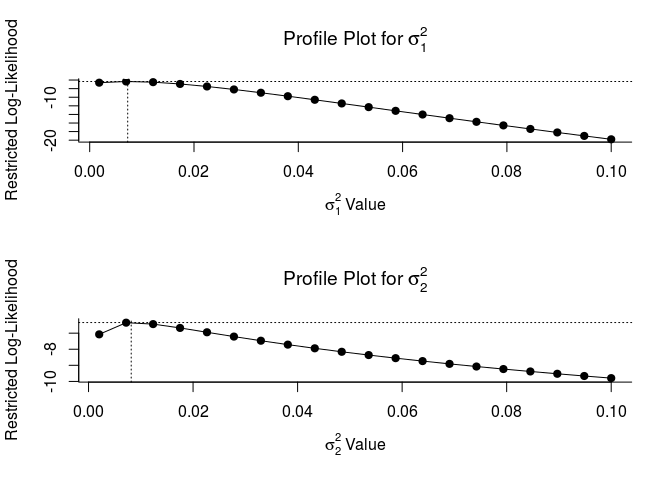

# Risks of Long-term Cognitive Impairment in Breast Cancer Patients Treated with Adjuvant Chemotherapy
[Benjamin Chan](http://careers.stackoverflow.com/benjaminchan)  
`r Sys.time()`  

`source` the R script, `make.R` to generate the project document.

```
> source("make.R")
```

This document was generated on **2016-06-24 09:01:20**.


# Project repository

*Live* version is stored here. *Static* version is this document.

* [Wiki](https://github.com/benjamin-chan/CogImpAfterBreastCaACT/wiki)
* [Meta-analysis](README.md#pooled-domain-effects)
* [Forest plot](Output/forest.png)
* [Funnel plot](Output/funnel.png)


This document is for the **Cognitive Impairment** topic.

For other topics, see links from the project [repository](https://github.com/benjamin-chan/AEAfterBreastCaACT).


# Scripts

Sequence of scripts:


prologue.Rmd %>% tidyData.Rmd %>% runMetaAnalysisPrePost.Rmd %>% epilogue.Rmd

<!--html_preserve--><div id="htmlwidget-3840" style="width:288px;height:480px;" class="grViz html-widget"></div>
<script type="application/json" data-for="htmlwidget-3840">{"x":{"diagram":"digraph {\n\ngraph [layout=dot]\n\nnode [fontname=\"Lato\"]\n\n  \"a\" [label = \"prologue.Rmd\", style = \"filled\", fontcolor = \"white\", fontsize = \"30pt\", color = \"#014386ff\", shape = \"oval\"] \n  \"b\" [label = \"tidyData.Rmd\", style = \"filled\", fontcolor = \"white\", fontsize = \"30pt\", color = \"#014386ff\", shape = \"oval\"] \n  \"c\" [label = \"runMetaAnalysisPrePost.Rmd\", style = \"filled\", fontcolor = \"white\", fontsize = \"30pt\", color = \"#014386ff\", shape = \"oval\"] \n  \"d\" [label = \"epilogue.Rmd\", style = \"filled\", fontcolor = \"white\", fontsize = \"30pt\", color = \"#014386ff\", shape = \"oval\"] \n  \"a\"->\"b\" \n  \"b\"->\"c\" \n  \"c\"->\"d\" \n}","config":{"engine":null,"options":null}},"evals":[],"jsHooks":[]}</script><!--/html_preserve-->


# Prologue

1. Set path of input data sources
1. Load [`devtools`](https://github.com/hadley/devtools)
1. Source the [`loadPkg`](https://gist.github.com/benjamin-chan/3b59313e8347fffea425) function
1. Load packages
1. Source the [`makeMetadata`](https://gist.github.com/benjamin-chan/091209ab4eee1f171540) function
1. Start the job timer


```
## Sourcing https://gist.githubusercontent.com/benjamin-chan/3b59313e8347fffea425/raw/84a146f3cde6330b901521710d513fa9d0b96951/loadPkg.R
```

```
## SHA-1 hash of file is 7bdcd4569a86aa9fff8ced241327992c550a16ce
```

```
## Sourcing https://gist.githubusercontent.com/benjamin-chan/091209ab4eee1f171540/raw/be6ae083cb81d383210979c195007b10f06f457c/makeMetadata.R
```

```
## SHA-1 hash of file is e3ec736201b7b84922ec31f1d49e236f36aa0164
```

# Tidy data

Sequence of scripts:


replicateOno.Rmd %>% readAhles.Rmd %>% readTager.Rmd %>% readSchagen.Rmd %>% readBender2015.Rmd %>% reshapeOno.Rmd %>% addFromDataAbstraction.Rmd %>% combineData.Rmd

<!--html_preserve--><div id="htmlwidget-4523" style="width:288px;height:480px;" class="grViz html-widget"></div>
<script type="application/json" data-for="htmlwidget-4523">{"x":{"diagram":"digraph {\n\ngraph [layout=dot]\n\nnode [fontname=\"Lato\"]\n\n  \"a\" [label = \"replicateOno.Rmd\", style = \"filled\", fontcolor = \"white\", fontsize = \"30pt\", color = \"#014386ff\", shape = \"oval\"] \n  \"b\" [label = \"readAhles.Rmd\", style = \"filled\", fontcolor = \"white\", fontsize = \"30pt\", color = \"#014386ff\", shape = \"oval\"] \n  \"c\" [label = \"readTager.Rmd\", style = \"filled\", fontcolor = \"white\", fontsize = \"30pt\", color = \"#014386ff\", shape = \"oval\"] \n  \"d\" [label = \"readSchagen.Rmd\", style = \"filled\", fontcolor = \"white\", fontsize = \"30pt\", color = \"#014386ff\", shape = \"oval\"] \n  \"e\" [label = \"readBender2015.Rmd\", style = \"filled\", fontcolor = \"white\", fontsize = \"30pt\", color = \"#014386ff\", shape = \"oval\"] \n  \"f\" [label = \"reshapeOno.Rmd\", style = \"filled\", fontcolor = \"white\", fontsize = \"30pt\", color = \"#014386ff\", shape = \"oval\"] \n  \"g\" [label = \"addFromDataAbstraction.Rmd\", style = \"filled\", fontcolor = \"white\", fontsize = \"30pt\", color = \"#014386ff\", shape = \"oval\"] \n  \"h\" [label = \"combineData.Rmd\", style = \"filled\", fontcolor = \"white\", fontsize = \"30pt\", color = \"#014386ff\", shape = \"oval\"] \n  \"a\"->\"b\" \n  \"b\"->\"c\" \n  \"c\"->\"d\" \n  \"d\"->\"e\" \n  \"e\"->\"f\" \n  \"f\"->\"g\" \n  \"g\"->\"h\" \n}","config":{"engine":null,"options":null}},"evals":[],"jsHooks":[]}</script><!--/html_preserve-->


## Replicate Ono

Replicate data from 
[Ono, Miyuki, et al.](http://www.ncbi.nlm.nih.gov/pmc/articles/PMC4354286/)
"A Meta-Analysis of Cognitive Impairment and Decline Associated with Adjuvant Chemotherapy in Women with Breast Cancer."
*Front Oncol.* 
2015; 5: 59. 

Data file was requested and received from the co-author, [James Ogilvie](https://www.griffith.edu.au/health/school-applied-psychology/rhd-students/james-ogilvie), in October 2015.

The `DOMAINFORMETAkvd` field (column AG) was coded by Kathleen Van Dyk <KVanDyk@mednet.ucla.edu>.

```
From: Van Dyk, Kathleen [KVanDyk@mednet.ucla.edu]
Sent: Tuesday, November 03, 2015 5:08 PM
To: Ayse Tezcan
Cc: Benjamin Chan
Subject: RE: Cognitive impairment draft paper

Hi,
 
Attached is the Ono spreadsheet with a new column with my suggestions for
domains and domains for each Ahles test is in sheet 2.  I've highlighted tests
that we may want to exclude if we want to consistently keep one or two
measures per test.  Ben --- does it matter statistically if there is more than
one measure from the same test (for example delayed recall and delayed
recognition) in the same domain?  In almost every case we have total and delay
for memory tests but if we add in more measures (Trial 6, Supraspan,
Recognition) does this confound analyses because these are likely highly
correlated measures within the same test?  Would all of the studies need to
use the same measures in each test (i.e., every study uses Total and Delay)?
I might not be asking this clearly --- let me know what you think.
```

Read data file.


```r
f <- sprintf("%s/%s", pathIn, "Requested Chemo Data domains kvd 11.19.15 2.xlsx")
echoFile(f)
```

```
## File: StudyDocuments/Requested Chemo Data domains kvd 11.19.15 2.xlsx
## Modification date: 2016-06-24 08:51:35
## File size: 178.9 KB
```

```r
D0 <- read.xlsx(f, sheet=1, check.names=TRUE)
D0 <- data.table(D0)
```

Show a map of the column names and locations.


```r
colNames <- data.frame(colNum = 1:ncol(D0),
                       colCell = c(LETTERS,
                                   sprintf("%s%s", LETTERS[1], LETTERS),
                                   sprintf("%s%s", LETTERS[2], LETTERS),
                                   sprintf("%s%s", LETTERS[3], LETTERS))[1:ncol(D0)],
                       varName = names(D0))
colNames
```

```
##    colNum colCell                  varName
## 1       1       A               First.Auth
## 2       2       B                Study.Ref
## 3       3       C                 Pub.Year
## 4       4       D                 Cog.Test
## 5       5       E    DOMAIN.FOR.META..kvd.
## 6       6       F                  Journal
## 7       7       G                 Pre.Meta
## 8       8       H                   Design
## 9       9       I                 Comp.Grp
## 10     10       J            Healthy_GROUP
## 11     11       K                   Tx.Grp
## 12     12       L   Pre.Post.Time.Interval
## 13     13       M                  Time.SD
## 14     14       N                     Tx.N
## 15     15       O                    Ctl.N
## 16     16       P                  Total.N
## 17     17       Q                   Tx.Age
## 18     18       R                Tx.Age.SD
## 19     19       S                  Ctl.Age
## 20     20       T               Ctl.Age.SD
## 21     21       U                    Tx.IQ
## 22     22       V                 Tx.IQ.SD
## 23     23       W                   Ctl.IQ
## 24     24       X                Ctl.IQ.SD
## 25     25       Y                  IQ.Note
## 26     26       Z                   Tx.EDU
## 27     27      AA                Tx.EDU.SD
## 28     28      AB                  Ctl.EDU
## 29     29      AC               Ctl.EDU.SD
## 30     30      AD                 EDU.Note
## 31     31      AE             Tx.Chem.Time
## 32     32      AF          Tx.Chem.Time.SD
## 33     33      AG Cognitive.Domain.Primary
## 34     34      AH                Score.Typ
## 35     35      AI                     Tx.M
## 36     36      AJ                    Tx.SD
## 37     37      AK                    Ctl.M
## 38     38      AL                   Ctl.SD
## 39     39      AM             Direct.Notes
## 40     40      AN                    X1.X2
## 41     41      AO                   Tx.N.1
## 42     42      AP                  Ctl.N.1
## 43     43      AQ                  Tx.SD.2
## 44     44      AR                 Ctl.SD.2
## 45     45      AS                  Spooled
## 46     46      AT                Cohen.s.d
## 47     47      AU                 Hedges.g
## 48     48      AV                     Var1
## 49     49      AW                     Var2
## 50     50      AX                 Variance
## 51     51      AY           Standard.Error
## 52     52      AZ                   Weight
## 53     53      BA                     w.ES
## 54     54      BB                   w.ES.2
## 55     55      BC                      w.2
## 56     56      BD                  StudyES
## 57     57      BE                  StudySE
## 58     58      BF                        z
## 59     59      BG                  LowerCI
## 60     60      BH                  UpperCI
## 61     61      BI                        Q
## 62     62      BJ                       df
## 63     63      BK               Q.Critical
## 64     64      BL           Q.Sig...p..05.
## 65     65      BM            RANDOM.EFFECT
## 66     66      BN                     RE_w
## 67     67      BO                   w.ES.1
## 68     68      BP                 w.ES.2.1
## 69     69      BQ                    w.2.1
## 70     70      BR                StudyES.1
## 71     71      BS                StudySE.1
## 72     72      BT                      z.1
## 73     73      BU                LowerCI.1
## 74     74      BV                UpperCI.1
## 75     75      BW                      Q.1
## 76     76      BX                     df.1
## 77     77      BY             Q.Critical.1
## 78     78      BZ         Q.Sig...p..05..1
## 79     79      CA                I.2.Fixed
## 80     80      CB               I.2.Random
```

Put the summary rows in a separate data table, `DOno`.


```r
DOno <- D0[is.na(First.Auth) & !is.na(Weight), c(52:ncol(D0)), with=FALSE]
```

Put the instrument-level rows in a separate data table, `D`.
Only keep the columns needed to calculate fixed and random effects statistics.

The `RANDOM.EFFECT` column was specific to the Ono analysis.
The value in the Ono spreadsheet will be different for our use.

```
From: James Ogilvie [j.ogilvie@griffith.edu.au]
Sent: Sunday, October 18, 2015 5:42 PM
To: Benjamin Chan
Cc: 'jamelnikow@ucdavis.edu'; 'm.ono@griffith.edu.au';
'd.shum@griffith.edu.au'; Ayse Tezcan (aztezcan@ucdavis.edu); Meghan Soulsby
(masoulsby@ucdavis.edu)
Subject: Re: Fwd: request for data from your recently published meta-analysis

Hi Benjamin,

Thanks for contacting me regarding this issue. I had wondered whether Dr.
Melnikow had received the data I had sent, as I had not received confirmation
of my email containing the data.

These are very good questions! It took me a while to get my head around the
random effect model when performing this analysis. I am attaching an article
that I found very useful in coming to terms with the model - hopefully you
will find this useful too.

To answer your questions,   is a constant across a pool of studies that you
wish to examine and generate summary/aggregate statistics (e.g., grand mean
effect size). Therefore, the value of the constant will change depending on
the the specific pool of studies examined. It is calculated across the total
pool of studies.

  is the total Q statistic (assessing heterogeneity) that is calculated across
  ALL studies and relates to the grand mean effect size. It is not the same as
  the Q statistic in column BH. There is a Q statistic for each study (this is
  the Q in column BH), as well as a Q statistic for all studies pooled
  together (this being thestatistic). The formula for calculating the Q
  statistic are provided in the pdf I've attached titled "Heterogeneity in
  MA".

As I've mentioned, the value of   is specific to the pool of studies you are
examining. Therefore, the  value to calculate effect sizes according to a
random effects model will be different for your analyses - assuming you have a
different pool of studies that you are including in the analyses. Given this,
the  value in column BL needs to be updated by you to be specific to the pool
of studies you are looking at. 
```


```r
importantVar <- c(1, 9:12, 14:17, 19, 35:39, 65, 33, 4, 5, 34)
authors <- c("Bender", "Collins", "Jenkins", "Wefel")
D <- D0[First.Auth %in% authors, importantVar, with=FALSE]
setnames(D,
         names(D),
         c("author",
           "comparisonGroup",
           "healthyGroup",
           "treatmentGroup",
           "timeDays",
           "nGroup1",
           "nGroup2",
           "nTotal",
           "ageGroup1",
           "ageGroup2",
           "meanGroup1",
           "sdGroup1",
           "meanGroup2",
           "sdGroup2",
           "direction",
           "randomEffect",  # Keep the value from Ono for verification purposes; do not use for analysis
           gsub("\\.", "", names(D0)[c(33, 4, 5, 34)])))
setnames(D, "DOMAINFORMETAkvd", "CognitiveDomainForMetaAnalysis")
```

The data in the received file is in the form of longitudinal means and standard deviations.
**Do not show**


```r
D
```

Replicate spreadsheet calculations.


```r
D <- D[direction == "Lower worse",
       `:=` (diffMean = meanGroup2 - meanGroup1)]
D <- D[direction == "Greater worse",
       `:=` (diffMean = meanGroup1 - meanGroup2)]
D <- D[,
       `:=` (sdPooled = sqrt((((nGroup1 - 1) * (sdGroup1 ^ 2)) +
                                ((nGroup2 - 1) * (sdGroup2 ^ 2))) /
                               (nGroup1 + nGroup2 - 2)))]
D <- D[,
       `:=` (cohenD = diffMean / sdPooled)]
D <- D[,
       `:=` (hedgesG = cohenD * (1 - (3 / ((4 * nTotal) - 9))))]
D <- D[,
       `:=` (var1 = (nGroup1 + nGroup2) / (nGroup1 * nGroup2),
             var2 = hedgesG ^ 2 / (2 * (nGroup1 + nGroup2)))]
D <- D[,
       `:=` (variance = var1 + var2)]
D <- D[,
       `:=` (se = sqrt(variance),
             weightFE = 1 / variance)]
D <- D[,
       `:=` (effSizeWeightedFE = weightFE * hedgesG)]
D <- D[, weightRE := 1 / (variance + randomEffect)]
D <- D[, effSizeWeightedRE := weightRE * hedgesG]
```

Calculate fixed effects statisitcs.


```r
DFixed <- D[!is.na(nTotal),
            .(df = .N,
              sumWeights = sum(weightFE),
              effSize = sum(effSizeWeightedFE) / sum(weightFE),
              se = sqrt(1 / sum(weightFE)),
              sumEffSizeWeighted = sum(effSizeWeightedFE),
              ssEffSizeWeighted = sum(weightFE * hedgesG ^ 2),
              ssWeights = sum(weightFE ^ 2)),
            .(author, timeDays)]
DFixed <- DFixed[,
                 `:=` (z = effSize / se,
                       lowerCI = effSize + qnorm(0.025) * se,
                       upperCI = effSize + qnorm(0.975) * se,
                       Q = ssEffSizeWeighted - (sumEffSizeWeighted ^ 2 / sumWeights),
                       criticalValue = qchisq(0.05, df, lower.tail=FALSE))]
DFixed <- DFixed[,
                 `:=` (pvalue = pchisq(Q, df, lower.tail=FALSE),
                       Isq = 100 * ((Q - df) / Q))]
```

Check if my calculations agree with Ono's.


```r
isCheckFixedPassed <- all.equal(DOno[, .(effSize = StudyES, z, Q)], 
                                DFixed[, .(effSize, z, Q)],
                                check.names=FALSE)
message(sprintf("Do my FIXED effect statistic calculations agree with Ono's? %s",
                isCheckFixedPassed))
```

```
## Do my FIXED effect statistic calculations agree with Ono's? TRUE
```

```r
print(xtable(DFixed), type="html")
```

<!-- html table generated in R 3.3.0 by xtable 1.8-2 package -->
<!-- Fri Jun 24 09:01:25 2016 -->
<table border=1>
<tr> <th>  </th> <th> author </th> <th> timeDays </th> <th> df </th> <th> sumWeights </th> <th> effSize </th> <th> se </th> <th> sumEffSizeWeighted </th> <th> ssEffSizeWeighted </th> <th> ssWeights </th> <th> z </th> <th> lowerCI </th> <th> upperCI </th> <th> Q </th> <th> criticalValue </th> <th> pvalue </th> <th> Isq </th>  </tr>
  <tr> <td align="right"> 1 </td> <td> Bender </td> <td align="right"> 182.62 </td> <td align="right">  16 </td> <td align="right"> 96.80 </td> <td align="right"> 1.02 </td> <td align="right"> 0.10 </td> <td align="right"> 98.53 </td> <td align="right"> 241.49 </td> <td align="right"> 626.88 </td> <td align="right"> 10.01 </td> <td align="right"> 0.82 </td> <td align="right"> 1.22 </td> <td align="right"> 141.21 </td> <td align="right"> 26.30 </td> <td align="right"> 0.00 </td> <td align="right"> 88.67 </td> </tr>
  <tr> <td align="right"> 2 </td> <td> Bender </td> <td align="right"> 547.50 </td> <td align="right">  16 </td> <td align="right"> 63.53 </td> <td align="right"> 0.55 </td> <td align="right"> 0.13 </td> <td align="right"> 34.76 </td> <td align="right"> 285.90 </td> <td align="right"> 290.59 </td> <td align="right"> 4.36 </td> <td align="right"> 0.30 </td> <td align="right"> 0.79 </td> <td align="right"> 266.88 </td> <td align="right"> 26.30 </td> <td align="right"> 0.00 </td> <td align="right"> 94.00 </td> </tr>
  <tr> <td align="right"> 3 </td> <td> Collins </td> <td align="right"> 537.90 </td> <td align="right">  23 </td> <td align="right"> 604.56 </td> <td align="right"> 0.21 </td> <td align="right"> 0.04 </td> <td align="right"> 124.90 </td> <td align="right"> 39.49 </td> <td align="right"> 15893.07 </td> <td align="right"> 5.08 </td> <td align="right"> 0.13 </td> <td align="right"> 0.29 </td> <td align="right"> 13.69 </td> <td align="right"> 35.17 </td> <td align="right"> 0.94 </td> <td align="right"> -68.01 </td> </tr>
  <tr> <td align="right"> 4 </td> <td> Collins </td> <td align="right"> 146.50 </td> <td align="right">  23 </td> <td align="right"> 607.30 </td> <td align="right"> 0.10 </td> <td align="right"> 0.04 </td> <td align="right"> 58.14 </td> <td align="right"> 17.63 </td> <td align="right"> 16035.80 </td> <td align="right"> 2.36 </td> <td align="right"> 0.02 </td> <td align="right"> 0.18 </td> <td align="right"> 12.07 </td> <td align="right"> 35.17 </td> <td align="right"> 0.97 </td> <td align="right"> -90.58 </td> </tr>
  <tr> <td align="right"> 5 </td> <td> Jenkins </td> <td align="right"> 364.00 </td> <td align="right">  14 </td> <td align="right"> 592.05 </td> <td align="right"> 0.08 </td> <td align="right"> 0.04 </td> <td align="right"> 47.58 </td> <td align="right"> 23.62 </td> <td align="right"> 25038.13 </td> <td align="right"> 1.96 </td> <td align="right"> -0.00 </td> <td align="right"> 0.16 </td> <td align="right"> 19.79 </td> <td align="right"> 23.68 </td> <td align="right"> 0.14 </td> <td align="right"> 29.27 </td> </tr>
  <tr> <td align="right"> 6 </td> <td> Jenkins </td> <td align="right"> 28.00 </td> <td align="right">  14 </td> <td align="right"> 593.46 </td> <td align="right"> 0.03 </td> <td align="right"> 0.04 </td> <td align="right"> 19.46 </td> <td align="right"> 12.29 </td> <td align="right"> 25157.32 </td> <td align="right"> 0.80 </td> <td align="right"> -0.05 </td> <td align="right"> 0.11 </td> <td align="right"> 11.65 </td> <td align="right"> 23.68 </td> <td align="right"> 0.63 </td> <td align="right"> -20.17 </td> </tr>
  <tr> <td align="right"> 7 </td> <td> Wefel </td> <td align="right"> 182.62 </td> <td align="right">  10 </td> <td align="right"> 89.09 </td> <td align="right"> 0.18 </td> <td align="right"> 0.11 </td> <td align="right"> 15.73 </td> <td align="right"> 5.24 </td> <td align="right"> 793.76 </td> <td align="right"> 1.67 </td> <td align="right"> -0.03 </td> <td align="right"> 0.38 </td> <td align="right"> 2.47 </td> <td align="right"> 18.31 </td> <td align="right"> 0.99 </td> <td align="right"> -305.57 </td> </tr>
  <tr> <td align="right"> 8 </td> <td> Wefel </td> <td align="right"> 547.86 </td> <td align="right">  10 </td> <td align="right"> 79.52 </td> <td align="right"> 0.26 </td> <td align="right"> 0.11 </td> <td align="right"> 20.75 </td> <td align="right"> 8.62 </td> <td align="right"> 632.66 </td> <td align="right"> 2.33 </td> <td align="right"> 0.04 </td> <td align="right"> 0.48 </td> <td align="right"> 3.20 </td> <td align="right"> 18.31 </td> <td align="right"> 0.98 </td> <td align="right"> -212.29 </td> </tr>
   </table>

Calculate random effects statisitcs.


```r
DRandom <- D[!is.na(nTotal),
             .(df = .N,
               sumWeights = sum(weightRE),
               ssEffSizeWeighted = sum(weightRE * hedgesG ^ 2),
               ssWeights = sum(weightRE ^ 2),
               sumEffSizeWeighted = sum(effSizeWeightedRE),
               effSize = sum(effSizeWeightedRE) / sum(weightRE),
               se = sqrt(1 / sum(weightRE))),
             .(author, timeDays)]
DRandom <- DRandom[,
                   `:=` (z = effSize / se,
                         lowerCI = effSize + qnorm(0.025) * se,
                         upperCI = effSize + qnorm(0.975) * se,
                         Q = ssEffSizeWeighted - (sumEffSizeWeighted ^ 2 / sumWeights),
                         criticalValue = qchisq(0.05, df, lower.tail=FALSE))]
DRandom <- DRandom[,
                   `:=` (pvalue = pchisq(Q, df, lower.tail=FALSE),
                         Isq = 100 * ((Q - df) / Q))]
```

Check if my calculations agree with Ono's.


```r
isCheckRandomPassed <- all.equal(DOno[, .(effSize = StudyES.1, z = z.1, Q = Q.1)], 
                                 DRandom[, .(effSize, z, Q)],
                                 check.names=FALSE)
message(sprintf("Do my RANDOM effect statistic calculations agree with Ono's? %s",
                isCheckRandomPassed))
```

```
## Do my RANDOM effect statistic calculations agree with Ono's? TRUE
```

```r
print(xtable(DRandom), type="html")
```

<!-- html table generated in R 3.3.0 by xtable 1.8-2 package -->
<!-- Fri Jun 24 09:01:25 2016 -->
<table border=1>
<tr> <th>  </th> <th> author </th> <th> timeDays </th> <th> df </th> <th> sumWeights </th> <th> ssEffSizeWeighted </th> <th> ssWeights </th> <th> sumEffSizeWeighted </th> <th> effSize </th> <th> se </th> <th> z </th> <th> lowerCI </th> <th> upperCI </th> <th> Q </th> <th> criticalValue </th> <th> pvalue </th> <th> Isq </th>  </tr>
  <tr> <td align="right"> 1 </td> <td> Bender </td> <td align="right"> 182.62 </td> <td align="right">  16 </td> <td align="right"> 48.04 </td> <td align="right"> 137.29 </td> <td align="right"> 147.43 </td> <td align="right"> 53.60 </td> <td align="right"> 1.12 </td> <td align="right"> 0.14 </td> <td align="right"> 7.73 </td> <td align="right"> 0.83 </td> <td align="right"> 1.40 </td> <td align="right"> 77.50 </td> <td align="right"> 26.30 </td> <td align="right"> 0.00 </td> <td align="right"> 79.35 </td> </tr>
  <tr> <td align="right"> 2 </td> <td> Bender </td> <td align="right"> 547.50 </td> <td align="right">  16 </td> <td align="right"> 37.25 </td> <td align="right"> 199.95 </td> <td align="right"> 92.56 </td> <td align="right"> 26.23 </td> <td align="right"> 0.70 </td> <td align="right"> 0.16 </td> <td align="right"> 4.30 </td> <td align="right"> 0.38 </td> <td align="right"> 1.03 </td> <td align="right"> 181.48 </td> <td align="right"> 26.30 </td> <td align="right"> 0.00 </td> <td align="right"> 91.18 </td> </tr>
  <tr> <td align="right"> 3 </td> <td> Collins </td> <td align="right"> 537.90 </td> <td align="right">  23 </td> <td align="right"> 115.28 </td> <td align="right"> 7.62 </td> <td align="right"> 577.83 </td> <td align="right"> 23.96 </td> <td align="right"> 0.21 </td> <td align="right"> 0.09 </td> <td align="right"> 2.23 </td> <td align="right"> 0.03 </td> <td align="right"> 0.39 </td> <td align="right"> 2.64 </td> <td align="right"> 35.17 </td> <td align="right"> 1.00 </td> <td align="right"> -770.38 </td> </tr>
  <tr> <td align="right"> 4 </td> <td> Collins </td> <td align="right"> 146.50 </td> <td align="right">  23 </td> <td align="right"> 115.38 </td> <td align="right"> 3.38 </td> <td align="right"> 578.84 </td> <td align="right"> 11.11 </td> <td align="right"> 0.10 </td> <td align="right"> 0.09 </td> <td align="right"> 1.03 </td> <td align="right"> -0.09 </td> <td align="right"> 0.28 </td> <td align="right"> 2.31 </td> <td align="right"> 35.17 </td> <td align="right"> 1.00 </td> <td align="right"> -895.09 </td> </tr>
  <tr> <td align="right"> 5 </td> <td> Jenkins </td> <td align="right"> 364.00 </td> <td align="right">  14 </td> <td align="right"> 75.63 </td> <td align="right"> 3.04 </td> <td align="right"> 408.57 </td> <td align="right"> 6.11 </td> <td align="right"> 0.08 </td> <td align="right"> 0.11 </td> <td align="right"> 0.70 </td> <td align="right"> -0.14 </td> <td align="right"> 0.31 </td> <td align="right"> 2.54 </td> <td align="right"> 23.68 </td> <td align="right"> 1.00 </td> <td align="right"> -450.68 </td> </tr>
  <tr> <td align="right"> 6 </td> <td> Jenkins </td> <td align="right"> 28.00 </td> <td align="right">  14 </td> <td align="right"> 75.65 </td> <td align="right"> 1.57 </td> <td align="right"> 408.83 </td> <td align="right"> 2.50 </td> <td align="right"> 0.03 </td> <td align="right"> 0.11 </td> <td align="right"> 0.29 </td> <td align="right"> -0.19 </td> <td align="right"> 0.26 </td> <td align="right"> 1.49 </td> <td align="right"> 23.68 </td> <td align="right"> 1.00 </td> <td align="right"> -840.71 </td> </tr>
  <tr> <td align="right"> 7 </td> <td> Wefel </td> <td align="right"> 182.62 </td> <td align="right">  10 </td> <td align="right"> 36.53 </td> <td align="right"> 2.16 </td> <td align="right"> 133.47 </td> <td align="right"> 6.48 </td> <td align="right"> 0.18 </td> <td align="right"> 0.17 </td> <td align="right"> 1.07 </td> <td align="right"> -0.15 </td> <td align="right"> 0.50 </td> <td align="right"> 1.01 </td> <td align="right"> 18.31 </td> <td align="right"> 1.00 </td> <td align="right"> -890.02 </td> </tr>
  <tr> <td align="right"> 8 </td> <td> Wefel </td> <td align="right"> 547.86 </td> <td align="right">  10 </td> <td align="right"> 34.81 </td> <td align="right"> 3.79 </td> <td align="right"> 121.21 </td> <td align="right"> 9.12 </td> <td align="right"> 0.26 </td> <td align="right"> 0.17 </td> <td align="right"> 1.55 </td> <td align="right"> -0.07 </td> <td align="right"> 0.59 </td> <td align="right"> 1.41 </td> <td align="right"> 18.31 </td> <td align="right"> 1.00 </td> <td align="right"> -611.34 </td> </tr>
   </table>

Exclude tests Kathleen determined to be not useful.

```
From: Van Dyk, Kathleen [KVanDyk@mednet.ucla.edu]
Sent: Thursday, November 19, 2015 10:22 AM
To: Benjamin Chan
Cc: Ayse Tezcan
Subject: RE: Cognitive impairment draft paper

Hi Ben,
 
Ok --- attached is the Ono spreadsheet with my suggested domains.  I did
strikethrough for the measures we probably shouldn't include at all in the
domains to keep it somewhat uniform across tests (i.e., some folks used Trial
1 from a list-learning test, some just used Total and Delay, etc.).
```


```r
strikethrough <- c("RAVL trial 6",
                   "CVLT Trial 1",
                   "RVLT trial 1",
                   "AVLT supraspan")
D <- D[!(CogTest %in% strikethrough)]
```

Domains and tests.


```r
unique(D[, .(CognitiveDomainForMetaAnalysis, CogTest)])[order(CognitiveDomainForMetaAnalysis, CogTest)]
```

```
##     CognitiveDomainForMetaAnalysis                            CogTest
##  1:     Attn/Wkg Mem/Concentration               WAIS-III -Arithmetic
##  2:     Attn/Wkg Mem/Concentration                       4WSTM 15 sec
##  3:     Attn/Wkg Mem/Concentration                       4WSTM 30 sec
##  4:     Attn/Wkg Mem/Concentration                        4WSTM 5 sec
##  5:     Attn/Wkg Mem/Concentration                 Consonant trigrams
##  6:     Attn/Wkg Mem/Concentration Letter-number sequencing: WAIS-III
##  7:     Attn/Wkg Mem/Concentration               PASAT number correct
##  8:     Attn/Wkg Mem/Concentration              Spatial span: WMS-III
##  9:     Attn/Wkg Mem/Concentration                    TMT part A time
## 10:     Attn/Wkg Mem/Concentration                           Trails A
## 11:     Attn/Wkg Mem/Concentration                WAIS-III Digit span
## 12:     Attn/Wkg Mem/Concentration  WAIS-III Letter-number sequencing
## 13:     Attn/Wkg Mem/Concentration                  WAIS-R arithmetic
## 14:     Attn/Wkg Mem/Concentration                  WAIS-R digit span
## 15:     Attn/Wkg Mem/Concentration       WMS-III digit span backwards
## 16:     Attn/Wkg Mem/Concentration         WMS-III digit span forward
## 17:     Attn/Wkg Mem/Concentration   WMS-III letter number sequencing
## 18:     Attn/Wkg Mem/Concentration     WMS-III spatial span backwards
## 19:     Attn/Wkg Mem/Concentration      WMS-III spatial span forwards
## 20:                       Exec Fxn                             Stroop
## 21:                       Exec Fxn                    TMT part B time
## 22:                       Exec Fxn                           Trails B
## 23:                       Exec Fxn                WAIS-R similarities
## 24:                       Exec Fxn       WCST sorts divided by trials
## 25:         Information Proc Speed                Letter cancellation
## 26:         Information Proc Speed            Symbol search: WAIS-III
## 27:         Information Proc Speed       WAIS-III Digit Symbol Coding
## 28:         Information Proc Speed             WAIS-III Symbol search
## 29:         Information Proc Speed                WAIS-R digit symbol
## 30:                    Motor Speed             Grooved Peg Board time
## 31:                    Motor Speed     Grooved pegboard dominant hand
## 32:                    Motor Speed  Grooved pegboard nondominant hand
## 33:        Verbal Ability/Language  Boston Naming Test number correct
## 34:        Verbal Ability/Language  Verbal Fluency FAS number correct
## 35:        Verbal Ability/Language       Verbal fluency COWAT correct
## 36:                  Verbal Memory                       AVLT delayed
## 37:                  Verbal Memory                         AVLT total
## 38:                  Verbal Memory                CVLT delayed recall
## 39:                  Verbal Memory           CVLT delayed recognition
## 40:                  Verbal Memory                RAVL delayed recall
## 41:                  Verbal Memory                   RAVL total score
## 42:                  Verbal Memory                VSRT Delayed Recall
## 43:                  Verbal Memory             VSRT Long-Term Storage
## 44:                  Verbal Memory          WMS-III Logical memory II
## 45:                  Verbal Memory       WMS-III Story delayed recall
## 46:                  Verbal Memory     WMS-III Story immediate recall
## 47:                  Visual Memory             Complex figure delayed
## 48:                  Visual Memory           Complex figure immediate
## 49:                  Visual Memory               NVSRT Delayed Recall
## 50:                  Visual Memory                 RCF delayed recall
## 51:                  Visual Memory               RCF immediate recall
## 52:                  Visual Memory                RVLT delayed recall
## 53:                  Visual Memory           RVLT delayed recognition
## 54:                  Visual Memory         WMS-III Family pictures II
## 55:                   Visuospatial              WAIS-III Block design
## 56:                   Visuospatial                WAIS-R block design
##     CognitiveDomainForMetaAnalysis                            CogTest
```

Save working data tables to file if the integrity checks passed.
I don't need to save `DOno` since the integrity checks passed.


```r
metadataD = makeMetadata(D)
metadataDFixed = makeMetadata(DFixed)
metadataDRandom = makeMetadata(DRandom)
if (isCheckFixedPassed & isCheckRandomPassed) {
  f <- sprintf("%s/%s", pathOut, "Ono.RData")
  save(D,
       metadataD,
       DFixed,
       metadataDFixed,
       DRandom,
       metadataDRandom,
       file=f)
  message(sprintf("%s saved on: %s\nFile size: %s KB", 
                  f,
                  file.mtime(f),
                  file.size(f) / 1e3))
} else {
  warning(sprinf("Integrity checks failed.\n%s not saved.", f))
}
```

```
## Output/Ono.RData saved on: 2016-06-24 09:01:25
## File size: 311.26 KB
```

## Read Ahles

Read data from 
[Ahles TA, et al.](http://www.ncbi.nlm.nih.gov/pmc/articles/PMC2988635/)
"Longitudinal Assessment of Cognitive Changes Associated With Adjuvant Treatment for Breast Cancer: Impact of Age and Cognitive Reserve."
*J Clin Oncol.* 
2010 Oct 10; 28(29): 4434-4440.

Data file was requested and received from the co-author, [Yuelin Li](https://www.mskcc.org/profile/yuelin-li), in October 2015.

Read data file (text format).


```r
f <- sprintf("%s/%s", pathIn, "Soulsby_means.txt")
echoFile(f)
```

```
## File: StudyDocuments/Soulsby_means.txt
## Modification date: 2016-06-24 08:51:50
## File size: 36.1 KB
```

```r
D <- fread(f, sep="|")
```

The data in the received file is in the form of longitudinal means and standard deviations.
**Do not show**


```r
D
```

Study design.


```r
D[, .(nrows = .N, totalN = sum(N)), .(txgrp, ptime)]
```

```
##        txgrp    ptime nrows totalN
##  1:    chemo baseline    35   2056
##  2:    chemo   posttx    35   1886
##  3:    chemo      1yr    35   1677
##  4:    chemo      2yr    35   1549
##  5: chemo no baseline    35   2432
##  6: chemo no   posttx    35   2321
##  7: chemo no      1yr    35   2237
##  8: chemo no      2yr    35   2138
##  9:  control baseline    35   1522
## 10:  control   posttx    35   1478
## 11:  control      1yr    35   1447
## 12:  control      2yr    35   1346
```

Map `ptime` to *months after treatment*.
[Ahles TA, et al.](http://www.ncbi.nlm.nih.gov/pmc/articles/PMC2988635/) reports results in terms of

* Baseline
* 1 month after treatment
* 6 months after treatment
* 18 months after treatment

As far as I can tell, values of `ptime` map to these, although seemingly imprecise.


```r
D[ptime == "baseline", monthsPostTx := 0]
D[ptime == "posttx", monthsPostTx := 1]
D[ptime == "1yr", monthsPostTx := 6]
D[ptime == "2yr", monthsPostTx := 18]
```

Exclude

* Non-chemotherapy and control patients


```r
D <- D[txgrp == "chemo"]
```

Instruments.
**Do not show**


```r
D[, .N, .(Variable, Label)]
```

Merge Kathleen's <KVanDyk@mednet.ucla.edu> domain assignments.

```
From: Van Dyk, Kathleen [KVanDyk@mednet.ucla.edu]
Sent: Tuesday, November 03, 2015 5:08 PM
To: Ayse Tezcan
Cc: Benjamin Chan
Subject: RE: Cognitive impairment draft paper

Hi,
 
Attached is the Ono spreadsheet with a new column with my suggestions for
domains and domains for each Ahles test is in sheet 2.  I've highlighted tests
that we may want to exclude if we want to consistently keep one or two
measures per test.  Ben --- does it matter statistically if there is more than
one measure from the same test (for example delayed recall and delayed
recognition) in the same domain?  In almost every case we have total and delay
for memory tests but if we add in more measures (Trial 6, Supraspan,
Recognition) does this confound analyses because these are likely highly
correlated measures within the same test?  Would all of the studies need to
use the same measures in each test (i.e., every study uses Total and Delay)?
I might not be asking this clearly --- let me know what you think.
```


```r
f <- sprintf("%s/%s", pathIn, "Requested Chemo Data domains kvd 11.19.15 2.xlsx")
echoFile(f)
```

```
## File: StudyDocuments/Requested Chemo Data domains kvd 11.19.15 2.xlsx
## Modification date: 2016-06-24 08:51:35
## File size: 178.9 KB
```

```r
D0 <- read.xlsx(f, sheet=2, check.names=TRUE)
D0 <- data.table(D0)
CognitiveDomainForMetaAnalysis <- D0[!is.na(DOMAIN.FOR.META..kvd.), DOMAIN.FOR.META..kvd.]
lookup <- cbind(D[, .N, .(Variable, Label)], CognitiveDomainForMetaAnalysis)[, .(Variable, CognitiveDomainForMetaAnalysis)]
D <- merge(lookup, D, by="Variable")
unique(D[, .(CognitiveDomainForMetaAnalysis, Label)])[order(CognitiveDomainForMetaAnalysis, Label)]
```

```
##     CognitiveDomainForMetaAnalysis
##  1:     Attn/Wkg Mem/Concentration
##  2:     Attn/Wkg Mem/Concentration
##  3:     Attn/Wkg Mem/Concentration
##  4:     Attn/Wkg Mem/Concentration
##  5:     Attn/Wkg Mem/Concentration
##  6:     Attn/Wkg Mem/Concentration
##  7:     Attn/Wkg Mem/Concentration
##  8:     Attn/Wkg Mem/Concentration
##  9:     Attn/Wkg Mem/Concentration
## 10:     Attn/Wkg Mem/Concentration
## 11:                       Exec Fxn
## 12:                       Exec Fxn
## 13:                       Exec Fxn
## 14:                       Exec Fxn
## 15:                       Exec Fxn
## 16:                       Exec Fxn
## 17:                       Exec Fxn
## 18:         Information Proc Speed
## 19:         Information Proc Speed
## 20:         Information Proc Speed
## 21:         Information Proc Speed
## 22:                    Motor Speed
## 23:                    Motor Speed
## 24:                    Motor Speed
## 25:        Verbal Ability/Language
## 26:        Verbal Ability/Language
## 27:        Verbal Ability/Language
## 28:        Verbal Ability/Language
## 29:                  Verbal Memory
## 30:                  Verbal Memory
## 31:                  Verbal Memory
## 32:                  Verbal Memory
## 33:                  Visual Memory
## 34:                  Visual Memory
## 35:                   Visuospatial
##     CognitiveDomainForMetaAnalysis
##                                                  Label
##  1:            CPT: Distractibility, Correct Responses
##  2:              CPT: Distractibility, False Positives
##  3:                CPT: Distractibility, Reaction Time
##  4:                  CPT: Vigilance, Correct Responses
##  5:                    CPT: Vigilance, False Positives
##  6:                      CPT: Vigilance, Reaction Time
##  7:               DKEFS Trails: Letter Sequencing, sec
##  8:               DKEFS Trails: Number Sequencing, sec
##  9:                       PASAT (Rao): 2 second pacing
## 10:                       PASAT (Rao): 3 second pacing
## 11:        DKEFS Card Sorting: Confirmed Correct Sorts
## 12:                   DKEFS Card Sorting: Free Sorting
## 13:                           DKEFS Stroop: Color-Word
## 14:         DKEFS Trails: Number-Letter Switching, sec
## 15:       DKEFS Verbal Fluency: Switching Fruits/Veget
## 16:              DKEFS: Card Sorting, Sort Recognition
## 17:                        DKEFS: Stroop, Set Shifting
## 18:                               CVLT-2: Digit Symbol
## 19:                   DKEFS Stroop: Color Patch Naming
## 20:                    DKEFS Stroop: Word Reading, sec
## 21:           DKEFS Trails: Visual Scanning in Seconds
## 22:                     DKEFS Trails: Motor Speed, sec
## 23:              Grooved Pegboard Test: Left Hand, sec
## 24:             Grooved Pegboard Test: Right Hand, sec
## 25:                               DKEFS Verbal Fluency
## 26: DKEFS Verbal Fluency: anival or clothing and names
## 27:                                   WASI: Vocabulary
## 28:                               WRAT-3 Reading Score
## 29:                     CVLT-2: Long Delay Free Recall
## 30:                           CVLT-2: Trials 1-5 Total
## 31:          Wechsler Memory Scale-3: Logical Memory I
## 32:         Wechsler Memory Scale-3: Logical Memory II
## 33:                   Wechsler Memory Scale-3: Faces I
## 34:                  Wechsler Memory Scale-3: Faces II
## 35:                                 WASI: Block Design
##                                                  Label
```

Save working data tables to file.


```r
metadata <- makeMetadata(D)
f <- sprintf("%s/%s", pathOut, "Ahles.RData")
save(D, metadata, file=f)
message(sprintf("%s saved on: %s\nFile size: %s KB", 
                f,
                file.mtime(f),
                file.size(f) / 1e3))
```

```
## Output/Ahles.RData saved on: 2016-06-24 09:01:25
## File size: 108.694 KB
```

## Read Tager

Read data from 
[Tager, FA, et al.](http://link.springer.com/article/10.1007%2Fs10549-009-0606-8)
"The cognitive effects of chemotherapy in post-menopausal breast cancer patients: a controlled longitudinal study."
*Breast Cancer Res Treat.* 
  2010 Aug;123(1):25-34.

Data file was requested and received from the co-author, [Paula S. McKinley](pm491@cumc.columbia.edu), on November 20, 2015.

Read data file (SPSS format).


```r
f <- sprintf("%s/%s", pathIn, "Tager_DataForMetaAnalysis.sav")
echoFile(f)
```

```
## File: StudyDocuments/Tager_DataForMetaAnalysis.sav
## Modification date: 2016-06-24 08:51:59
## File size: 102.7 KB
```

```r
D <- read_sav(f)
D <- data.table(D)
D <- D[,
       `:=` (session = factor(session,
                              levels = 1:4,
                              labels = c("Pre-surgery",
                                         "Post surgery before treatment",
                                         "Post treatment/6mths post surgery",
                                         "6 month follow-up")),
             chemoyn = factor(chemoyn,
                              levels= 0:1,
                              labels = c("No", "Yes")),
             CTregmen = factor(CTregmen,
                               levels = 1:3,
                               labels = c("AC",
                                          "ACT",
                                          "CMF")),
             tx = factor(tx,
                         levels = 0:11,
                         labels = c("None",
                                    "Chemo",
                                    "Radiation",
                                    "Tamoxifen",
                                    "Arimadex",
                                    "Chemo + Radiation",
                                    "Chemo + Tamoxifen",
                                    "Chemo + Arimadex",
                                    "Radiation + Tamoxifen",
                                    "Radiation + Arimadex",
                                    "Chemo + Radiation + Tamoxifen",
                                    "Chemo + Radiation + Arimadex")))]
```

Check data.


```r
D[, .N, .(chemoyn, CTregmen)]
```

```
##    chemoyn CTregmen  N
## 1:      No       NA 89
## 2:     Yes      CMF 24
## 3:     Yes      ACT 40
## 4:     Yes       AC 21
```

```r
D[, .N, .(chemoyn, chemowks)]
```

```
##    chemoyn chemowks  N
## 1:      No       88 89
## 2:     Yes       24 39
## 3:     Yes       16 14
## 4:     Yes       12  8
## 5:     Yes       28  3
## 6:     Yes       18  3
## 7:     Yes        8 12
## 8:     Yes       14  6
```

Keep *z*-score variables for these instruments.

* Finger Tapper - Dom Hand
* Finger Tapper - NonDom Hand
* Pegboard - Dom Hand
* Pegboard - Nondom Hand
* COWAT
* Boston Naming
* Trail Making A
* Trail Making B
* WAIS-III Digit Symbol
* WAIS-III Digit Span
* WAIS-III Arithmetic
* WAIS-III Number/Letter
* Rey Copy
* Buschke Total 
* Benton Visual Retention Correct


```r
measures <- c("tapdomz",
              "tapndomz",
              "pegdomz",
              "pegndomz",
              "cowz",
              "bntz",
              "trlaz",
              "trlbz",
              "dsymz",
              "dspaz",
              "aritz",
              "numz",
              "reyz",
              "bustotz",
              "bvrcoz")
```

Melt data.


```r
D <- melt(D,
          id.vars = c("subid", "session", "chemoyn", "chemowks", "CTregmen", "tx"),
          measure.vars = measures)
setnames(D, "variable", "Variable")
D <- D[Variable == "tapdomz", Label := "Finger Tapper - Dom Hand"]
D <- D[Variable == "tapndomz", Label := "Finger Tapper - NonDom Hand"]
D <- D[Variable == "pegdomz", Label := "Pegboard - Dom Hand"]
D <- D[Variable == "pegndomz", Label := "Pegboard - Nondom Hand"]
D <- D[Variable == "cowz", Label := "COWAT"]
D <- D[Variable == "bntz", Label := "Boston Naming"]
D <- D[Variable == "trlaz", Label := "Trail Making A"]
D <- D[Variable == "trlbz", Label := "Trail Making B"]
D <- D[Variable == "dsymz", Label := "WAIS-III Digit Symbol"]
D <- D[Variable == "dspaz", Label := "WAIS-III Digit Span"]
D <- D[Variable == "aritz", Label := "WAIS-III Arithmetic"]
D <- D[Variable == "numz", Label := "WAIS-III Number/Letter"]
D <- D[Variable == "reyz", Label := "Rey Copy"]
D <- D[Variable == "bustotz", Label := "Buschke Total "]
D <- D[Variable == "bvrcoz", Label := "Benton Visual Retention Correct"]
setkey(D, subid, session)
```

Exclude

* Non-chemotherapy patients
* Measurements before surgery


```r
D <- D[chemoyn != "No" &
         session != "Pre-surgery"]
D[, .N, .(chemoyn, session)]
```

```
##    chemoyn                           session   N
## 1:     Yes     Post surgery before treatment 450
## 2:     Yes Post treatment/6mths post surgery 450
## 3:     Yes                 6 month follow-up 375
```

Calculate means and standard deviations


```r
T <- D[,
       .(N = .N,
         meanZ = mean(value, na.rm=TRUE),
         sdZ = sd(value, na.rm=TRUE)),
       .(Variable,
         Label,
         session)]
setkey(T, Variable, Label, session)
```

Check against *Table 2*, column **CT Group** of [Tager, FA, et al.](http://link.springer.com/article/10.1007%2Fs10549-009-0606-8).


```r
T1 <- T[session == "Post surgery before treatment"]
T1 <- T1[, x := sprintf("%.2f (%.2f)", meanZ, sdZ)]
T1[, .(Variable, Label, N, x)]
```

```
##     Variable                           Label  N            x
##  1:  tapdomz        Finger Tapper - Dom Hand 30  1.74 (1.21)
##  2: tapndomz     Finger Tapper - NonDom Hand 30  1.38 (1.11)
##  3:  pegdomz             Pegboard - Dom Hand 30 -0.18 (1.67)
##  4: pegndomz          Pegboard - Nondom Hand 30 -0.41 (1.64)
##  5:     cowz                           COWAT 30  0.24 (0.94)
##  6:     bntz                   Boston Naming 30 -0.33 (1.48)
##  7:    trlaz                  Trail Making A 30  0.40 (1.00)
##  8:    trlbz                  Trail Making B 30  0.32 (1.18)
##  9:    dsymz           WAIS-III Digit Symbol 30  0.69 (0.98)
## 10:    dspaz             WAIS-III Digit Span 30  0.23 (0.91)
## 11:    aritz             WAIS-III Arithmetic 30  0.09 (0.92)
## 12:     numz          WAIS-III Number/Letter 30  0.34 (0.90)
## 13:     reyz                        Rey Copy 30 -1.52 (2.84)
## 14:  bustotz                  Buschke Total  30 -0.60 (1.06)
## 15:   bvrcoz Benton Visual Retention Correct 30  0.01 (1.17)
```

Map `session` to *months after treatment*.
[Tager, FA, et al.](http://link.springer.com/article/10.1007%2Fs10549-009-0606-8)

* Baseline
* 1 month after treatment
* 6 months after treatment

As far as I can tell, values of `ptime` map to these, although seemingly imprecise.


```r
T <- T[session == "Post surgery before treatment", monthsPostTx := 0]
T <- T[session == "Post treatment/6mths post surgery", monthsPostTx := 6]
T <- T[session == "6 month follow-up", monthsPostTx := 12]
```

Merge Kathleen's <KVanDyk@mednet.ucla.edu> domain assignments.

```
From: Van Dyk, Kathleen [KVanDyk@mednet.ucla.edu]
Sent: Tuesday, November 03, 2015 5:08 PM
To: Ayse Tezcan
Cc: Benjamin Chan
Subject: RE: Cognitive impairment draft paper

Hi,
 
Attached is the Ono spreadsheet with a new column with my suggestions for
domains and domains for each Ahles test is in sheet 2.  I've highlighted tests
that we may want to exclude if we want to consistently keep one or two
measures per test.  Ben --- does it matter statistically if there is more than
one measure from the same test (for example delayed recall and delayed
recognition) in the same domain?  In almost every case we have total and delay
for memory tests but if we add in more measures (Trial 6, Supraspan,
Recognition) does this confound analyses because these are likely highly
correlated measures within the same test?  Would all of the studies need to
use the same measures in each test (i.e., every study uses Total and Delay)?
I might not be asking this clearly --- let me know what you think.
```


```r
f <- sprintf("%s/%s", pathIn, "Requested Chemo Data domains kvd 11.19.15 2.xlsx")
echoFile(f)
```

```
## File: StudyDocuments/Requested Chemo Data domains kvd 11.19.15 2.xlsx
## Modification date: 2016-06-24 08:51:35
## File size: 178.9 KB
```

```r
D0 <- read.xlsx(f, sheet=1, check.names=TRUE)
D0 <- data.table(D0)
D0 <- D0[First.Auth == "Tager" & !is.na(DOMAIN.FOR.META..kvd.),
         .(Label = Cog.Test,
           CognitiveDomainForMetaAnalysis = DOMAIN.FOR.META..kvd.)]
D0 <- D0[Label == "WAIS-IIIDigit Span",
         Label := "WAIS-III Digit Span"]
lookup <- D0
T <- merge(lookup, T, by="Label")
unique(T[, .(CognitiveDomainForMetaAnalysis, Label)])[order(CognitiveDomainForMetaAnalysis, Label)]
```

```
##     CognitiveDomainForMetaAnalysis                       Label
##  1:     Attn/Wkg Mem/Concentration              Trail Making A
##  2:     Attn/Wkg Mem/Concentration         WAIS-III Arithmetic
##  3:     Attn/Wkg Mem/Concentration         WAIS-III Digit Span
##  4:     Attn/Wkg Mem/Concentration      WAIS-III Number/Letter
##  5:                       Exec Fxn              Trail Making B
##  6:         Information Proc Speed       WAIS-III Digit Symbol
##  7:                    Motor Speed    Finger Tapper - Dom Hand
##  8:                    Motor Speed Finger Tapper - NonDom Hand
##  9:                    Motor Speed         Pegboard - Dom Hand
## 10:                    Motor Speed      Pegboard - Nondom Hand
## 11:        Verbal Ability/Language               Boston Naming
## 12:        Verbal Ability/Language                       COWAT
## 13:                  Verbal Memory              Buschke Total 
## 14:                   Visuospatial                    Rey Copy
```

Save working data tables to file.


```r
metadata <- makeMetadata(T)
f <- sprintf("%s/%s", pathOut, "Tager.RData")
save(T, metadata, file=f)
message(sprintf("%s saved on: %s\nFile size: %s KB", 
                f,
                file.mtime(f),
                file.size(f) / 1e3))
```

```
## Output/Tager.RData saved on: 2016-06-24 09:01:25
## File size: 91.407 KB
```

## Read Schagen

Read data from 
[Schagen, et al.](http://www.ncbi.nlm.nih.gov/pubmed/17148777)
"Change in Cognitive Function After Chemotherapy: a Prospective Study in Breast Cancer Patients"
*JNCI*,
Vol. 98, No. 23, December 6, 2006.
and
[Stouten-Kemperman](http://www.ncbi.nlm.nih.gov/pubmed/24858488)
"Neurotoxicity in breast cancer survivors ???10 years post-treatment is dependent on treatment type."
*Brain Imaging and Behavior*
(2015) 9:275-284.

> From: Ayse Tezcan [mailto:aztezcan@ucdavis.edu]   
> Sent: Monday, May 16, 2016 8:59 AM  
> To: Joy Melnikow  
> Cc: Ganz, Patricia, M.D.; Meghan Soulsby; Benjamin Chan; Van Dyk, Kathleen  
> Subject: Re: Request to include your data in our meta-analysis of cognitive
> impairment  associated with breast cancer chemotherapy
> 
> This is great news!
> 
> Just to remind what the studies were:
> 
> * "Change in Cognitive Function After Chemotherapy: a Prospective Study in Breast Cancer Patients"" [JNCI, Vol. 98, No. 23, December 6, 2006](http://www.ncbi.nlm.nih.gov/pubmed/17148777)
> * "Neurotoxicity in breast cancer survivors ???10 years post-treatment is dependent on treatment type."" [Brain Imaging and Behavior (2015) 9:275-284](http://www.ncbi.nlm.nih.gov/pubmed/24858488)
> 
> The study compared 4 groups: FEC (Con-CT), CTC (high dose), No-chemo (RT-
> only) and healthy controls.
> 
> The 2015 study was a follow-up study to the 2006 study. For 2006 study, the
> follow-up assessment was 12 months after baseline, and for 2015 study, it
> was ???10 years.
> 
> 2015 study included 61.5% of the original FEC participants, 82% of CTC,
> 50.9% of RT-only and 66.7% of HCs.
> 
> **For our study, we only need the data from the FEC (Con-CT) group**; however,
> we can discuss the effect of high dose chemotherapy.


```r
f <- sprintf("%s/%s", pathIn, "Schagen Domains.xlsx")
echoFile(f)
```

```
## File: StudyDocuments/Schagen Domains.xlsx
## Modification date: 2016-06-24 08:52:12
## File size: 17.9 KB
```

```r
varname <- c("cognitiveDomain", "cognitiveTest", "comment", "monthsPostTx")
D1 <- data.table(read.xlsx(f, sheet="2006"))
setnames(D1, names(D1), c(varname, "fec", "ctc", "noct", "control"))
D2 <- data.table(read.xlsx(f, sheet="2015"))
setnames(D2, names(D2), c(varname, "hict", "conct", "rtonly", "hc"))
```

From the 2006 data, remove the CTC, no-CT, and control columns.


```r
D1 <- D1[,
         `:=` (ctc = NULL,
               noct = NULL,
               control = NULL)]
```

From the 2015 data, remove the HI-CT, RT, and HC columns.


```r
D2 <- D2[,
         `:=` (hict = NULL,
               rtonly = NULL,
               hc = NULL)]
```

Add sample sizes.


```r
D1 <- D1[, n := 39]
D2 <- D2[, n := 24]
```

Split up the mean and SD values into separate columns.


```r
D1 <- D1[, 
         `:=` (mean = as.numeric(tstrsplit(fec, "\\(")[[1]]),
               sd = as.numeric(gsub(")", "", tstrsplit(fec, "\\(")[[2]])))]
D1 <- D1[, fec := NULL]
D2 <- D2[, 
         `:=` (mean = as.numeric(tstrsplit(conct, "\\(")[[1]]),
               sd = as.numeric(gsub(")", "", tstrsplit(conct, "\\(")[[2]])))]
D2 <- D2[, conct := NULL]
```

Clean up cognitive test labels.


```r
D1[, .N, cognitiveTest]
```

```
##                                cognitiveTest N
##  1:   Stroop color word test mean card 1+2 b 2
##  2:                      WAIS Digit Symbol c 2
##  3:                          Trailmaking A b 2
##  4:                      Eriksen congruent b 2
##  5:                     Eriksen perceptual b 2
##  6:              Eriksen response conflict b 2
##  7:          Stroop color word test card 4 b 2
##  8:    Stroop color word test interference b 2
##  9:                          Trailmaking B b 2
## 10:       AFM task stimulus identification b 2
## 11:     AFM task central response decision b 2
## 12:     AFM task time response preparation b 2
## 13: AFM reaction time corrected for errors b 2
## 14:                            CVLT recall c 2
## 15:                    CVLT delayed recall c 2
## 16:                       CVLT recognition c 2
## 17:                  WMS immediate recall c  2
## 18:                     WMS delayed recall c 2
## 19:                        Memory update 6 c 2
## 20:                        Memory update 9 c 2
## 21:                       Memory update 12 c 2
## 22:                           Word fluency c 2
## 23:        Fepsy Finger Tapping (dominant) c 2
## 24:    Fepsy Finger Tapping (non dominant) c 2
##                                cognitiveTest N
```

```r
D1 <- D1[, cognitiveTest := gsub("\\s+[abc]\\s*$", "", cognitiveTest)]
D1[, .N, cognitiveTest]
```

```
##                              cognitiveTest N
##  1:   Stroop color word test mean card 1+2 2
##  2:                      WAIS Digit Symbol 2
##  3:                          Trailmaking A 2
##  4:                      Eriksen congruent 2
##  5:                     Eriksen perceptual 2
##  6:              Eriksen response conflict 2
##  7:          Stroop color word test card 4 2
##  8:    Stroop color word test interference 2
##  9:                          Trailmaking B 2
## 10:       AFM task stimulus identification 2
## 11:     AFM task central response decision 2
## 12:     AFM task time response preparation 2
## 13: AFM reaction time corrected for errors 2
## 14:                            CVLT recall 2
## 15:                    CVLT delayed recall 2
## 16:                       CVLT recognition 2
## 17:                   WMS immediate recall 2
## 18:                     WMS delayed recall 2
## 19:                        Memory update 6 2
## 20:                        Memory update 9 2
## 21:                       Memory update 12 2
## 22:                           Word fluency 2
## 23:        Fepsy Finger Tapping (dominant) 2
## 24:    Fepsy Finger Tapping (non dominant) 2
##                              cognitiveTest N
```

```r
D2 <- D2[, cognitiveTest := gsub("^\\s*", "", cognitiveTest)]
```

Remove the `Eriksen`, `AFM`, and `Memory update` tests from 2006 data.
Kathleen suggests

> This is not a standard clinical NP test - we may want to take out (Eriksen)

and

> This task seems to be an experimental measure - not sure if it should be included (AFM)

and

> I don't know what this test is (Memory update)


```r
D1 <- D1[grep("(Eriksen)|(AFM)|(Memory update)", cognitiveTest, invert=TRUE)]
```

Rename CVLT tests.


```r
D2 <- D2[cognitiveTest == "Verbal memory immediate recall", cognitiveTest := "CVLT recall"]
```

```
## Warning in bmerge(i, x, leftcols, rightcols, io <- FALSE, xo, roll = 0, : A
## known encoding (latin1 or UTF-8) was detected in a join column. data.table
## compares the bytes currently, so doesn't support *mixed* encodings well;
## i.e., using both latin1 and UTF-8, or if any unknown encodings are non-
## ascii and some of those are marked known and others not. But if either
## latin1 or UTF-8 is used exclusively, and all unknown encodings are ascii,
## then the result should be ok. In future we will check for you and avoid
## this warning if everything is ok. The tricky part is doing this without
## impacting performance for ascii-only cases.
```

```r
D2 <- D2[cognitiveTest == "Verbal memory delayed recall correct", cognitiveTest := "CVLT delayed recall"]
```

```
## Warning in bmerge(i, x, leftcols, rightcols, io <- FALSE, xo, roll = 0, : A
## known encoding (latin1 or UTF-8) was detected in a join column. data.table
## compares the bytes currently, so doesn't support *mixed* encodings well;
## i.e., using both latin1 and UTF-8, or if any unknown encodings are non-
## ascii and some of those are marked known and others not. But if either
## latin1 or UTF-8 is used exclusively, and all unknown encodings are ascii,
## then the result should be ok. In future we will check for you and avoid
## this warning if everything is ok. The tricky part is doing this without
## impacting performance for ascii-only cases.
```

```r
D2 <- D2[cognitiveTest == "Verbal memory cued recognition hits", cognitiveTest := "CVLT recognition"]
```

```
## Warning in bmerge(i, x, leftcols, rightcols, io <- FALSE, xo, roll = 0, : A
## known encoding (latin1 or UTF-8) was detected in a join column. data.table
## compares the bytes currently, so doesn't support *mixed* encodings well;
## i.e., using both latin1 and UTF-8, or if any unknown encodings are non-
## ascii and some of those are marked known and others not. But if either
## latin1 or UTF-8 is used exclusively, and all unknown encodings are ascii,
## then the result should be ok. In future we will check for you and avoid
## this warning if everything is ok. The tricky part is doing this without
## impacting performance for ascii-only cases.
```

Identify tests used in both 2006 and 2015 publications.


```r
t1 <- unique(D1[, cognitiveTest])
t2 <- unique(D2[, cognitiveTest])
intersect(t1, t2)
```

```
## character(0)
```

Row bind the 2006 data to the 2015 data.


```r
D <- rbind(D1, D2)
```

Rename domain values.


```r
D[cognitiveDomain == "Attention", cognitiveDomain := "Attn/Wkg Mem/Concentration"]
# D[cognitiveDomain == "", cognitiveDomain := "Verbal Memory"]
# D[cognitiveDomain == "", cognitiveDomain := "Visual Memory"]
D[cognitiveDomain == "Language", cognitiveDomain := "Verbal Ability/Language"]
# D[cognitiveDomain == "", cognitiveDomain := "Motor Speed"]
D[cognitiveDomain == "Information Processing Speed", cognitiveDomain := "Information Proc Speed"]
D[grep("Executive Func", cognitiveDomain), cognitiveDomain := "Exec Fxn"]
# D[cognitiveDomain == "", cognitiveDomain := "Visuospatial"]
```

Add global variable values.


```r
D <- D[,
       `:=` (author = "Schagen",
             treatmentGroup = "FEC/CON-CT",
             scoreType = "Raw")]
```

Save working data tables to file.


```r
metadata <- makeMetadata(D)
f <- sprintf("%s/%s", pathOut, "Schagen.RData")
save(D, metadata, file=f)
message(sprintf("%s saved on: %s\nFile size: %s KB", 
                f,
                file.mtime(f),
                file.size(f) / 1e3))
```

```
## Output/Schagen.RData saved on: 2016-06-24 09:01:26
## File size: 93.804 KB
```

## Read Bender 2015

Read data from 
[Bender, et al.](http://www.ncbi.nlm.nih.gov/pubmed/25906766)
"Patterns of change in cognitive function with anastrozole therapy."
*Cancer.* 2015 Aug 1;121(15):2627-36. doi: 10.1002/cncr.29393. Epub 2015 Apr 23.

Data provided by

> From: Sereika, Susan M [mailto:ssereika@pitt.edu]   
> Sent: Monday, May 23, 2016 6:40 AM  
> To: Benjamin Chan; Joy Melnikow; Ayse Zubeyde Tezcan  
> Cc: Bender, Catherine M  
> Subject: Summary Statistics Individual NP Tests for the Anastrozole Only Group from Bender et al., 2015  
> 
> Hello,
> 
> Attached is an SAS dataset containing the summary statistics (mean, STD, and
> n) for the 9 individual NP test values that were used in calculating the three
> reported composites (executive function, concentration, and visual working
> memory) at pretreatment (baseline) and at 6, 12, and 18 months post baseline
> for breast cancer survivors receiving anastrozole only from Bender et al.,
> 2015.


```r
f <- sprintf("%s/%s", pathIn, "bendersummarystats.sas7bdat")
echoFile(f)
```

```
## File: StudyDocuments/bendersummarystats.sas7bdat
## Modification date: 2016-06-24 08:53:53
## File size: 131.1 KB
```

```r
D <- read_sas(f)
D <- data.table(D)
```

Melt the data.


```r
meltStat <- function (D, re, value.name, id.vars) {
  varnames <- grep(re, names(D), value=TRUE)
  D <- melt(D[, c(id.vars, varnames), with=FALSE],
            id.vars=id.vars,
            variable.name="test",
            value.name=value.name)
  D <- D[, test := gsub(re, "", test)]
  D
}
id.vars <- c("stime", "group")
D1 <- meltStat(D, "^mean_", "mean", id.vars)
D2 <- meltStat(D, "^std_", "sd", id.vars)
D3 <- meltStat(D, "^n_", "n", id.vars)
keyvar <- c(id.vars, "test")
D <- merge(D1, merge(D2, D3, by=keyvar, all=TRUE), by=keyvar, all=TRUE)
```

Create `monthsPostTx`.


```r
D <- D[stime == 0, monthsPostTx := 0]
D <- D[stime == 1, monthsPostTx := 6]
D <- D[stime == 2, monthsPostTx := 12]
D <- D[stime == 3, monthsPostTx := 18]
D <- D[, stime := NULL]
```

Add `cognitiveDomain` and `cognitiveTest`.


```r
domains <- data.frame(rbind(c("cftircl", "Complex Figure Test: Immediate Recall", "Vis Mem"),
                            c("cftdrcl", "Complex Figure Test: Delayed Recall", "Vis Mem"),
                            c("CFB005A1", "Digit Vigilance Test - Page 1 - Time (seconds)", "Attn/Wkg Mem/Concen"),
                            c("CFB005B1", "Digit Vigilance Test - Page 1 - Errors", "Attn/Wkg Mem/Concen"),
                            c("SWMTotalerrors", "SWM Total errors", "Attn/Wkg Mem/Concen"),
                            c("SWMStrategy", "SWM Strategy", "Attn/Wkg Mem/Concen"),
                            c("SOCMeaninitthinktime5moves", "SOC Mean initial thinking time (5 moves)", "Exec Fxn"),
                            c("SOCMeansubseqthinktime5mo", "SOC Mean subsequent thinking time (5 moves)", "Exec Fxn"),
                            c("SOCProblemssolvdinminmoves", "SOC Problems solved in minimum moves", "Exec Fxn")))
domains <- data.table(domains)
setnames(domains, names(domains), c("test", "cognitiveTest", "cognitiveDomain"))
D <- merge(D, domains, by="test")
D <- D[, test := NULL]
```

Add global variable values.


```r
D <- D[,
       `:=` (author = "Bender 2015",
             scoreType = "Raw")]
D <- D[group == 1, treatmentGroup := "CT + Anastrozole"]
D <- D[group == 3, treatmentGroup := "Anastrozole alone"]
D <- D[group == 4, treatmentGroup := "Control"]
```

Only keep the `CT + Anastrozole` group.


```r
D <- D[treatmentGroup == "CT + Anastrozole"]
```

Save working data tables to file.


```r
metadata <- makeMetadata(D)
f <- sprintf("%s/%s", pathOut, "Bender2015.RData")
save(D, metadata, file=f)
message(sprintf("%s saved on: %s\nFile size: %s KB", 
                f,
                file.mtime(f),
                file.size(f) / 1e3))
```

```
## Output/Bender2015.RData saved on: 2016-06-24 09:01:26
## File size: 91.066 KB
```

## Reshape Ono

Reshape the Ono data set so it has a similar structure to the Ahles and Tager data.


```r
f <- sprintf("%s/%s", pathOut, "Ono.RData")
load(f, verbose=TRUE)
```

```
## Loading objects:
##   D
##   metadataD
##   DFixed
##   metadataDFixed
##   DRandom
##   metadataDRandom
```

```r
metadata$timeStamp
```

```
## [1] "2016-06-24 09:01:26"
```

```r
metadata$colNames
```

```
##  [1] "group"           "mean"            "sd"             
##  [4] "n"               "monthsPostTx"    "cognitiveTest"  
##  [7] "cognitiveDomain" "author"          "scoreType"      
## [10] "treatmentGroup"
```

Melt data.


```r
idVars <- c("author",
            "comparisonGroup",
            "treatmentGroup",
            "timeDays",
            "CogTest",
            "CognitiveDomainPrimary",
            "CognitiveDomainForMetaAnalysis",
            "ScoreTyp",
            "ageGroup1")
DN <- melt(D, id.vars = idVars,
           measure.vars = c("nGroup1", "nGroup2"), value.name = "N",
           na.rm=TRUE)
DMean <- melt(D, id.vars = idVars,
              measure.vars = c("meanGroup1", "meanGroup2"), value.name = "mean",
              na.rm=TRUE)
DSD <- melt(D, id.vars = idVars,
            measure.vars = c("sdGroup1", "sdGroup2"), value.name = "sd",
            na.rm=TRUE)
```

Check studies.
**Do not show**


```r
D[, .N, .(author, comparisonGroup, treatmentGroup, timeDays, ageGroup1)]
```

Prepare measure data sets for merging.


```r
DN    <- DN   [variable == "nGroup1"   , group := "Group 1"]
DMean <- DMean[variable == "meanGroup1", group := "Group 1"]
DSD   <- DSD  [variable == "sdGroup1"  , group := "Group 1"]
DN    <- DN   [variable == "nGroup2"   , group := "Group 2"]
DMean <- DMean[variable == "meanGroup2", group := "Group 2"]
DSD   <- DSD  [variable == "sdGroup2"  , group := "Group 2"]
```

Merge the melted data.


```r
setkeyv(DN, c(idVars, "group"))
setkeyv(DMean, c(idVars, "group"))
setkeyv(DSD, c(idVars, "group"))
D <- merge(DN[, variable := NULL], DMean[, variable := NULL])
D <- merge(D, DSD[, variable := NULL])
```

Deduplicate pre-treatment data.


```r
D1 <- D[group == "Group 1"]
setkeyv(D1, idVars[!(idVars %in% c("comparisonGroup", "treatmentGroup", "timeDays"))])
D1 <- unique(D1)
D1 <- D1[, monthsPostTx := 0]
D1 <- D1[,
         `:=` (comparisonGroup = NULL,
               treatmentGroup = NULL,
               timeDays = NULL,
               group = NULL)]
```

Calculate `monthsPostRx` for post-treatment values.


```r
D2 <- D[group == "Group 2"]
D2 <- D2[, monthsPostTx := round(timeDays / 365.25 * 12)]
D2 <- D2[,
         `:=` (comparisonGroup = NULL,
               timeDays = NULL,
               group = NULL)]
```

`rbind` pre-treatment and post-treatment data.


```r
D <- rbind(D1, D2, fill=TRUE)
```

Check data structure


```r
unique(D[, .(author, monthsPostTx)])[order(author, monthsPostTx)]
```

```
##      author monthsPostTx
##  1:  Bender            0
##  2:  Bender            6
##  3:  Bender           18
##  4: Collins            0
##  5: Collins            5
##  6: Collins           18
##  7: Jenkins            0
##  8: Jenkins            1
##  9: Jenkins           12
## 10:   Wefel            0
## 11:   Wefel            6
## 12:   Wefel           18
```

Rename the age variable.


```r
setnames(D, "ageGroup1", "age")
```

Overwrite the data to file.


```r
metadata <- makeMetadata(D)
f <- sprintf("%s/%s", pathOut, "Ono.RData")
save(D, metadata, file=f)
message(sprintf("%s saved on: %s\nFile size: %s KB", 
                f,
                file.mtime(f),
                file.size(f) / 1e3))
```

```
## Output/Ono.RData saved on: 2016-06-24 09:01:26
## File size: 117.095 KB
```

## Data abstraction

Create data sets from studies we had to abstract data from ourselves.
I.e., data did not come from primary source authors or secondary source systematic reviews.

Structure of the data should be

* `author`
* `monthsPostTx`
* `treatmentGroup`
* `cognitiveDomainOriginal` (remove this column since we won't use it)
* `cognitiveDomain`
* `cognitiveTest`
* `scoreType`
* `n`
* `mean`
* `sd`


### Fan

Reference: [Fan 2005, *et al*](http://www.ncbi.nlm.nih.gov/pubmed/16258100).
*J Clin Oncol.* 2005 Nov 1;23(31):8025-32.

Data is in the [Table 9](http://jco.ascopubs.org/content/23/31/8025/T9.expansion.html).

There is a footnote to Table 9:

> NOTE. Higher scores represent better function.

This is different from Trails A and B scores from other studies.
Make sure to account for this different in `combineData.Rmd`.

Fan reports *medians*.
We'll assign their median values to the `mean` variable to keep things consistent.

**Need to figure out what to do with `sd`**


```r
D <- rbind(data.table(monthsPostTx= 0, cognitiveTest="Trails A", mean=42.0, sd=NA, n=104, cognitiveDomain="Attn/Wkg Mem/Concentration"),
           data.table(monthsPostTx= 0, cognitiveTest="Trails B", mean=47.5, sd=NA, n=104, cognitiveDomain="Exec Fxn"),
           data.table(monthsPostTx=12, cognitiveTest="Trails A", mean=44.0, sd=NA, n= 91, cognitiveDomain="Attn/Wkg Mem/Concentration"),
           data.table(monthsPostTx=12, cognitiveTest="Trails B", mean=49.0, sd=NA, n= 91, cognitiveDomain="Exec Fxn"),
           data.table(monthsPostTx=24, cognitiveTest="Trails A", mean=47.0, sd=NA, n= 81, cognitiveDomain="Attn/Wkg Mem/Concentration"),
           data.table(monthsPostTx=24, cognitiveTest="Trails B", mean=50.0, sd=NA, n= 81, cognitiveDomain="Exec Fxn"))
D <- D[,
       `:=` (author = "Fan",
             treatmentGroup = "Chemotherapy",
             scoreType = "T score")]
D4a <- D
print(xtable(D4a), type="html")
```

<!-- html table generated in R 3.3.0 by xtable 1.8-2 package -->
<!-- Fri Jun 24 09:01:26 2016 -->
<table border=1>
<tr> <th>  </th> <th> monthsPostTx </th> <th> cognitiveTest </th> <th> mean </th> <th> sd </th> <th> n </th> <th> cognitiveDomain </th> <th> author </th> <th> treatmentGroup </th> <th> scoreType </th>  </tr>
  <tr> <td align="right"> 1 </td> <td align="right"> 0.00 </td> <td> Trails A </td> <td align="right"> 42.00 </td> <td>  </td> <td align="right"> 104.00 </td> <td> Attn/Wkg Mem/Concentration </td> <td> Fan </td> <td> Chemotherapy </td> <td> T score </td> </tr>
  <tr> <td align="right"> 2 </td> <td align="right"> 0.00 </td> <td> Trails B </td> <td align="right"> 47.50 </td> <td>  </td> <td align="right"> 104.00 </td> <td> Exec Fxn </td> <td> Fan </td> <td> Chemotherapy </td> <td> T score </td> </tr>
  <tr> <td align="right"> 3 </td> <td align="right"> 12.00 </td> <td> Trails A </td> <td align="right"> 44.00 </td> <td>  </td> <td align="right"> 91.00 </td> <td> Attn/Wkg Mem/Concentration </td> <td> Fan </td> <td> Chemotherapy </td> <td> T score </td> </tr>
  <tr> <td align="right"> 4 </td> <td align="right"> 12.00 </td> <td> Trails B </td> <td align="right"> 49.00 </td> <td>  </td> <td align="right"> 91.00 </td> <td> Exec Fxn </td> <td> Fan </td> <td> Chemotherapy </td> <td> T score </td> </tr>
  <tr> <td align="right"> 5 </td> <td align="right"> 24.00 </td> <td> Trails A </td> <td align="right"> 47.00 </td> <td>  </td> <td align="right"> 81.00 </td> <td> Attn/Wkg Mem/Concentration </td> <td> Fan </td> <td> Chemotherapy </td> <td> T score </td> </tr>
  <tr> <td align="right"> 6 </td> <td align="right"> 24.00 </td> <td> Trails B </td> <td align="right"> 50.00 </td> <td>  </td> <td align="right"> 81.00 </td> <td> Exec Fxn </td> <td> Fan </td> <td> Chemotherapy </td> <td> T score </td> </tr>
   </table>


### McDonald

Reference: [McDonald 2012, *et al*](http://www.ncbi.nlm.nih.gov/pubmed/22665542).
*J Clin Oncol.* 2012 Jul 10;30(20):2500-8. doi: 10.1200/JCO.2011.38.5674. Epub 2012 Jun 4

Data is in the [Table A2](http://jco.ascopubs.org/content/30/20/2500/T4.expansion.html) of the appendix.


```r
D <- rbind(data.table(monthsPostTx= 0, cognitiveTest="0-back", mean=96.1, sd= 8.2),
           data.table(monthsPostTx= 0, cognitiveTest="1-back", mean=78.3, sd=30.1),
           data.table(monthsPostTx= 0, cognitiveTest="2-back", mean=80.1, sd=27.5),
           data.table(monthsPostTx= 0, cognitiveTest="3-back", mean=66.7, sd=25.2),
           data.table(monthsPostTx=12, cognitiveTest="0-back", mean=88.0, sd=21.9),
           data.table(monthsPostTx=12, cognitiveTest="1-back", mean=89.1, sd=13.2),
           data.table(monthsPostTx=12, cognitiveTest="2-back", mean=83.1, sd=16.1),
           data.table(monthsPostTx=12, cognitiveTest="3-back", mean=68.4, sd=22.9))
D <- D[,
       `:=` (author = "McDonald",
             treatmentGroup = "CTx+",
             cognitiveDomain = "Attn/Wkg Mem/Concentration",
             scoreType = "% accuracy",
             n = 16)]
D4b <- D
print(xtable(D4b), type="html")
```

<!-- html table generated in R 3.3.0 by xtable 1.8-2 package -->
<!-- Fri Jun 24 09:01:26 2016 -->
<table border=1>
<tr> <th>  </th> <th> monthsPostTx </th> <th> cognitiveTest </th> <th> mean </th> <th> sd </th> <th> author </th> <th> treatmentGroup </th> <th> cognitiveDomain </th> <th> scoreType </th> <th> n </th>  </tr>
  <tr> <td align="right"> 1 </td> <td align="right"> 0.00 </td> <td> 0-back </td> <td align="right"> 96.10 </td> <td align="right"> 8.20 </td> <td> McDonald </td> <td> CTx+ </td> <td> Attn/Wkg Mem/Concentration </td> <td> % accuracy </td> <td align="right"> 16.00 </td> </tr>
  <tr> <td align="right"> 2 </td> <td align="right"> 0.00 </td> <td> 1-back </td> <td align="right"> 78.30 </td> <td align="right"> 30.10 </td> <td> McDonald </td> <td> CTx+ </td> <td> Attn/Wkg Mem/Concentration </td> <td> % accuracy </td> <td align="right"> 16.00 </td> </tr>
  <tr> <td align="right"> 3 </td> <td align="right"> 0.00 </td> <td> 2-back </td> <td align="right"> 80.10 </td> <td align="right"> 27.50 </td> <td> McDonald </td> <td> CTx+ </td> <td> Attn/Wkg Mem/Concentration </td> <td> % accuracy </td> <td align="right"> 16.00 </td> </tr>
  <tr> <td align="right"> 4 </td> <td align="right"> 0.00 </td> <td> 3-back </td> <td align="right"> 66.70 </td> <td align="right"> 25.20 </td> <td> McDonald </td> <td> CTx+ </td> <td> Attn/Wkg Mem/Concentration </td> <td> % accuracy </td> <td align="right"> 16.00 </td> </tr>
  <tr> <td align="right"> 5 </td> <td align="right"> 12.00 </td> <td> 0-back </td> <td align="right"> 88.00 </td> <td align="right"> 21.90 </td> <td> McDonald </td> <td> CTx+ </td> <td> Attn/Wkg Mem/Concentration </td> <td> % accuracy </td> <td align="right"> 16.00 </td> </tr>
  <tr> <td align="right"> 6 </td> <td align="right"> 12.00 </td> <td> 1-back </td> <td align="right"> 89.10 </td> <td align="right"> 13.20 </td> <td> McDonald </td> <td> CTx+ </td> <td> Attn/Wkg Mem/Concentration </td> <td> % accuracy </td> <td align="right"> 16.00 </td> </tr>
  <tr> <td align="right"> 7 </td> <td align="right"> 12.00 </td> <td> 2-back </td> <td align="right"> 83.10 </td> <td align="right"> 16.10 </td> <td> McDonald </td> <td> CTx+ </td> <td> Attn/Wkg Mem/Concentration </td> <td> % accuracy </td> <td align="right"> 16.00 </td> </tr>
  <tr> <td align="right"> 8 </td> <td align="right"> 12.00 </td> <td> 3-back </td> <td align="right"> 68.40 </td> <td align="right"> 22.90 </td> <td> McDonald </td> <td> CTx+ </td> <td> Attn/Wkg Mem/Concentration </td> <td> % accuracy </td> <td align="right"> 16.00 </td> </tr>
   </table>


### Wefel 2010

Reference: [Wefel 2010, *et al*](http://www.ncbi.nlm.nih.gov/pubmed/20564075)
Cancer. 2010 Jul 15;116(14):3348-56. doi: 10.1002/cncr.25098.

Data is in the [Table 4](http://onlinelibrary.wiley.com/doi/10.1002/cncr.25098/full#sec1-2).
Use data from *Time Point 1* and *Time Point 4*.

> Cognitive testing was conducted at baseline [*Time Point 1*] and then on
> average 2.9 months (standard deviation "SD" = 0.59), 7.0 months (SD, 1.4),
> and **13.1 months** (SD = 2.8) after baseline [*Time Point 4*].


```r
D <- rbind(data.table(monthsPostTx= 0  , n=42, mean= 0.09, sd=0.86, cognitiveTest="Hopkins Verbal Learning Test Total", cognitiveDomain="Verbal Memory", scoreType="Z-score"),
           data.table(monthsPostTx= 0  , n=42, mean=-0.18, sd=2.51, cognitiveTest="Trail Making Part B", cognitiveDomain="Exec Fxn", scoreType="Z-score"),
           data.table(monthsPostTx= 0  , n=42, mean= 0.29, sd=0.96, cognitiveTest="MAE Controlled Oral Word Association", cognitiveDomain="Verbal Ability/Language", scoreType="Z-score"),
           data.table(monthsPostTx= 0  , n=42, mean=-0.34, sd=1.57, cognitiveTest="Trail Making Part A", cognitiveDomain="Attn/Wkg Mem/Concentration", scoreType="Z-score"),
           data.table(monthsPostTx= 0  , n=42, mean=11.71, sd=2.45, cognitiveTest="WAIS-R Digit Symbol", cognitiveDomain="Information Proc Speed", scoreType="Scaled score"),
           data.table(monthsPostTx= 0  , n=42, mean= 9.00, sd=2.48, cognitiveTest="WAIS-R Digit Span", cognitiveDomain="Attn/Wkg Mem/Concentration", scoreType="Scaled score"),
           data.table(monthsPostTx=13.1, n=28, mean=-0.44, sd=1.23, cognitiveTest="Hopkins Verbal Learning Test Total", cognitiveDomain="Verbal Memory", scoreType="Z-score"),
           data.table(monthsPostTx=13.1, n=28, mean= 0.15, sd=1.22, cognitiveTest="Trail Making Part B", cognitiveDomain="Exec Fxn", scoreType="Z-score"),
           data.table(monthsPostTx=13.1, n=28, mean= 0.30, sd=1.15, cognitiveTest="MAE Controlled Oral Word Association", cognitiveDomain="Verbal Ability/Language", scoreType="Z-score"),
           data.table(monthsPostTx=13.1, n=28, mean= 0.56, sd=1.29, cognitiveTest="Trail Making Part A", cognitiveDomain="Attn/Wkg Mem/Concentration", scoreType="Z-score"),
           data.table(monthsPostTx=13.1, n=28, mean=13.25, sd=2.03, cognitiveTest="WAIS-R Digit Symbol", cognitiveDomain="Information Proc Speed", scoreType="Scaled score"),
           data.table(monthsPostTx=13.1, n=28, mean=10.04, sd=2.67, cognitiveTest="WAIS-R Digit Span", cognitiveDomain="Attn/Wkg Mem/Concentration", scoreType="Scaled score"))
D <- D[,
       `:=` (author = "Wefel 2010",
             treatmentGroup = "Chemotherapy with or without paclitaxel")]
D4c <- D
print(xtable(D4c), type="html")
```

<!-- html table generated in R 3.3.0 by xtable 1.8-2 package -->
<!-- Fri Jun 24 09:01:26 2016 -->
<table border=1>
<tr> <th>  </th> <th> monthsPostTx </th> <th> n </th> <th> mean </th> <th> sd </th> <th> cognitiveTest </th> <th> cognitiveDomain </th> <th> scoreType </th> <th> author </th> <th> treatmentGroup </th>  </tr>
  <tr> <td align="right"> 1 </td> <td align="right"> 0.00 </td> <td align="right"> 42.00 </td> <td align="right"> 0.09 </td> <td align="right"> 0.86 </td> <td> Hopkins Verbal Learning Test Total </td> <td> Verbal Memory </td> <td> Z-score </td> <td> Wefel 2010 </td> <td> Chemotherapy with or without paclitaxel </td> </tr>
  <tr> <td align="right"> 2 </td> <td align="right"> 0.00 </td> <td align="right"> 42.00 </td> <td align="right"> -0.18 </td> <td align="right"> 2.51 </td> <td> Trail Making Part B </td> <td> Exec Fxn </td> <td> Z-score </td> <td> Wefel 2010 </td> <td> Chemotherapy with or without paclitaxel </td> </tr>
  <tr> <td align="right"> 3 </td> <td align="right"> 0.00 </td> <td align="right"> 42.00 </td> <td align="right"> 0.29 </td> <td align="right"> 0.96 </td> <td> MAE Controlled Oral Word Association </td> <td> Verbal Ability/Language </td> <td> Z-score </td> <td> Wefel 2010 </td> <td> Chemotherapy with or without paclitaxel </td> </tr>
  <tr> <td align="right"> 4 </td> <td align="right"> 0.00 </td> <td align="right"> 42.00 </td> <td align="right"> -0.34 </td> <td align="right"> 1.57 </td> <td> Trail Making Part A </td> <td> Attn/Wkg Mem/Concentration </td> <td> Z-score </td> <td> Wefel 2010 </td> <td> Chemotherapy with or without paclitaxel </td> </tr>
  <tr> <td align="right"> 5 </td> <td align="right"> 0.00 </td> <td align="right"> 42.00 </td> <td align="right"> 11.71 </td> <td align="right"> 2.45 </td> <td> WAIS-R Digit Symbol </td> <td> Information Proc Speed </td> <td> Scaled score </td> <td> Wefel 2010 </td> <td> Chemotherapy with or without paclitaxel </td> </tr>
  <tr> <td align="right"> 6 </td> <td align="right"> 0.00 </td> <td align="right"> 42.00 </td> <td align="right"> 9.00 </td> <td align="right"> 2.48 </td> <td> WAIS-R Digit Span </td> <td> Attn/Wkg Mem/Concentration </td> <td> Scaled score </td> <td> Wefel 2010 </td> <td> Chemotherapy with or without paclitaxel </td> </tr>
  <tr> <td align="right"> 7 </td> <td align="right"> 13.10 </td> <td align="right"> 28.00 </td> <td align="right"> -0.44 </td> <td align="right"> 1.23 </td> <td> Hopkins Verbal Learning Test Total </td> <td> Verbal Memory </td> <td> Z-score </td> <td> Wefel 2010 </td> <td> Chemotherapy with or without paclitaxel </td> </tr>
  <tr> <td align="right"> 8 </td> <td align="right"> 13.10 </td> <td align="right"> 28.00 </td> <td align="right"> 0.15 </td> <td align="right"> 1.22 </td> <td> Trail Making Part B </td> <td> Exec Fxn </td> <td> Z-score </td> <td> Wefel 2010 </td> <td> Chemotherapy with or without paclitaxel </td> </tr>
  <tr> <td align="right"> 9 </td> <td align="right"> 13.10 </td> <td align="right"> 28.00 </td> <td align="right"> 0.30 </td> <td align="right"> 1.15 </td> <td> MAE Controlled Oral Word Association </td> <td> Verbal Ability/Language </td> <td> Z-score </td> <td> Wefel 2010 </td> <td> Chemotherapy with or without paclitaxel </td> </tr>
  <tr> <td align="right"> 10 </td> <td align="right"> 13.10 </td> <td align="right"> 28.00 </td> <td align="right"> 0.56 </td> <td align="right"> 1.29 </td> <td> Trail Making Part A </td> <td> Attn/Wkg Mem/Concentration </td> <td> Z-score </td> <td> Wefel 2010 </td> <td> Chemotherapy with or without paclitaxel </td> </tr>
  <tr> <td align="right"> 11 </td> <td align="right"> 13.10 </td> <td align="right"> 28.00 </td> <td align="right"> 13.25 </td> <td align="right"> 2.03 </td> <td> WAIS-R Digit Symbol </td> <td> Information Proc Speed </td> <td> Scaled score </td> <td> Wefel 2010 </td> <td> Chemotherapy with or without paclitaxel </td> </tr>
  <tr> <td align="right"> 12 </td> <td align="right"> 13.10 </td> <td align="right"> 28.00 </td> <td align="right"> 10.04 </td> <td align="right"> 2.67 </td> <td> WAIS-R Digit Span </td> <td> Attn/Wkg Mem/Concentration </td> <td> Scaled score </td> <td> Wefel 2010 </td> <td> Chemotherapy with or without paclitaxel </td> </tr>
   </table>


### Dumas

Reference: [Dumas 2013, *et al*](http://www.ncbi.nlm.nih.gov/pmc/articles/PMC3852152/).
*Brain Imaging Behav.* 2013 Dec; 7(4): 10.1007/s11682-013-9244-1.

Data is in the [Table 3](http://www.ncbi.nlm.nih.gov/pmc/articles/PMC3852152/table/T3/).


```r
D <- rbind(data.table(monthsPostTx= 0, cognitiveTest="0-back sensitivity ", mean=2.27, sd=0.9),
           data.table(monthsPostTx= 0, cognitiveTest="1-back sensitivity ", mean=1.70, sd=1.2),
           data.table(monthsPostTx= 0, cognitiveTest="2-back sensitivity ", mean=1.89, sd=0.8),
           data.table(monthsPostTx= 0, cognitiveTest="3-back sensitivity ", mean=1.32, sd=0.9),
           data.table(monthsPostTx=12, cognitiveTest="0-back sensitivity ", mean=2.40, sd=0.8),
           data.table(monthsPostTx=12, cognitiveTest="1-back sensitivity ", mean=2.29, sd=1.0),
           data.table(monthsPostTx=12, cognitiveTest="2-back sensitivity ", mean=1.68, sd=0.7),
           data.table(monthsPostTx=12, cognitiveTest="3-back sensitivity ", mean=1.60, sd=0.8),
           data.table(monthsPostTx= 0, cognitiveTest="0-back bias ", mean=0.20, sd=0.3),
           data.table(monthsPostTx= 0, cognitiveTest="1-back bias ", mean=0.22, sd=0.5),
           data.table(monthsPostTx= 0, cognitiveTest="2-back bias ", mean=0.05, sd=0.4),
           data.table(monthsPostTx= 0, cognitiveTest="3-back bias ", mean=0.61, sd=0.3),
           data.table(monthsPostTx=12, cognitiveTest="0-back bias ", mean=0.26, sd=0.3),
           data.table(monthsPostTx=12, cognitiveTest="1-back bias ", mean=0.06, sd=0.2),
           data.table(monthsPostTx=12, cognitiveTest="2-back bias ", mean=0.03, sd=.03),
           data.table(monthsPostTx=12, cognitiveTest="3-back bias ", mean=0.32, sd=0.2))
D <- D[,
       `:=` (author = "Dumas",
             treatmentGroup = "Chemotherapy +",
             cognitiveDomain = "Attn/Wkg Mem/Concentration",
             scoreType = "",
             n = 9)]
D4d <- D
print(xtable(D4d), type="html")
```

<!-- html table generated in R 3.3.0 by xtable 1.8-2 package -->
<!-- Fri Jun 24 09:01:26 2016 -->
<table border=1>
<tr> <th>  </th> <th> monthsPostTx </th> <th> cognitiveTest </th> <th> mean </th> <th> sd </th> <th> author </th> <th> treatmentGroup </th> <th> cognitiveDomain </th> <th> scoreType </th> <th> n </th>  </tr>
  <tr> <td align="right"> 1 </td> <td align="right"> 0.00 </td> <td> 0-back sensitivity  </td> <td align="right"> 2.27 </td> <td align="right"> 0.90 </td> <td> Dumas </td> <td> Chemotherapy + </td> <td> Attn/Wkg Mem/Concentration </td> <td>  </td> <td align="right"> 9.00 </td> </tr>
  <tr> <td align="right"> 2 </td> <td align="right"> 0.00 </td> <td> 1-back sensitivity  </td> <td align="right"> 1.70 </td> <td align="right"> 1.20 </td> <td> Dumas </td> <td> Chemotherapy + </td> <td> Attn/Wkg Mem/Concentration </td> <td>  </td> <td align="right"> 9.00 </td> </tr>
  <tr> <td align="right"> 3 </td> <td align="right"> 0.00 </td> <td> 2-back sensitivity  </td> <td align="right"> 1.89 </td> <td align="right"> 0.80 </td> <td> Dumas </td> <td> Chemotherapy + </td> <td> Attn/Wkg Mem/Concentration </td> <td>  </td> <td align="right"> 9.00 </td> </tr>
  <tr> <td align="right"> 4 </td> <td align="right"> 0.00 </td> <td> 3-back sensitivity  </td> <td align="right"> 1.32 </td> <td align="right"> 0.90 </td> <td> Dumas </td> <td> Chemotherapy + </td> <td> Attn/Wkg Mem/Concentration </td> <td>  </td> <td align="right"> 9.00 </td> </tr>
  <tr> <td align="right"> 5 </td> <td align="right"> 12.00 </td> <td> 0-back sensitivity  </td> <td align="right"> 2.40 </td> <td align="right"> 0.80 </td> <td> Dumas </td> <td> Chemotherapy + </td> <td> Attn/Wkg Mem/Concentration </td> <td>  </td> <td align="right"> 9.00 </td> </tr>
  <tr> <td align="right"> 6 </td> <td align="right"> 12.00 </td> <td> 1-back sensitivity  </td> <td align="right"> 2.29 </td> <td align="right"> 1.00 </td> <td> Dumas </td> <td> Chemotherapy + </td> <td> Attn/Wkg Mem/Concentration </td> <td>  </td> <td align="right"> 9.00 </td> </tr>
  <tr> <td align="right"> 7 </td> <td align="right"> 12.00 </td> <td> 2-back sensitivity  </td> <td align="right"> 1.68 </td> <td align="right"> 0.70 </td> <td> Dumas </td> <td> Chemotherapy + </td> <td> Attn/Wkg Mem/Concentration </td> <td>  </td> <td align="right"> 9.00 </td> </tr>
  <tr> <td align="right"> 8 </td> <td align="right"> 12.00 </td> <td> 3-back sensitivity  </td> <td align="right"> 1.60 </td> <td align="right"> 0.80 </td> <td> Dumas </td> <td> Chemotherapy + </td> <td> Attn/Wkg Mem/Concentration </td> <td>  </td> <td align="right"> 9.00 </td> </tr>
  <tr> <td align="right"> 9 </td> <td align="right"> 0.00 </td> <td> 0-back bias  </td> <td align="right"> 0.20 </td> <td align="right"> 0.30 </td> <td> Dumas </td> <td> Chemotherapy + </td> <td> Attn/Wkg Mem/Concentration </td> <td>  </td> <td align="right"> 9.00 </td> </tr>
  <tr> <td align="right"> 10 </td> <td align="right"> 0.00 </td> <td> 1-back bias  </td> <td align="right"> 0.22 </td> <td align="right"> 0.50 </td> <td> Dumas </td> <td> Chemotherapy + </td> <td> Attn/Wkg Mem/Concentration </td> <td>  </td> <td align="right"> 9.00 </td> </tr>
  <tr> <td align="right"> 11 </td> <td align="right"> 0.00 </td> <td> 2-back bias  </td> <td align="right"> 0.05 </td> <td align="right"> 0.40 </td> <td> Dumas </td> <td> Chemotherapy + </td> <td> Attn/Wkg Mem/Concentration </td> <td>  </td> <td align="right"> 9.00 </td> </tr>
  <tr> <td align="right"> 12 </td> <td align="right"> 0.00 </td> <td> 3-back bias  </td> <td align="right"> 0.61 </td> <td align="right"> 0.30 </td> <td> Dumas </td> <td> Chemotherapy + </td> <td> Attn/Wkg Mem/Concentration </td> <td>  </td> <td align="right"> 9.00 </td> </tr>
  <tr> <td align="right"> 13 </td> <td align="right"> 12.00 </td> <td> 0-back bias  </td> <td align="right"> 0.26 </td> <td align="right"> 0.30 </td> <td> Dumas </td> <td> Chemotherapy + </td> <td> Attn/Wkg Mem/Concentration </td> <td>  </td> <td align="right"> 9.00 </td> </tr>
  <tr> <td align="right"> 14 </td> <td align="right"> 12.00 </td> <td> 1-back bias  </td> <td align="right"> 0.06 </td> <td align="right"> 0.20 </td> <td> Dumas </td> <td> Chemotherapy + </td> <td> Attn/Wkg Mem/Concentration </td> <td>  </td> <td align="right"> 9.00 </td> </tr>
  <tr> <td align="right"> 15 </td> <td align="right"> 12.00 </td> <td> 2-back bias  </td> <td align="right"> 0.03 </td> <td align="right"> 0.03 </td> <td> Dumas </td> <td> Chemotherapy + </td> <td> Attn/Wkg Mem/Concentration </td> <td>  </td> <td align="right"> 9.00 </td> </tr>
  <tr> <td align="right"> 16 </td> <td align="right"> 12.00 </td> <td> 3-back bias  </td> <td align="right"> 0.32 </td> <td align="right"> 0.20 </td> <td> Dumas </td> <td> Chemotherapy + </td> <td> Attn/Wkg Mem/Concentration </td> <td>  </td> <td align="right"> 9.00 </td> </tr>
   </table>


### Moore

Reference: [Moore 2014, *et al*](http://www.ncbi.nlm.nih.gov/pubmed/24647490).
*Support Care Cancer.* 2014 Aug;22(8):2127-31. doi: 10.1007/s00520-014-2197-0. Epub 2014 Mar 20.

Data was sent by the study author.


```r
D <- rbind(data.table(monthsPostTx= 0, cognitiveTest="WAIS-III Symbol Search"      , mean=29, sd= 6),
           data.table(monthsPostTx= 0, cognitiveTest="WAIS-III Digit Symbol Coding", mean=75, sd=14),
           data.table(monthsPostTx= 1, cognitiveTest="WAIS-III Symbol Search"      , mean=32, sd= 4),
           data.table(monthsPostTx= 1, cognitiveTest="WAIS-III Digit Symbol Coding", mean=74, sd= 8),
           data.table(monthsPostTx=12, cognitiveTest="WAIS-III Symbol Search"      , mean=33, sd= 4),
           data.table(monthsPostTx=12, cognitiveTest="WAIS-III Digit Symbol Coding", mean=74, sd=14))
D <- D[,
       `:=` (author = "Moore",
             treatmentGroup = "Chemotherapy",
             cognitiveDomain = "Info Proc Speed",
             scoreType = "",
             n = 7)]
D4e <- D
print(xtable(D4e), type="html")
```

<!-- html table generated in R 3.3.0 by xtable 1.8-2 package -->
<!-- Fri Jun 24 09:01:26 2016 -->
<table border=1>
<tr> <th>  </th> <th> monthsPostTx </th> <th> cognitiveTest </th> <th> mean </th> <th> sd </th> <th> author </th> <th> treatmentGroup </th> <th> cognitiveDomain </th> <th> scoreType </th> <th> n </th>  </tr>
  <tr> <td align="right"> 1 </td> <td align="right"> 0.00 </td> <td> WAIS-III Symbol Search </td> <td align="right"> 29.00 </td> <td align="right"> 6.00 </td> <td> Moore </td> <td> Chemotherapy </td> <td> Info Proc Speed </td> <td>  </td> <td align="right"> 7.00 </td> </tr>
  <tr> <td align="right"> 2 </td> <td align="right"> 0.00 </td> <td> WAIS-III Digit Symbol Coding </td> <td align="right"> 75.00 </td> <td align="right"> 14.00 </td> <td> Moore </td> <td> Chemotherapy </td> <td> Info Proc Speed </td> <td>  </td> <td align="right"> 7.00 </td> </tr>
  <tr> <td align="right"> 3 </td> <td align="right"> 1.00 </td> <td> WAIS-III Symbol Search </td> <td align="right"> 32.00 </td> <td align="right"> 4.00 </td> <td> Moore </td> <td> Chemotherapy </td> <td> Info Proc Speed </td> <td>  </td> <td align="right"> 7.00 </td> </tr>
  <tr> <td align="right"> 4 </td> <td align="right"> 1.00 </td> <td> WAIS-III Digit Symbol Coding </td> <td align="right"> 74.00 </td> <td align="right"> 8.00 </td> <td> Moore </td> <td> Chemotherapy </td> <td> Info Proc Speed </td> <td>  </td> <td align="right"> 7.00 </td> </tr>
  <tr> <td align="right"> 5 </td> <td align="right"> 12.00 </td> <td> WAIS-III Symbol Search </td> <td align="right"> 33.00 </td> <td align="right"> 4.00 </td> <td> Moore </td> <td> Chemotherapy </td> <td> Info Proc Speed </td> <td>  </td> <td align="right"> 7.00 </td> </tr>
  <tr> <td align="right"> 6 </td> <td align="right"> 12.00 </td> <td> WAIS-III Digit Symbol Coding </td> <td align="right"> 74.00 </td> <td align="right"> 14.00 </td> <td> Moore </td> <td> Chemotherapy </td> <td> Info Proc Speed </td> <td>  </td> <td align="right"> 7.00 </td> </tr>
   </table>

## Combine data from studies

Load data from

1. Ono
1. Ahles
1. Tager
1. Schagen


```r
f <- sprintf("%s/%s", pathOut, "Ono.RData")
load(f, verbose=TRUE)
```

```
## Loading objects:
##   D
##   metadata
```

```r
metadata$colNames
```

```
##  [1] "author"                         "CogTest"                       
##  [3] "CognitiveDomainPrimary"         "CognitiveDomainForMetaAnalysis"
##  [5] "ScoreTyp"                       "age"                           
##  [7] "N"                              "mean"                          
##  [9] "sd"                             "monthsPostTx"                  
## [11] "treatmentGroup"
```

```r
D1 <- D
colNames1 <- metadataD$colNames
f <- sprintf("%s/%s", pathOut, "Ahles.RData")
load(f, verbose=TRUE)
```

```
## Loading objects:
##   D
##   metadata
```

```r
metadata$colNames
```

```
##  [1] "Variable"                       "CognitiveDomainForMetaAnalysis"
##  [3] "txgrp"                          "ptime"                         
##  [5] "NObs"                           "Label"                         
##  [7] "N"                              "Mean"                          
##  [9] "Median"                         "StdDev"                        
## [11] "monthsPostTx"
```

```r
D2 <- D
f <- sprintf("%s/%s", pathOut, "Tager.RData")
load(f, verbose=TRUE)
```

```
## Loading objects:
##   T
##   metadata
```

```r
metadata$colNames
```

```
## [1] "Label"                          "CognitiveDomainForMetaAnalysis"
## [3] "Variable"                       "session"                       
## [5] "N"                              "meanZ"                         
## [7] "sdZ"                            "monthsPostTx"
```

```r
D3 <- T
f <- sprintf("%s/%s", pathOut, "Schagen.RData")
load(f, verbose=TRUE)
```

```
## Loading objects:
##   D
##   metadata
```

```r
metadata$colNames
```

```
##  [1] "cognitiveDomain" "cognitiveTest"   "comment"        
##  [4] "monthsPostTx"    "n"               "mean"           
##  [7] "sd"              "author"          "treatmentGroup" 
## [10] "scoreType"
```

```r
D5 <- D
f <- sprintf("%s/%s", pathOut, "Bender2015.RData")
load(f, verbose=TRUE)
```

```
## Loading objects:
##   D
##   metadata
```

```r
metadata$colNames
```

```
##  [1] "group"           "mean"            "sd"             
##  [4] "n"               "monthsPostTx"    "cognitiveTest"  
##  [7] "cognitiveDomain" "author"          "scoreType"      
## [10] "treatmentGroup"
```

```r
D6 <- D
```

Structure of the data should be

* `author`
* `monthsPostTx`
* `treatmentGroup`
* `cognitiveDomainOriginal` (remove this column since we won't use it)
* `cognitiveDomain`
* `cognitiveTest`
* `scoreType`
* `n`
* `mean`
* `sd`

Restructure Ono.


```r
colOrder <- c("author",
              "monthsPostTx",
              "treatmentGroup",
              "cognitiveDomain",
              "cognitiveTest",
              "scoreType",
              "n",
              "mean",
              "sd")
setnames(D1,
         c("CogTest", "CognitiveDomainPrimary", "CognitiveDomainForMetaAnalysis", "ScoreTyp", "N"),
         c("cognitiveTest", "cognitiveDomainOriginal", "cognitiveDomain", "scoreType", "n"))
D1 <- D1[author == "Bender", author := "Bender 2006"]
D1 <- D1[author == "Wefel", author := "Wefel 2004"]
D1 <- D1[scoreType == "z score", scoreType := "Z-score"]
D1 <- D1[scoreType == "Scaled scores", scoreType := "Scaled score"]
D1[,
   `:=` (cognitiveDomainOriginal = NULL)]
setcolorder(D1, c(colOrder, "age"))
```

Fix a data errors in Collins.
Remove a duplicate row.


```r
n0 <- nrow(D1)
D1 <- D1[!(author == "Collins" & monthsPostTx == 0 &
             cognitiveTest %in% c("Letter-number sequencing: WAIS-III", "Symbol search: WAIS-III"))]
message(sprintf("Removed %d rows", n0 - nrow(D1)))
```

```
## Removed 2 rows
```

Restructure Ahles.


```r
D2 <- D2[, author := "Ahles"]
setnames(D2,
         c("CognitiveDomainForMetaAnalysis", "txgrp", "Label", "N", "Mean", "StdDev"),
         c("cognitiveDomain", "treatmentGroup", "cognitiveTest", "n", "mean", "sd"))
D2[,
   `:=` (Variable = NULL,
         ptime = NULL,
         NObs = NULL,
         Median = NULL,
         scoreType = "Z-score")]
setcolorder(D2, colOrder)
```

Restructure Tager.


```r
D3 <- D3[, author := "Tager"]
setnames(D3,
         c("Label", "CognitiveDomainForMetaAnalysis", "N", "meanZ", "sdZ"),
         c("cognitiveTest", "cognitiveDomain", "n", "mean", "sd"))
D3[,
   `:=` (Variable = NULL,
         session = NULL,
         treatmentGroup = "Chemo",
         scoreType = "Z-score")]
setcolorder(D3, colOrder)
```

`rbindlist` the data.


```r
D <- rbindlist(list(D1, D2, D3, D4a, D4b, D4c, D4d, D4e, D5, D6),
               use.names=TRUE,
               fill=TRUE)
```

Exclude Fan since it has missing data and cannot be included in the meta-analysis.


```r
D <- D[author != "Fan"]
```

Fill in `age` for these studies.


```r
unique(D[is.na(age), author])
```

```
## [1] "Ahles"       "Tager"       "McDonald"    "Wefel 2010"  "Dumas"      
## [6] "Moore"       "Schagen"     "Bender 2015"
```

```r
D <- D[author == "Ahles"     , age := 51.7]
D <- D[author == "Tager"     , age := 60.3]
D <- D[author == "Fan"       , age := 48]
D <- D[author == "McDonald"  , age := 52.9]
D <- D[author == "Wefel 2010", age := 48.8]
D <- D[author == "Dumas"     , age := 57.1]
D <- D[author == "Moore"     , age := 53]
D <- D[author == "Schagen"   , age := 45.5]
D <- D[author == "Bender 2015", age := 59.2]
```

Standardize age.


```r
age <- unique(D[, .(author, age)])
age <- age[, ageCentered := scale(age, center=TRUE, scale=FALSE)]
age[,
    .(meanRaw = mean(age),
      sdRaw = sd(age),
      meanCentered = mean(ageCentered),
      sdCentered = sd(ageCentered))]
```

```
##     meanRaw    sdRaw meanCentered sdCentered
## 1: 51.34846 6.308398 3.279495e-15   6.308398
```

```r
age[order(age)]
```

```
##          author   age ageCentered
##  1: Bender 2006 40.11 -11.2384615
##  2: Bender 2006 44.13  -7.2184615
##  3:  Wefel 2004 45.40  -5.9484615
##  4:     Schagen 45.50  -5.8484615
##  5:  Wefel 2010 48.80  -2.5484615
##  6:     Jenkins 51.49   0.1415385
##  7:       Ahles 51.70   0.3515385
##  8:    McDonald 52.90   1.5515385
##  9:       Moore 53.00   1.6515385
## 10:       Dumas 57.10   5.7515385
## 11:     Collins 57.90   6.5515385
## 12: Bender 2015 59.20   7.8515385
## 13:       Tager 60.30   8.9515385
```

```r
D <- merge(D, age, by=c("author", "age"))
```

Fill in `education`, mean education, for these studies.


```r
unique(D[is.na(age), author])
```

```
## character(0)
```

```r
D <- D[author == "Bender 2006", education := 14.11]
D <- D[author == "Collins"   , education := 14.6]
D <- D[author == "Jenkins"   , education := 12.02]
D <- D[author == "Wefel 2004", education := 14]
D <- D[author == "Ahles"     , education := 15.7]
D <- D[author == "Tager"     , education := 16.6]
D <- D[author == "Fan"       , education := NA]
D <- D[author == "McDonald"  , education := 15.2]
D <- D[author == "Wefel 2010", education := 13.0]
D <- D[author == "Dumas"     , education := 15.3]
D <- D[author == "Moore"     , education := NA]
D <- D[author == "Schagen"   , education := NA]
D <- D[author == "Bender 2015", education := 14.8]
```

Standardize education.


```r
education <- unique(D[, .(author, education)])
education <- education[, educationCentered := scale(education, center=TRUE, scale=FALSE)]
education[,
          .(meanRaw = mean(education, na.rm=TRUE),
            sdRaw = sd(education, na.rm=TRUE),
            meanCentered = mean(educationCentered, na.rm=TRUE),
            sdCentered = sd(educationCentered, na.rm=TRUE))]
```

```
##    meanRaw    sdRaw meanCentered sdCentered
## 1:  14.533 1.327973 5.329071e-16   1.327973
```

```r
education[order(education)]
```

```
##          author education educationCentered
##  1:     Jenkins     12.02            -2.513
##  2:  Wefel 2010     13.00            -1.533
##  3:  Wefel 2004     14.00            -0.533
##  4: Bender 2006     14.11            -0.423
##  5:     Collins     14.60             0.067
##  6: Bender 2015     14.80             0.267
##  7:    McDonald     15.20             0.667
##  8:       Dumas     15.30             0.767
##  9:       Ahles     15.70             1.167
## 10:       Tager     16.60             2.067
## 11:       Moore        NA                NA
## 12:     Schagen        NA                NA
```

```r
D <- merge(D, education, by=c("author", "education"))
```

Use mean substitution for Moore and Schagen.
Moore and Schagen does not report education descriptive data for their cohorts.
Schagen reports IQ score.
Substitute the mean value of the other studies.


```r
D <- D[author == "Moore", educationCentered := 0]
D <- D[author == "Schagen", educationCentered := 0]
```

Identify tests where higher values are worse.


```r
D <- D[, 
       isHigherWorse := 
         (grepl("sec|time", cognitiveTest, ignore.case=TRUE) &
            !(grepl("4WSTM", cognitiveTest) | grepl("PASAT", cognitiveTest))) |
         grepl("pegboard", cognitiveTest, ignore.case=TRUE) |
         (grepl("stroop", cognitiveTest, ignore.case=TRUE) & !grepl("^stroop$", cognitiveTest, ignore.case=TRUE))|
         (grepl("trail", cognitiveTest, ignore.case=TRUE) & author != "Fan")]
tests <- unique(D[, .(isHigherWorse, cognitiveDomain, cognitiveTest)])
setorder(tests, isHigherWorse, cognitiveDomain, cognitiveTest)
print(xtable(tests[isHigherWorse == TRUE]), type="html")
```

<!-- html table generated in R 3.3.0 by xtable 1.8-2 package -->
<!-- Fri Jun 24 09:01:26 2016 -->
<table border=1>
<tr> <th>  </th> <th> isHigherWorse </th> <th> cognitiveDomain </th> <th> cognitiveTest </th>  </tr>
  <tr> <td align="right"> 1 </td> <td> TRUE </td> <td> Attn/Wkg Mem/Concentration </td> <td> Trails A </td> </tr>
  <tr> <td align="right"> 2 </td> <td> TRUE </td> <td> Attn/Wkg Mem/Concentration </td> <td> TMT part A time </td> </tr>
  <tr> <td align="right"> 3 </td> <td> TRUE </td> <td> Attn/Wkg Mem/Concentration </td> <td> CPT: Distractibility, Reaction Time </td> </tr>
  <tr> <td align="right"> 4 </td> <td> TRUE </td> <td> Attn/Wkg Mem/Concentration </td> <td> DKEFS Trails: Number Sequencing, sec </td> </tr>
  <tr> <td align="right"> 5 </td> <td> TRUE </td> <td> Attn/Wkg Mem/Concentration </td> <td> DKEFS Trails: Letter Sequencing, sec </td> </tr>
  <tr> <td align="right"> 6 </td> <td> TRUE </td> <td> Attn/Wkg Mem/Concentration </td> <td> CPT: Vigilance, Reaction Time </td> </tr>
  <tr> <td align="right"> 7 </td> <td> TRUE </td> <td> Attn/Wkg Mem/Concentration </td> <td> Trail Making A </td> </tr>
  <tr> <td align="right"> 8 </td> <td> TRUE </td> <td> Attn/Wkg Mem/Concentration </td> <td> Trail Making Part A </td> </tr>
  <tr> <td align="right"> 9 </td> <td> TRUE </td> <td> Attn/Wkg Mem/Concentration </td> <td> Trailmaking A </td> </tr>
  <tr> <td align="right"> 10 </td> <td> TRUE </td> <td> Attn/Wkg Mem/Concentration </td> <td>  Trailmaking A </td> </tr>
  <tr> <td align="right"> 11 </td> <td> TRUE </td> <td> Motor Speed </td> <td> Grooved Peg Board time </td> </tr>
  <tr> <td align="right"> 12 </td> <td> TRUE </td> <td> Motor Speed </td> <td> Grooved pegboard dominant hand </td> </tr>
  <tr> <td align="right"> 13 </td> <td> TRUE </td> <td> Motor Speed </td> <td> Grooved pegboard nondominant hand </td> </tr>
  <tr> <td align="right"> 14 </td> <td> TRUE </td> <td> Motor Speed </td> <td> DKEFS Trails: Motor Speed, sec </td> </tr>
  <tr> <td align="right"> 15 </td> <td> TRUE </td> <td> Motor Speed </td> <td> Grooved Pegboard Test: Left Hand, sec </td> </tr>
  <tr> <td align="right"> 16 </td> <td> TRUE </td> <td> Motor Speed </td> <td> Grooved Pegboard Test: Right Hand, sec </td> </tr>
  <tr> <td align="right"> 17 </td> <td> TRUE </td> <td> Motor Speed </td> <td> Pegboard - Dom Hand </td> </tr>
  <tr> <td align="right"> 18 </td> <td> TRUE </td> <td> Motor Speed </td> <td> Pegboard - Nondom Hand </td> </tr>
  <tr> <td align="right"> 19 </td> <td> TRUE </td> <td> Exec Fxn </td> <td> Trails B </td> </tr>
  <tr> <td align="right"> 20 </td> <td> TRUE </td> <td> Exec Fxn </td> <td> TMT part B time </td> </tr>
  <tr> <td align="right"> 21 </td> <td> TRUE </td> <td> Exec Fxn </td> <td> DKEFS Stroop: Color-Word </td> </tr>
  <tr> <td align="right"> 22 </td> <td> TRUE </td> <td> Exec Fxn </td> <td> DKEFS: Stroop, Set Shifting </td> </tr>
  <tr> <td align="right"> 23 </td> <td> TRUE </td> <td> Exec Fxn </td> <td> DKEFS Trails: Number-Letter Switching, sec </td> </tr>
  <tr> <td align="right"> 24 </td> <td> TRUE </td> <td> Exec Fxn </td> <td> Trail Making B </td> </tr>
  <tr> <td align="right"> 25 </td> <td> TRUE </td> <td> Exec Fxn </td> <td> Trail Making Part B </td> </tr>
  <tr> <td align="right"> 26 </td> <td> TRUE </td> <td> Exec Fxn </td> <td> Stroop color word test card 4 </td> </tr>
  <tr> <td align="right"> 27 </td> <td> TRUE </td> <td> Exec Fxn </td> <td> Stroop color word test interference </td> </tr>
  <tr> <td align="right"> 28 </td> <td> TRUE </td> <td> Exec Fxn </td> <td> Trailmaking B </td> </tr>
  <tr> <td align="right"> 29 </td> <td> TRUE </td> <td> Exec Fxn </td> <td>  Stroop card 3 </td> </tr>
  <tr> <td align="right"> 30 </td> <td> TRUE </td> <td> Exec Fxn </td> <td>  Trailmaking B </td> </tr>
  <tr> <td align="right"> 31 </td> <td> TRUE </td> <td> Exec Fxn </td> <td> SOC Mean initial thinking time (5 moves) </td> </tr>
  <tr> <td align="right"> 32 </td> <td> TRUE </td> <td> Information Proc Speed </td> <td> DKEFS Stroop: Color Patch Naming </td> </tr>
  <tr> <td align="right"> 33 </td> <td> TRUE </td> <td> Information Proc Speed </td> <td> DKEFS Trails: Visual Scanning in Seconds </td> </tr>
  <tr> <td align="right"> 34 </td> <td> TRUE </td> <td> Information Proc Speed </td> <td> DKEFS Stroop: Word Reading, sec </td> </tr>
  <tr> <td align="right"> 35 </td> <td> TRUE </td> <td> Information Proc Speed </td> <td> Stroop color word test mean card 1+2 </td> </tr>
  <tr> <td align="right"> 36 </td> <td> TRUE </td> <td> Information Proc Speed </td> <td>  Stroop card 1 </td> </tr>
  <tr> <td align="right"> 37 </td> <td> TRUE </td> <td> Information Proc Speed </td> <td>  Stroop card 2 </td> </tr>
  <tr> <td align="right"> 38 </td> <td> TRUE </td> <td> Attn/Wkg Mem/Concen </td> <td> Digit Vigilance Test - Page 1 - Time (seconds) </td> </tr>
   </table>

```r
print(xtable(tests[isHigherWorse == FALSE]), type="html")
```

<!-- html table generated in R 3.3.0 by xtable 1.8-2 package -->
<!-- Fri Jun 24 09:01:27 2016 -->
<table border=1>
<tr> <th>  </th> <th> isHigherWorse </th> <th> cognitiveDomain </th> <th> cognitiveTest </th>  </tr>
  <tr> <td align="right"> 1 </td> <td> FALSE </td> <td> Attn/Wkg Mem/Concentration </td> <td> 4WSTM 15 sec </td> </tr>
  <tr> <td align="right"> 2 </td> <td> FALSE </td> <td> Attn/Wkg Mem/Concentration </td> <td> 4WSTM 30 sec </td> </tr>
  <tr> <td align="right"> 3 </td> <td> FALSE </td> <td> Attn/Wkg Mem/Concentration </td> <td> 4WSTM 5 sec </td> </tr>
  <tr> <td align="right"> 4 </td> <td> FALSE </td> <td> Attn/Wkg Mem/Concentration </td> <td>  WAIS-III -Arithmetic </td> </tr>
  <tr> <td align="right"> 5 </td> <td> FALSE </td> <td> Attn/Wkg Mem/Concentration </td> <td> Consonant trigrams </td> </tr>
  <tr> <td align="right"> 6 </td> <td> FALSE </td> <td> Attn/Wkg Mem/Concentration </td> <td> PASAT number correct </td> </tr>
  <tr> <td align="right"> 7 </td> <td> FALSE </td> <td> Attn/Wkg Mem/Concentration </td> <td> Spatial span: WMS-III </td> </tr>
  <tr> <td align="right"> 8 </td> <td> FALSE </td> <td> Attn/Wkg Mem/Concentration </td> <td> WAIS-III Digit span </td> </tr>
  <tr> <td align="right"> 9 </td> <td> FALSE </td> <td> Attn/Wkg Mem/Concentration </td> <td> WAIS-III Letter-number sequencing </td> </tr>
  <tr> <td align="right"> 10 </td> <td> FALSE </td> <td> Attn/Wkg Mem/Concentration </td> <td> WMS-III digit span backwards </td> </tr>
  <tr> <td align="right"> 11 </td> <td> FALSE </td> <td> Attn/Wkg Mem/Concentration </td> <td> WMS-III digit span forward </td> </tr>
  <tr> <td align="right"> 12 </td> <td> FALSE </td> <td> Attn/Wkg Mem/Concentration </td> <td> WMS-III letter number sequencing </td> </tr>
  <tr> <td align="right"> 13 </td> <td> FALSE </td> <td> Attn/Wkg Mem/Concentration </td> <td> WMS-III spatial span backwards </td> </tr>
  <tr> <td align="right"> 14 </td> <td> FALSE </td> <td> Attn/Wkg Mem/Concentration </td> <td> WMS-III spatial span forwards </td> </tr>
  <tr> <td align="right"> 15 </td> <td> FALSE </td> <td> Attn/Wkg Mem/Concentration </td> <td> WAIS-R arithmetic </td> </tr>
  <tr> <td align="right"> 16 </td> <td> FALSE </td> <td> Attn/Wkg Mem/Concentration </td> <td> WAIS-R digit span </td> </tr>
  <tr> <td align="right"> 17 </td> <td> FALSE </td> <td> Attn/Wkg Mem/Concentration </td> <td> Letter-number sequencing: WAIS-III </td> </tr>
  <tr> <td align="right"> 18 </td> <td> FALSE </td> <td> Attn/Wkg Mem/Concentration </td> <td> CPT: Distractibility, Correct Responses </td> </tr>
  <tr> <td align="right"> 19 </td> <td> FALSE </td> <td> Attn/Wkg Mem/Concentration </td> <td> CPT: Distractibility, False Positives </td> </tr>
  <tr> <td align="right"> 20 </td> <td> FALSE </td> <td> Attn/Wkg Mem/Concentration </td> <td> PASAT (Rao): 2 second pacing </td> </tr>
  <tr> <td align="right"> 21 </td> <td> FALSE </td> <td> Attn/Wkg Mem/Concentration </td> <td> PASAT (Rao): 3 second pacing </td> </tr>
  <tr> <td align="right"> 22 </td> <td> FALSE </td> <td> Attn/Wkg Mem/Concentration </td> <td> CPT: Vigilance, Correct Responses </td> </tr>
  <tr> <td align="right"> 23 </td> <td> FALSE </td> <td> Attn/Wkg Mem/Concentration </td> <td> CPT: Vigilance, False Positives </td> </tr>
  <tr> <td align="right"> 24 </td> <td> FALSE </td> <td> Attn/Wkg Mem/Concentration </td> <td> WAIS-III Arithmetic </td> </tr>
  <tr> <td align="right"> 25 </td> <td> FALSE </td> <td> Attn/Wkg Mem/Concentration </td> <td> WAIS-III Digit Span </td> </tr>
  <tr> <td align="right"> 26 </td> <td> FALSE </td> <td> Attn/Wkg Mem/Concentration </td> <td> WAIS-III Number/Letter </td> </tr>
  <tr> <td align="right"> 27 </td> <td> FALSE </td> <td> Attn/Wkg Mem/Concentration </td> <td> 0-back </td> </tr>
  <tr> <td align="right"> 28 </td> <td> FALSE </td> <td> Attn/Wkg Mem/Concentration </td> <td> 1-back </td> </tr>
  <tr> <td align="right"> 29 </td> <td> FALSE </td> <td> Attn/Wkg Mem/Concentration </td> <td> 2-back </td> </tr>
  <tr> <td align="right"> 30 </td> <td> FALSE </td> <td> Attn/Wkg Mem/Concentration </td> <td> 3-back </td> </tr>
  <tr> <td align="right"> 31 </td> <td> FALSE </td> <td> Attn/Wkg Mem/Concentration </td> <td> WAIS-R Digit Span </td> </tr>
  <tr> <td align="right"> 32 </td> <td> FALSE </td> <td> Attn/Wkg Mem/Concentration </td> <td> 0-back sensitivity  </td> </tr>
  <tr> <td align="right"> 33 </td> <td> FALSE </td> <td> Attn/Wkg Mem/Concentration </td> <td> 1-back sensitivity  </td> </tr>
  <tr> <td align="right"> 34 </td> <td> FALSE </td> <td> Attn/Wkg Mem/Concentration </td> <td> 2-back sensitivity  </td> </tr>
  <tr> <td align="right"> 35 </td> <td> FALSE </td> <td> Attn/Wkg Mem/Concentration </td> <td> 3-back sensitivity  </td> </tr>
  <tr> <td align="right"> 36 </td> <td> FALSE </td> <td> Attn/Wkg Mem/Concentration </td> <td> 0-back bias  </td> </tr>
  <tr> <td align="right"> 37 </td> <td> FALSE </td> <td> Attn/Wkg Mem/Concentration </td> <td> 1-back bias  </td> </tr>
  <tr> <td align="right"> 38 </td> <td> FALSE </td> <td> Attn/Wkg Mem/Concentration </td> <td> 2-back bias  </td> </tr>
  <tr> <td align="right"> 39 </td> <td> FALSE </td> <td> Attn/Wkg Mem/Concentration </td> <td> 3-back bias  </td> </tr>
  <tr> <td align="right"> 40 </td> <td> FALSE </td> <td> Verbal Memory </td> <td> RAVL delayed recall </td> </tr>
  <tr> <td align="right"> 41 </td> <td> FALSE </td> <td> Verbal Memory </td> <td> RAVL total score </td> </tr>
  <tr> <td align="right"> 42 </td> <td> FALSE </td> <td> Verbal Memory </td> <td> CVLT delayed recall </td> </tr>
  <tr> <td align="right"> 43 </td> <td> FALSE </td> <td> Verbal Memory </td> <td> CVLT delayed recognition </td> </tr>
  <tr> <td align="right"> 44 </td> <td> FALSE </td> <td> Verbal Memory </td> <td> WMS-III Logical memory II </td> </tr>
  <tr> <td align="right"> 45 </td> <td> FALSE </td> <td> Verbal Memory </td> <td> AVLT delayed </td> </tr>
  <tr> <td align="right"> 46 </td> <td> FALSE </td> <td> Verbal Memory </td> <td> AVLT total </td> </tr>
  <tr> <td align="right"> 47 </td> <td> FALSE </td> <td> Verbal Memory </td> <td> WMS-III Story delayed recall </td> </tr>
  <tr> <td align="right"> 48 </td> <td> FALSE </td> <td> Verbal Memory </td> <td> WMS-III Story immediate recall </td> </tr>
  <tr> <td align="right"> 49 </td> <td> FALSE </td> <td> Verbal Memory </td> <td> CVLT-2: Trials 1-5 Total </td> </tr>
  <tr> <td align="right"> 50 </td> <td> FALSE </td> <td> Verbal Memory </td> <td> CVLT-2: Long Delay Free Recall </td> </tr>
  <tr> <td align="right"> 51 </td> <td> FALSE </td> <td> Verbal Memory </td> <td> Wechsler Memory Scale-3: Logical Memory I </td> </tr>
  <tr> <td align="right"> 52 </td> <td> FALSE </td> <td> Verbal Memory </td> <td> Wechsler Memory Scale-3: Logical Memory II </td> </tr>
  <tr> <td align="right"> 53 </td> <td> FALSE </td> <td> Verbal Memory </td> <td> Buschke Total  </td> </tr>
  <tr> <td align="right"> 54 </td> <td> FALSE </td> <td> Verbal Memory </td> <td> Hopkins Verbal Learning Test Total </td> </tr>
  <tr> <td align="right"> 55 </td> <td> FALSE </td> <td> Verbal Memory </td> <td> CVLT recall </td> </tr>
  <tr> <td align="right"> 56 </td> <td> FALSE </td> <td> Verbal Memory </td> <td> CVLT recognition </td> </tr>
  <tr> <td align="right"> 57 </td> <td> FALSE </td> <td> Verbal Memory </td> <td>  Verbal memory immediate recall </td> </tr>
  <tr> <td align="right"> 58 </td> <td> FALSE </td> <td> Verbal Memory </td> <td>  Verbal memory delayed recall correct </td> </tr>
  <tr> <td align="right"> 59 </td> <td> FALSE </td> <td> Verbal Memory </td> <td>  Verbal memory cued recognition hits </td> </tr>
  <tr> <td align="right"> 60 </td> <td> FALSE </td> <td> Visual Memory </td> <td> RCF delayed recall </td> </tr>
  <tr> <td align="right"> 61 </td> <td> FALSE </td> <td> Visual Memory </td> <td> RCF immediate recall </td> </tr>
  <tr> <td align="right"> 62 </td> <td> FALSE </td> <td> Visual Memory </td> <td> RVLT delayed recall </td> </tr>
  <tr> <td align="right"> 63 </td> <td> FALSE </td> <td> Visual Memory </td> <td> RVLT delayed recognition </td> </tr>
  <tr> <td align="right"> 64 </td> <td> FALSE </td> <td> Visual Memory </td> <td> WMS-III Family pictures II </td> </tr>
  <tr> <td align="right"> 65 </td> <td> FALSE </td> <td> Visual Memory </td> <td> Complex figure delayed </td> </tr>
  <tr> <td align="right"> 66 </td> <td> FALSE </td> <td> Visual Memory </td> <td> Complex figure immediate </td> </tr>
  <tr> <td align="right"> 67 </td> <td> FALSE </td> <td> Visual Memory </td> <td> Wechsler Memory Scale-3: Faces I </td> </tr>
  <tr> <td align="right"> 68 </td> <td> FALSE </td> <td> Visual Memory </td> <td> Wechsler Memory Scale-3: Faces II </td> </tr>
  <tr> <td align="right"> 69 </td> <td> FALSE </td> <td> Visual Memory </td> <td> WMS immediate recall </td> </tr>
  <tr> <td align="right"> 70 </td> <td> FALSE </td> <td> Visual Memory </td> <td> WMS delayed recall </td> </tr>
  <tr> <td align="right"> 71 </td> <td> FALSE </td> <td> Visual Memory </td> <td>  WMS immediate recall </td> </tr>
  <tr> <td align="right"> 72 </td> <td> FALSE </td> <td> Visual Memory </td> <td>  WMS delayed recall </td> </tr>
  <tr> <td align="right"> 73 </td> <td> FALSE </td> <td> Verbal Ability/Language </td> <td> Boston Naming Test number correct </td> </tr>
  <tr> <td align="right"> 74 </td> <td> FALSE </td> <td> Verbal Ability/Language </td> <td> Verbal Fluency FAS number correct </td> </tr>
  <tr> <td align="right"> 75 </td> <td> FALSE </td> <td> Verbal Ability/Language </td> <td> Verbal fluency COWAT correct </td> </tr>
  <tr> <td align="right"> 76 </td> <td> FALSE </td> <td> Verbal Ability/Language </td> <td> DKEFS Verbal Fluency: anival or clothing and names </td> </tr>
  <tr> <td align="right"> 77 </td> <td> FALSE </td> <td> Verbal Ability/Language </td> <td> DKEFS Verbal Fluency </td> </tr>
  <tr> <td align="right"> 78 </td> <td> FALSE </td> <td> Verbal Ability/Language </td> <td> WRAT-3 Reading Score </td> </tr>
  <tr> <td align="right"> 79 </td> <td> FALSE </td> <td> Verbal Ability/Language </td> <td> WASI: Vocabulary </td> </tr>
  <tr> <td align="right"> 80 </td> <td> FALSE </td> <td> Verbal Ability/Language </td> <td> Boston Naming </td> </tr>
  <tr> <td align="right"> 81 </td> <td> FALSE </td> <td> Verbal Ability/Language </td> <td> COWAT </td> </tr>
  <tr> <td align="right"> 82 </td> <td> FALSE </td> <td> Verbal Ability/Language </td> <td> MAE Controlled Oral Word Association </td> </tr>
  <tr> <td align="right"> 83 </td> <td> FALSE </td> <td> Verbal Ability/Language </td> <td> Word fluency </td> </tr>
  <tr> <td align="right"> 84 </td> <td> FALSE </td> <td> Verbal Ability/Language </td> <td>  Fluency Animals </td> </tr>
  <tr> <td align="right"> 85 </td> <td> FALSE </td> <td> Verbal Ability/Language </td> <td>  Fluency Professions </td> </tr>
  <tr> <td align="right"> 86 </td> <td> FALSE </td> <td> Motor Speed </td> <td> Finger Tapper - Dom Hand </td> </tr>
  <tr> <td align="right"> 87 </td> <td> FALSE </td> <td> Motor Speed </td> <td> Finger Tapper - NonDom Hand </td> </tr>
  <tr> <td align="right"> 88 </td> <td> FALSE </td> <td> Motor Speed </td> <td> Fepsy Finger Tapping (dominant) </td> </tr>
  <tr> <td align="right"> 89 </td> <td> FALSE </td> <td> Motor Speed </td> <td> Fepsy Finger Tapping (non dominant) </td> </tr>
  <tr> <td align="right"> 90 </td> <td> FALSE </td> <td> Motor Speed </td> <td>  Mean taps dominant hand </td> </tr>
  <tr> <td align="right"> 91 </td> <td> FALSE </td> <td> Motor Speed </td> <td>  Mean taps non-dominant hand </td> </tr>
  <tr> <td align="right"> 92 </td> <td> FALSE </td> <td> Exec Fxn </td> <td> WCST sorts divided by trials </td> </tr>
  <tr> <td align="right"> 93 </td> <td> FALSE </td> <td> Exec Fxn </td> <td> Stroop </td> </tr>
  <tr> <td align="right"> 94 </td> <td> FALSE </td> <td> Exec Fxn </td> <td> WAIS-R similarities </td> </tr>
  <tr> <td align="right"> 95 </td> <td> FALSE </td> <td> Exec Fxn </td> <td> DKEFS Card Sorting: Confirmed Correct Sorts </td> </tr>
  <tr> <td align="right"> 96 </td> <td> FALSE </td> <td> Exec Fxn </td> <td> DKEFS Verbal Fluency: Switching Fruits/Veget </td> </tr>
  <tr> <td align="right"> 97 </td> <td> FALSE </td> <td> Exec Fxn </td> <td> DKEFS Card Sorting: Free Sorting </td> </tr>
  <tr> <td align="right"> 98 </td> <td> FALSE </td> <td> Exec Fxn </td> <td> DKEFS: Card Sorting, Sort Recognition </td> </tr>
  <tr> <td align="right"> 99 </td> <td> FALSE </td> <td> Visuospatial </td> <td> WAIS-III Block design </td> </tr>
  <tr> <td align="right"> 100 </td> <td> FALSE </td> <td> Visuospatial </td> <td> WAIS-R block design </td> </tr>
  <tr> <td align="right"> 101 </td> <td> FALSE </td> <td> Visuospatial </td> <td> WASI: Block Design </td> </tr>
  <tr> <td align="right"> 102 </td> <td> FALSE </td> <td> Visuospatial </td> <td> Rey Copy </td> </tr>
  <tr> <td align="right"> 103 </td> <td> FALSE </td> <td> Information Proc Speed </td> <td> WAIS-III Digit Symbol Coding </td> </tr>
  <tr> <td align="right"> 104 </td> <td> FALSE </td> <td> Information Proc Speed </td> <td> WAIS-III Symbol search </td> </tr>
  <tr> <td align="right"> 105 </td> <td> FALSE </td> <td> Information Proc Speed </td> <td> Letter cancellation </td> </tr>
  <tr> <td align="right"> 106 </td> <td> FALSE </td> <td> Information Proc Speed </td> <td> WAIS-R digit symbol </td> </tr>
  <tr> <td align="right"> 107 </td> <td> FALSE </td> <td> Information Proc Speed </td> <td> Symbol search: WAIS-III </td> </tr>
  <tr> <td align="right"> 108 </td> <td> FALSE </td> <td> Information Proc Speed </td> <td> CVLT-2: Digit Symbol </td> </tr>
  <tr> <td align="right"> 109 </td> <td> FALSE </td> <td> Information Proc Speed </td> <td> WAIS-III Digit Symbol </td> </tr>
  <tr> <td align="right"> 110 </td> <td> FALSE </td> <td> Information Proc Speed </td> <td> WAIS-R Digit Symbol </td> </tr>
  <tr> <td align="right"> 111 </td> <td> FALSE </td> <td> Information Proc Speed </td> <td> WAIS Digit Symbol </td> </tr>
  <tr> <td align="right"> 112 </td> <td> FALSE </td> <td> Information Proc Speed </td> <td>  Digit symbol </td> </tr>
  <tr> <td align="right"> 113 </td> <td> FALSE </td> <td> Info Proc Speed </td> <td> WAIS-III Digit Symbol Coding </td> </tr>
  <tr> <td align="right"> 114 </td> <td> FALSE </td> <td> Info Proc Speed </td> <td> WAIS-III Symbol Search </td> </tr>
  <tr> <td align="right"> 115 </td> <td> FALSE </td> <td> Attn/Wkg Mem/Concen </td> <td> Digit Vigilance Test - Page 1 - Errors </td> </tr>
  <tr> <td align="right"> 116 </td> <td> FALSE </td> <td> Attn/Wkg Mem/Concen </td> <td> SWM Strategy </td> </tr>
  <tr> <td align="right"> 117 </td> <td> FALSE </td> <td> Attn/Wkg Mem/Concen </td> <td> SWM Total errors </td> </tr>
  <tr> <td align="right"> 118 </td> <td> FALSE </td> <td> Vis Mem </td> <td> Complex Figure Test: Delayed Recall </td> </tr>
  <tr> <td align="right"> 119 </td> <td> FALSE </td> <td> Vis Mem </td> <td> Complex Figure Test: Immediate Recall </td> </tr>
   </table>

Output to CSV for Kathleen to verify.
**No longer needed.**
See [issue #7](https://github.com/benjamin-chan/AEAfterBreastCaACT/issues/7).


```r
f <- "tests.csv"
write.csv(tests, f, row.names=FALSE)
```

Shorten domain labels.


```r
setnames(D, c("cognitiveDomain", "cognitiveTest"), c("domain", "test"))
D <- D[domain == "Attn/Wkg Mem/Concentration", domain := "Attn/Wkg Mem/Concen"]
D <- D[domain == "Verbal Memory", domain := "Verb Mem"]
D <- D[domain == "Visual Memory", domain := "Vis Mem"]
D <- D[domain == "Verbal Ability/Language", domain := "Verb Ability/Lang"]
# D <- D[domain == "Motor Speed", domain := ""]
D <- D[domain == "Information Proc Speed", domain := "Info Proc Speed"]
# D <- D[domain == "Exec Fxn", domain := ""]
# D <- D[domain == "Visuospatial", domain := ""]
D <- D[, domain := factor(domain)]
D[, .N, domain]
```

```
##                 domain   N
## 1:   Verb Ability/Lang  37
## 2:        Visuospatial  13
## 3:            Verb Mem  63
## 4:            Exec Fxn  60
## 5:     Info Proc Speed  46
## 6: Attn/Wkg Mem/Concen 162
## 7:         Motor Speed  39
## 8:             Vis Mem  49
```

Trim leading and trailing whitespace.


```r
D <- D[, test := gsub("^[[:space:]]*", "", test)]
D <- D[, test := gsub("[[:space:]]*$", "", test)]
```

Standardize test labels.


```r
D <- D[, test := gsub(":", "", test)]
D <- D[, test := gsub("anival", "animal", test)]
D <- D[, test := gsub("Wechsler Memory Scale-3", "WMS-III", test)]
D <- D[, test := gsub("Trails A", "TMT A", test)]
D <- D[, test := gsub("Trail Making A", "TMT A", test)]
D <- D[, test := gsub("Trail Making Part A", "TMT A", test)]
D <- D[, test := gsub("TMT part A time", "TMT A", test)]
D <- D[, test := gsub("Trailmaking A", "TMT A", test)]
D <- D[, test := gsub("Trails B", "TMT B", test)]
D <- D[, test := gsub("Trail Making B", "TMT B", test)]
D <- D[, test := gsub("Trail Making Part B", "TMT B", test)]
D <- D[, test := gsub("TMT part B time", "TMT B", test)]
D <- D[, test := gsub("Trailmaking B", "TMT B", test)]
D <- D[, test := gsub(" in Seconds", ", sec", test)]
D <- D[, test := gsub("second", "sec", test)]
D <- D[, test := gsub(" - ", " ", test)]
D <- D[, test := gsub("WAIS-III -Arithmetic", "WAIS-III Arithmetic", test)]
D <- D[, test := gsub("WAIS-III Letter-number sequencing", "WAIS-III Letter-number", test)]
D <- D[, test := gsub("WAIS-III Number/Letter", "WAIS-III Letter-number", test)]
D <- D[, test := gsub("Letter-number sequencing WAIS-III", "WAIS-III Letter-Number", test)]
D <- D[, test := gsub("Symbol search WAIS-III", "WAIS-III Symbol Search", test)]
D <- D[, test := gsub("Spatial span WMS-III", "WMS-III Spatial span", test)]
D <- D[, test := gsub("Verbal fluency COWAT correct", "COWAT Verbal fluency correct", test)]
D <- D[, test := gsub("^Boston Naming Test number correct$", "Boston Naming Test", test)]
D <- D[, test := gsub("^Boston Naming$", "Boston Naming Test", test)]
D <- D[, test := gsub("Peg Board time", "Pegboard, sec", test)]
D <- D[, test := gsub("^Pegboard", "Grooved Pegboard", test)]
D <- D[, test := gsub("dominant hand", "Dom Hand", test)]
D <- D[, test := gsub("nondominant hand", "Nondom Hand", test)]
D <- D[, test := gsub("nonDom", "Nondom", test)]
D <- D[, test := gsub("Grooved Pegboard Test", "Grooved Pegboard", test)]
D <- D[, test := toTitleCase(test)]
D <- D[, test := gsub("4wstm", "4WSTM", test)]
D <- D[, test := gsub("TMT a", "TMT A", test)]
```

Output to [tests.csv](tests.csv) for Kathleen to verify.


```r
f <- "tests.csv"
write.csv(unique(D[, .(domain, test)])[order(domain, test)], f, row.names=FALSE)
file.info(f)["mtime"]
```

```
##                         mtime
## tests.csv 2016-06-24 09:01:27
```

Create `slab` variable for study label.
Add additional information for Bender.


```r
D <- D[, slab := sprintf("%s: %s", author, test)]
D <- D[author == "Bender 2006" & age == 40.11,
       slab := sprintf("%s (%s)", slab, "CT alone")]
D <- D[author == "Bender 2006" & age == 44.13,
       slab := sprintf("%s (%s)", slab, "CT + tamoxifen")]
D <- D[, `:=` (treatmentGroup = NULL)]
```

Split the data into two versions

1. `DLong` Longitudinal (including all time points)
2. `DPrepost` Pre-post (pre-treatment and 12+ month post-treatment)


```r
D[, .N, .(author, monthsPostTx)][order(author, monthsPostTx)]
```

```
##          author monthsPostTx  N
##  1:       Ahles          0.0 35
##  2:       Ahles          1.0 35
##  3:       Ahles          6.0 35
##  4:       Ahles         18.0 35
##  5: Bender 2006          0.0 14
##  6: Bender 2006          6.0 14
##  7: Bender 2006         18.0 14
##  8: Bender 2015          0.0  7
##  9: Bender 2015          6.0  7
## 10: Bender 2015         12.0  7
## 11: Bender 2015         18.0  7
## 12:     Collins          0.0 21
## 13:     Collins          5.0 21
## 14:     Collins         18.0 21
## 15:       Dumas          0.0  8
## 16:       Dumas         12.0  8
## 17:     Jenkins          0.0 13
## 18:     Jenkins          1.0 13
## 19:     Jenkins         12.0 13
## 20:    McDonald          0.0  4
## 21:    McDonald         12.0  4
## 22:       Moore          0.0  2
## 23:       Moore          1.0  2
## 24:       Moore         12.0  2
## 25:     Schagen          0.0 14
## 26:     Schagen         12.0 14
## 27:     Schagen        138.0 15
## 28:       Tager          0.0 14
## 29:       Tager          6.0 14
## 30:       Tager         12.0 14
## 31:  Wefel 2004          0.0 10
## 32:  Wefel 2004          6.0 10
## 33:  Wefel 2004         18.0 10
## 34:  Wefel 2010          0.0  6
## 35:  Wefel 2010         13.1  6
##          author monthsPostTx  N
```

```r
DLong <- D
DPre  <- D[monthsPostTx == 0]
DPre [, .N, .(author, monthsPostTx)][order(author, monthsPostTx)]
```

```
##          author monthsPostTx  N
##  1:       Ahles            0 35
##  2: Bender 2006            0 14
##  3: Bender 2015            0  7
##  4:     Collins            0 21
##  5:       Dumas            0  8
##  6:     Jenkins            0 13
##  7:    McDonald            0  4
##  8:       Moore            0  2
##  9:     Schagen            0 14
## 10:       Tager            0 14
## 11:  Wefel 2004            0 10
## 12:  Wefel 2010            0  6
```

```r
DPost <- D[12 <= monthsPostTx]
DPost[, .N, .(author, monthsPostTx)][order(author, monthsPostTx)]
```

```
##          author monthsPostTx  N
##  1:       Ahles         18.0 35
##  2: Bender 2006         18.0 14
##  3: Bender 2015         12.0  7
##  4: Bender 2015         18.0  7
##  5:     Collins         18.0 21
##  6:       Dumas         12.0  8
##  7:     Jenkins         12.0 13
##  8:    McDonald         12.0  4
##  9:       Moore         12.0  2
## 10:     Schagen         12.0 14
## 11:     Schagen        138.0 15
## 12:       Tager         12.0 14
## 13:  Wefel 2004         18.0 10
## 14:  Wefel 2010         13.1  6
```

```r
key <- c("author", "age", "ageCentered", "education", "educationCentered",
         "domain", "test", "isHigherWorse", "scoreType", "slab")
setkeyv(DPre , key)
setkeyv(DPost, key)
DPrepost <- merge(DPre, DPost, suffixes=c("Pre", "Post"))
```

```
## Warning in bmerge(i, x, leftcols, rightcols, io, xo, roll, rollends,
## nomatch, : A known encoding (latin1 or UTF-8) was detected in a join
## column. data.table compares the bytes currently, so doesn't support *mixed*
## encodings well; i.e., using both latin1 and UTF-8, or if any unknown
## encodings are non-ascii and some of those are marked known and others
## not. But if either latin1 or UTF-8 is used exclusively, and all unknown
## encodings are ascii, then the result should be ok. In future we will check
## for you and avoid this warning if everything is ok. The tricky part is
## doing this without impacting performance for ascii-only cases.
```

Calculate summaries for `monthsPostTxPost`.


```r
monthsPostTxPost <- unique(DPrepost[, .(author, monthsPostTxPost)])
list(n = length(monthsPostTxPost[, monthsPostTxPost]),
     summary = summary(monthsPostTxPost[, monthsPostTxPost]),
     sd = sd(monthsPostTxPost[, monthsPostTxPost]),
     data = monthsPostTxPost[order(author)])
```

```
## $n
## [1] 13
## 
## $summary
##    Min. 1st Qu.  Median    Mean 3rd Qu.    Max. 
##   12.00   12.00   12.00   14.39   18.00   18.00 
## 
## $sd
## [1] 2.983416
## 
## $data
##          author monthsPostTxPost
##  1:       Ahles             18.0
##  2: Bender 2006             18.0
##  3: Bender 2015             12.0
##  4: Bender 2015             18.0
##  5:     Collins             18.0
##  6:       Dumas             12.0
##  7:     Jenkins             12.0
##  8:    McDonald             12.0
##  9:       Moore             12.0
## 10:     Schagen             12.0
## 11:       Tager             12.0
## 12:  Wefel 2004             18.0
## 13:  Wefel 2010             13.1
```

Add additional information for Schagen.
The 2006 paper's author is *Schagen*.
But the 2015 paper's author is actually *Stouten-Kemperman* (Schagen is the lat author).


```r
DPrepost <- DPrepost[author == "Schagen" & monthsPostTxPost == 12,
                     slab := sprintf("%s: %s", "Schagen", test)]
DPrepost <- DPrepost[author == "Schagen" & monthsPostTxPost == 138,
                     slab := sprintf("%s: %s", "Stouten-Kemperman", test)]
```

Add additional information for Bender 2015.


```r
DPrepost <- DPrepost[author == "Bender 2015",
                     slab := sprintf("%s: %s (%d months)", author, test, monthsPostTxPost)]
```

If the cognitive test where high values are worse,
then flip the signs so the pre-post difference will have the same direction as tests where high values are better.


```r
DPrepost <- DPrepost[isHigherWorse == TRUE,
                     `:=` (meanPre = -meanPre,
                           meanPost = -meanPost)]
message(sprintf("%d rows were flipped", nrow(DPrepost[isHigherWorse == TRUE])))
```

```
## 35 rows were flipped
```

Calculate effect sizes.


```r
calcFixed <- function (D) {
  escalc("SMD", data=D,
         m1i=meanPost, sd1i=sdPost, n1i=nPost,
         m2i=meanPre,  sd2i=sdPre,  n2i=nPre)
}
l <- list(calcFixed(DPrepost[domain == "Attn/Wkg Mem/Concen"]),
          calcFixed(DPrepost[domain == "Verb Mem"]),
          calcFixed(DPrepost[domain == "Vis Mem"]),
          calcFixed(DPrepost[domain == "Verb Ability/Lang"]),
          calcFixed(DPrepost[domain == "Motor Speed"]),
          calcFixed(DPrepost[domain == "Info Proc Speed"]),
          calcFixed(DPrepost[domain == "Exec Fxn"]),
          calcFixed(DPrepost[domain == "Visuospatial"]))
DPrepost <- rbindlist(l)
```

Order the data.


```r
setorder(DPrepost, domain, author, test)
```

Remove studies with missing data.


```r
unique(DPrepost[is.na(yi), .(author, domain, test, yi)])
```

```
## Empty data.table (0 rows) of 4 cols: author,domain,test,yi
```

```r
DPrepost <- DPrepost[!is.na(yi)]
```

Add `id` variable.
Will need this for the random effect.


```r
DPrepost <- DPrepost[, id := factor(1:nrow(DPrepost))]
```

Add covariate for 5FU chemo regimen.

> From: Ayse Tezcan [mailto:aztezcan@ucdavis.edu]   
> Sent: Monday, June 06, 2016 8:28 AM  
> To: Benjamin Chan  
> Subject: Re: status of CI manuscript  
> 
> I am just curious about the motor speed even though it is not significant,
> into the studies with and without 5FU separately be too much work? Chemo
> it looks like consistently the only one always remains declined. Would looking
> regimens with 5FU: **Stouten, Wefel, Collins, Jenkins** and without: Bender,
> Tager, Ahles (it also has 43% 5Fu, but I am including here since less than
> 50%), McDonald, Dumas, Moore. It's OK if it adds extra time to your load. I am
> just curious since we have this distinct group of studies with chemo regimens
> and would be interesting to see whether there is a difference.

*Stouten* is also *Schagen*.


```r
DPrepost <- DPrepost[, is5FU := FALSE]
DPrepost <- DPrepost[grep("(Schagen)|(Stouten)|(Wefel)|(Collins)|(Jenkins)", author),
                     is5FU := TRUE]
```

Add covariate for % CMF regimens.


```r
DPrepost <- DPrepost[, pctCMF := 0]
DPrepost <- DPrepost[author == "Bender 2015", pctCMF := NA]
DPrepost <- DPrepost[author == "Bender 2006", pctCMF := 20]
DPrepost <- DPrepost[author == "Jenkins", pctCMF := 3.6]
DPrepost <- DPrepost[author == "Tager", pctCMF := 30]
DPrepost <- DPrepost[author == "Ahles", pctCMF := 13]
unique(DPrepost[, .(author, pctCMF)][order(author)])
```

```
##          author pctCMF
##  1:       Ahles   13.0
##  2: Bender 2006   20.0
##  3: Bender 2015     NA
##  4:     Collins    0.0
##  5:       Dumas    0.0
##  6:     Jenkins    3.6
##  7:    McDonald    0.0
##  8:       Moore    0.0
##  9:     Schagen    0.0
## 10:       Tager   30.0
## 11:  Wefel 2004    0.0
## 12:  Wefel 2010    0.0
```

Save working data tables to file.


```r
metadataPrepost <- makeMetadata(DPrepost)
metadataLong <- makeMetadata(DLong)
f <- sprintf("%s/%s", pathOut, "AllStudies.RData")
save(DPrepost, metadataPrepost, DLong, metadataLong, file=f)
message(sprintf("%s saved on: %s\nFile size: %s KB", 
                f,
                file.mtime(f),
                file.size(f) / 1e3))
```

```
## Output/AllStudies.RData saved on: 2016-06-24 09:01:27
## File size: 313.393 KB
```

# Meta-analysis, pre-post

Standardized mean differences (SMD) between pre-treatment and 12+ month post-treatment cognitive impairment measures is modeled with a multilevel mixed effects model.
Cognitive domain is modeled as a fixed effect, with one effect size for each of the 8 domains.
In our meta-analysis, we have multiple SMDs from each study
(one for each cognitive test reported).
Instead of modeling the random effect as a single parameter
(as we would if we only had one observed SMD per study),
we partition the random effect into variance components for observed SMD *i* and for study.
The two variance components allow for the computation of an intraclass correlation.
In addition, study-level mean age and years of education are included as covariates.

* Age is centered around a mean of 51.3.
* Education is centered around a mean of 14.5.

Therefore, the main effects from the models with these covariates are the estimates at the covariate means.

Mathematically, the model is represented as

<math xmlns="http://www.w3.org/1998/Math/MathML" display="block">
  <msub>
    <mi>y</mi>
    <mi>i</mi>
  </msub>
  <mo>=</mo>
  <munder>
    <mo>&#x2211;<!-- ??? --></mo>
    <mrow class="MJX-TeXAtom-ORD">
      <mi>j</mi>
      <mo>=</mo>
      <mn>1</mn>
    </mrow>
  </munder>
  <msub>
    <mi>&#x03B2;<!-- ?? --></mi>
    <mi>j</mi>
  </msub>
  <msub>
    <mi>x</mi>
    <mrow class="MJX-TeXAtom-ORD">
      <mi>i</mi>
      <mo>,</mo>
      <mtext>domain&#xA0;</mtext>
      <mi>j</mi>
    </mrow>
  </msub>
  <mo>+</mo>
  <msub>
    <mi>&#x03B3;<!-- ?? --></mi>
    <mtext>age</mtext>
  </msub>
  <msub>
    <mi>x</mi>
    <mrow class="MJX-TeXAtom-ORD">
      <mi>i</mi>
      <mo>,</mo>
      <mtext>age</mtext>
    </mrow>
  </msub>
  <mo>+</mo>
  <msub>
    <mi>&#x03B3;<!-- ?? --></mi>
    <mtext>education</mtext>
  </msub>
  <msub>
    <mi>x</mi>
    <mrow class="MJX-TeXAtom-ORD">
      <mi>i</mi>
      <mo>,</mo>
      <mtext>education</mtext>
    </mrow>
  </msub>
  <mo>+</mo>
  <msub>
    <mi>&#x03C3;<!-- ?? --></mi>
    <mi>i</mi>
  </msub>
  <mo>+</mo>
  <msub>
    <mi>&#x03C3;<!-- ?? --></mi>
    <mtext>study</mtext>
  </msub>
</math>

A second model to estimate a global SMD is

<math xmlns="http://www.w3.org/1998/Math/MathML" display="block">
  <msub>
    <mi>y</mi>
    <mi>i</mi>
  </msub>
  <mo>=</mo>
  <mi>&#x03B2;<!-- ?? --></mi>
  <mo>+</mo>
  <msub>
    <mi>&#x03B3;<!-- ?? --></mi>
    <mtext>age</mtext>
  </msub>
  <msub>
    <mi>x</mi>
    <mrow class="MJX-TeXAtom-ORD">
      <mi>i</mi>
      <mo>,</mo>
      <mtext>age</mtext>
    </mrow>
  </msub>
  <mo>+</mo>
  <msub>
    <mi>&#x03B3;<!-- ?? --></mi>
    <mtext>education</mtext>
  </msub>
  <msub>
    <mi>x</mi>
    <mrow class="MJX-TeXAtom-ORD">
      <mi>i</mi>
      <mo>,</mo>
      <mtext>education</mtext>
    </mrow>
  </msub>
  <mo>+</mo>
  <msub>
    <mi>&#x03C3;<!-- ?? --></mi>
    <mi>i</mi>
  </msub>
  <mo>+</mo>
  <msub>
    <mi>&#x03C3;<!-- ?? --></mi>
    <mtext>study</mtext>
  </msub>
</math>

Models were estimated using the `rma.mv()` function from the `metafor` package for R.


```r
citation("metafor")
```

```
## 
## To cite the metafor package in publications, please use:
## 
##   Viechtbauer, W. (2010). Conducting meta-analyses in R with the
##   metafor package. Journal of Statistical Software, 36(3), 1-48.
##   URL: http://www.jstatsoft.org/v36/i03/
## 
## A BibTeX entry for LaTeX users is
## 
##   @Article{,
##     title = {Conducting meta-analyses in {R} with the {metafor} package},
##     author = {Wolfgang Viechtbauer},
##     journal = {Journal of Statistical Software},
##     year = {2010},
##     volume = {36},
##     number = {3},
##     pages = {1--48},
##     url = {http://www.jstatsoft.org/v36/i03/},
##   }
```

An additional reference is

[Konstantopoulos, S. (2011)](http://onlinelibrary.wiley.com/doi/10.1002/jrsm.35/abstract), Fixed effects and variance components estimation in three-level meta-analysis. *Res. Synth. Method*, 2: 61-76. doi: 10.1002/jrsm.35

Load tidy data.


```r
f <- sprintf("%s/%s", pathOut, "AllStudies.RData")
load(f, verbose=TRUE)
```

```
## Loading objects:
##   DPrepost
##   metadataPrepost
##   DLong
##   metadataLong
```

```r
metadataPrepost$timeStamp
```

```
## [1] "2016-06-24 09:01:27"
```

```r
metadataPrepost$colNames
```

```
##  [1] "author"            "age"               "ageCentered"      
##  [4] "education"         "educationCentered" "domain"           
##  [7] "test"              "isHigherWorse"     "scoreType"        
## [10] "slab"              "monthsPostTxPre"   "nPre"             
## [13] "meanPre"           "sdPre"             "commentPre"       
## [16] "groupPre"          "monthsPostTxPost"  "nPost"            
## [19] "meanPost"          "sdPost"            "commentPost"      
## [22] "groupPost"         "yi"                "vi"               
## [25] "id"                "is5FU"             "pctCMF"
```

```r
D <- DPrepost
```

* `M0` models domain SMDs without confounders
* `M1` models domain SMDs with domain effect modifiers
* `M2` models the global SMD with confounders


```r
randomEffect <- list(~ 1 | id, ~ 1 | author)
M0 <- rma.mv(yi ~ domain - 1,
             vi, data=D, random=randomEffect, slab=slab)
M1 <- rma.mv(yi ~ domain - 1 + 
               pctCMF +
               ageCentered + educationCentered + 
               # is5FU * domain + 
               ageCentered * domain + 
               educationCentered * domain,
             vi, data=D, random=randomEffect, slab=slab)
```

```
## Warning in rma.mv(yi ~ domain - 1 + pctCMF + ageCentered +
## educationCentered + : Rows with NAs omitted from model fitting.
```

```r
M2 <- rma.mv(yi ~ is5FU + ageCentered + educationCentered,
             vi, data=D, random=randomEffect)
```


```r
betasM0 <- data.frame(M0[c("b", "se", "zval", "pval", "ci.lb", "ci.ub")])
betasM1 <- data.frame(M1[c("b", "se", "zval", "pval", "ci.lb", "ci.ub")])
betasM2 <- data.frame(M2[c("b", "se", "zval", "pval", "ci.lb", "ci.ub")])
j <- grepl("domain", rownames(M1$b)) & !grepl(":", rownames(M1$b))
summary <- rbind(data.frame(studies = D[, .(studies = uniqueN(author)), domain][, studies],
                            tests = D[, .N, domain][, N],
                            betasM1[j, ]),
                 data.frame(studies = D[, .(studies = uniqueN(author))][, studies],
                            tests = D[, .N],
                            betasM2[1, ]))
rownames(summary) <- gsub("domain", "", rownames(summary))
rownames(summary) <- gsub("intrcpt", "**GLOBAL**", rownames(summary))
```


## Pooled domain effects

<!-- html table generated in R 3.3.0 by xtable 1.8-2 package -->
<!-- Fri Jun 24 09:01:28 2016 -->
<table border=1>
<caption align="top"> Pooled domain and global effect sizes at mean covariate values </caption>
<tr> <th>  </th> <th> studies </th> <th> tests </th> <th> b </th> <th> se </th> <th> zval </th> <th> pval </th> <th> ci.lb </th> <th> ci.ub </th>  </tr>
  <tr> <td align="right"> Motor Speed </td> <td align="right"> 5 </td> <td align="right"> 12 </td> <td align="right"> -0.117 </td> <td align="right"> 0.246 </td> <td align="right"> -0.477 </td> <td align="right"> 0.6334 </td> <td align="right"> -0.599 </td> <td align="right"> 0.364 </td> </tr>
  <tr> <td align="right"> Exec Fxn </td> <td align="right"> 8 </td> <td align="right"> 19 </td> <td align="right"> 0.039 </td> <td align="right"> 0.144 </td> <td align="right"> 0.271 </td> <td align="right"> 0.7867 </td> <td align="right"> -0.243 </td> <td align="right"> 0.321 </td> </tr>
  <tr> <td align="right"> Visuospatial </td> <td align="right"> 4 </td> <td align="right"> 4 </td> <td align="right"> 0.179 </td> <td align="right"> 0.324 </td> <td align="right"> 0.552 </td> <td align="right"> 0.5808 </td> <td align="right"> -0.456 </td> <td align="right"> 0.814 </td> </tr>
  <tr> <td align="right"> Info Proc Speed </td> <td align="right"> 8 </td> <td align="right"> 14 </td> <td align="right"> 0.053 </td> <td align="right"> 0.152 </td> <td align="right"> 0.351 </td> <td align="right"> 0.7258 </td> <td align="right"> -0.245 </td> <td align="right"> 0.351 </td> </tr>
  <tr> <td align="right"> Attn/Wkg Mem/Concen </td> <td align="right"> 11 </td> <td align="right"> 58 </td> <td align="right"> -0.102 </td> <td align="right"> 0.107 </td> <td align="right"> -0.951 </td> <td align="right"> 0.3417 </td> <td align="right"> -0.312 </td> <td align="right"> 0.108 </td> </tr>
  <tr> <td align="right"> Vis Mem </td> <td align="right"> 6 </td> <td align="right"> 17 </td> <td align="right"> 0.463 </td> <td align="right"> 0.169 </td> <td align="right"> 2.733 </td> <td align="right"> 0.0063 </td> <td align="right"> 0.131 </td> <td align="right"> 0.795 </td> </tr>
  <tr> <td align="right"> Verb Mem </td> <td align="right"> 7 </td> <td align="right"> 20 </td> <td align="right"> 0.512 </td> <td align="right"> 0.143 </td> <td align="right"> 3.583 </td> <td align="right"> 0.0003 </td> <td align="right"> 0.232 </td> <td align="right"> 0.792 </td> </tr>
  <tr> <td align="right"> Verb Ability/Lang </td> <td align="right"> 6 </td> <td align="right"> 11 </td> <td align="right"> 0.171 </td> <td align="right"> 0.186 </td> <td align="right"> 0.919 </td> <td align="right"> 0.3583 </td> <td align="right"> -0.194 </td> <td align="right"> 0.535 </td> </tr>
  <tr> <td align="right"> **GLOBAL** </td> <td align="right"> 12 </td> <td align="right"> 155 </td> <td align="right"> 0.210 </td> <td align="right"> 0.096 </td> <td align="right"> 2.194 </td> <td align="right"> 0.0282 </td> <td align="right"> 0.022 </td> <td align="right"> 0.397 </td> </tr>
   </table>

The intraclass correlation within study from `M1` is 0.0786.


```r
summary(M0)
```

```
## 
## Multivariate Meta-Analysis Model (k = 155; method: REML)
## 
##    logLik   Deviance        AIC        BIC       AICc  
## -139.0778   278.1555   298.1555   328.0598   299.7732  
## 
## Variance Components: 
## 
##             estim    sqrt  nlvls  fixed  factor
## sigma^2.1  0.1344  0.3667    155     no      id
## sigma^2.2  0.0097  0.0984     12     no  author
## 
## Test for Residual Heterogeneity: 
## QE(df = 147) = 542.4804, p-val < .0001
## 
## Test of Moderators (coefficient(s) 1,2,3,4,5,6,7,8): 
## QM(df = 8) = 40.0643, p-val < .0001
## 
## Model Results:
## 
##                            estimate      se     zval    pval    ci.lb
## domainMotor Speed           -0.0992  0.1349  -0.7351  0.4623  -0.3637
## domainExec Fxn               0.0755  0.1052   0.7176  0.4730  -0.1307
## domainVisuospatial           0.2696  0.2270   1.1878  0.2349  -0.1752
## domainInfo Proc Speed        0.0656  0.1249   0.5254  0.5993  -0.1792
## domainAttn/Wkg Mem/Concen   -0.0259  0.0684  -0.3789  0.7048  -0.1600
## domainVis Mem                0.4508  0.1138   3.9596  <.0001   0.2276
## domainVerb Mem               0.4941  0.1071   4.6121  <.0001   0.2841
## domainVerb Ability/Lang      0.2314  0.1368   1.6913  0.0908  -0.0368
##                             ci.ub     
## domainMotor Speed          0.1653     
## domainExec Fxn             0.2816     
## domainVisuospatial         0.7144     
## domainInfo Proc Speed      0.3104     
## domainAttn/Wkg Mem/Concen  0.1082     
## domainVis Mem              0.6739  ***
## domainVerb Mem             0.7040  ***
## domainVerb Ability/Lang    0.4996    .
## 
## ---
## Signif. codes:  0 '***' 0.001 '**' 0.01 '*' 0.05 '.' 0.1 ' ' 1
```

```r
summary(M1)
```

```
## 
## Multivariate Meta-Analysis Model (k = 141; method: REML)
## 
##    logLik   Deviance        AIC        BIC       AICc  
## -118.7366   237.4732   291.4732   365.8201   308.6550  
## 
## Variance Components: 
## 
##             estim    sqrt  nlvls  fixed  factor
## sigma^2.1  0.1847  0.4298    141     no      id
## sigma^2.2  0.0158  0.1255     11     no  author
## 
## Test for Residual Heterogeneity: 
## QE(df = 116) = 422.2359, p-val < .0001
## 
## Test of Moderators (coefficient(s) 1,2,3,4,5,6,7,8,9,10,11,12,13,14,15,16,17,18,19,20,21,22,23,24,25): 
## QM(df = 25) = 54.8089, p-val = 0.0005
## 
## Model Results:
## 
##                                              estimate      se     zval
## domainMotor Speed                             -0.1172  0.2457  -0.4770
## domainExec Fxn                                 0.0389  0.1438   0.2706
## domainVisuospatial                             0.1789  0.3240   0.5522
## domainInfo Proc Speed                          0.0533  0.1521   0.3507
## domainAttn/Wkg Mem/Concen                     -0.1019  0.1072  -0.9509
## domainVis Mem                                  0.4631  0.1695   2.7325
## domainVerb Mem                                 0.5121  0.1429   3.5829
## domainVerb Ability/Lang                        0.1708  0.1859   0.9186
## pctCMF                                         0.0088  0.0082   1.0770
## ageCentered                                    0.0167  0.0434   0.3847
## educationCentered                             -0.1026  0.2816  -0.3643
## domainExec Fxn:ageCentered                    -0.0178  0.0511  -0.3493
## domainVisuospatial:ageCentered                -0.0350  0.0713  -0.4910
## domainInfo Proc Speed:ageCentered             -0.0147  0.0527  -0.2792
## domainAttn/Wkg Mem/Concen:ageCentered          0.0124  0.0455   0.2732
## domainVis Mem:ageCentered                     -0.0481  0.0498  -0.9661
## domainVerb Mem:ageCentered                    -0.0822  0.0480  -1.7124
## domainVerb Ability/Lang:ageCentered           -0.0352  0.0547  -0.6436
## domainExec Fxn:educationCentered               0.0236  0.2923   0.0809
## domainVisuospatial:educationCentered           0.1825  0.4201   0.4344
## domainInfo Proc Speed:educationCentered       -0.0926  0.2958  -0.3131
## domainAttn/Wkg Mem/Concen:educationCentered    0.0514  0.2786   0.1844
## domainVis Mem:educationCentered                0.2278  0.3019   0.7543
## domainVerb Mem:educationCentered               0.2957  0.2852   1.0367
## domainVerb Ability/Lang:educationCentered      0.1379  0.3163   0.4360
##                                                pval    ci.lb   ci.ub     
## domainMotor Speed                            0.6334  -0.5988  0.3644     
## domainExec Fxn                               0.7867  -0.2429  0.3207     
## domainVisuospatial                           0.5808  -0.4561  0.8138     
## domainInfo Proc Speed                        0.7258  -0.2448  0.3514     
## domainAttn/Wkg Mem/Concen                    0.3417  -0.3120  0.1081     
## domainVis Mem                                0.0063   0.1309  0.7953   **
## domainVerb Mem                               0.0003   0.2320  0.7922  ***
## domainVerb Ability/Lang                      0.3583  -0.1936  0.5352     
## pctCMF                                       0.2815  -0.0072  0.0248     
## ageCentered                                  0.7004  -0.0683  0.1017     
## educationCentered                            0.7156  -0.6545  0.4493     
## domainExec Fxn:ageCentered                   0.7269  -0.1180  0.0823     
## domainVisuospatial:ageCentered               0.6234  -0.1747  0.1047     
## domainInfo Proc Speed:ageCentered            0.7801  -0.1180  0.0886     
## domainAttn/Wkg Mem/Concen:ageCentered        0.7847  -0.0768  0.1017     
## domainVis Mem:ageCentered                    0.3340  -0.1457  0.0495     
## domainVerb Mem:ageCentered                   0.0868  -0.1763  0.0119    .
## domainVerb Ability/Lang:ageCentered          0.5199  -0.1423  0.0720     
## domainExec Fxn:educationCentered             0.9355  -0.5492  0.5965     
## domainVisuospatial:educationCentered         0.6640  -0.6410  1.0060     
## domainInfo Proc Speed:educationCentered      0.7542  -0.6723  0.4871     
## domainAttn/Wkg Mem/Concen:educationCentered  0.8537  -0.4947  0.5974     
## domainVis Mem:educationCentered              0.4507  -0.3640  0.8195     
## domainVerb Mem:educationCentered             0.2999  -0.2634  0.8548     
## domainVerb Ability/Lang:educationCentered    0.6628  -0.4820  0.7579     
## 
## ---
## Signif. codes:  0 '***' 0.001 '**' 0.01 '*' 0.05 '.' 0.1 ' ' 1
```

```r
summary(M2)
```

```
## 
## Multivariate Meta-Analysis Model (k = 155; method: REML)
## 
##    logLik   Deviance        AIC        BIC       AICc  
## -152.7889   305.5778   317.5778   335.6815   318.1612  
## 
## Variance Components: 
## 
##             estim    sqrt  nlvls  fixed  factor
## sigma^2.1  0.1762  0.4197    155     no      id
## sigma^2.2  0.0153  0.1236     12     no  author
## 
## Test for Residual Heterogeneity: 
## QE(df = 151) = 617.2917, p-val < .0001
## 
## Test of Moderators (coefficient(s) 2,3,4): 
## QM(df = 3) = 2.5813, p-val = 0.4608
## 
## Model Results:
## 
##                    estimate      se     zval    pval    ci.lb   ci.ub   
## intrcpt              0.2096  0.0955   2.1945  0.0282   0.0224  0.3968  *
## is5FUTRUE           -0.1187  0.1550  -0.7662  0.4435  -0.4225  0.1850   
## ageCentered         -0.0156  0.0109  -1.4284  0.1532  -0.0370  0.0058   
## educationCentered    0.0040  0.0659   0.0601  0.9521  -0.1253  0.1332   
## 
## ---
## Signif. codes:  0 '***' 0.001 '**' 0.01 '*' 0.05 '.' 0.1 ' ' 1
```

Output summary table.


```r
M1a <- M1
M1b <- rma.mv(yi ~ domain - 1 + 
                (is5FU == FALSE) +
                ageCentered + educationCentered + 
                (is5FU == FALSE) * domain + 
                ageCentered * domain + 
                educationCentered * domain,
              vi, data=D, random=randomEffect, slab=slab)
buildTable <- function (M) {
  require(data.table)
  data.table(parameter = rownames(summary(M)$b),
             estimate = summary(M)$b[, 1],
             se = summary(M)$se,
             zval = summary(M)$zval,
             pval = summary(M)$pval,
             ci.lb = summary(M)$ci.lb,
             ci.ub = summary(M)$ci.ub)
}
T <- rbind(data.table(is5FU = FALSE, buildTable(M1a)),
           data.table(is5FU = TRUE , buildTable(M1b)))
T <- T[grep("(age)|(educ)|(is5FU)", parameter, invert=TRUE)]
setnames(T, names(T), gsub("parameter", "domain", names(T)))
T <- T[, domain := gsub("domain", "", domain)]
show(T)
```

```
##     is5FU              domain     estimate         se       zval
##  1: FALSE         Motor Speed -0.117196767 0.24569700 -0.4769971
##  2: FALSE            Exec Fxn  0.038903622 0.14379260  0.2705537
##  3: FALSE        Visuospatial  0.178888192 0.32396084  0.5521908
##  4: FALSE     Info Proc Speed  0.053331672 0.15209135  0.3506555
##  5: FALSE Attn/Wkg Mem/Concen -0.101908353 0.10717209 -0.9508851
##  6: FALSE             Vis Mem  0.463097497 0.16947575  2.7325296
##  7: FALSE            Verb Mem  0.512109550 0.14293046  3.5829280
##  8: FALSE   Verb Ability/Lang  0.170811357 0.18593990  0.9186375
##  9: FALSE              pctCMF  0.008783728 0.00815584  1.0769863
## 10:  TRUE         Motor Speed -0.065241806 0.22625037 -0.2883611
## 11:  TRUE            Exec Fxn  0.064512081 0.18072506  0.3569626
## 12:  TRUE        Visuospatial  0.414567215 0.56238092  0.7371644
## 13:  TRUE     Info Proc Speed  0.061622105 0.19787083  0.3114259
## 14:  TRUE Attn/Wkg Mem/Concen  0.195428748 0.14136209  1.3824693
## 15:  TRUE             Vis Mem  0.308811859 0.19501323  1.5835431
## 16:  TRUE            Verb Mem  0.037743444 0.17594751  0.2145154
## 17:  TRUE   Verb Ability/Lang  0.180426010 0.24043526  0.7504141
##             pval        ci.lb      ci.ub
##  1: 0.6333641586 -0.598754039 0.36436051
##  2: 0.7867342952 -0.242924687 0.32073193
##  3: 0.5808176397 -0.456063379 0.81383976
##  4: 0.7258467932 -0.244761891 0.35142523
##  5: 0.3416626818 -0.311961799 0.10814509
##  6: 0.0062850018  0.130931139 0.79526385
##  7: 0.0003397643  0.231970991 0.79224811
##  8: 0.3582852238 -0.193624144 0.53524686
##  9: 0.2814863819 -0.007201425 0.02476888
## 10: 0.7730703408 -0.508684388 0.37820078
## 11: 0.7211198367 -0.289702534 0.41872670
## 12: 0.4610223582 -0.687679138 1.51681357
## 13: 0.7554768473 -0.326197588 0.44944180
## 14: 0.1668276430 -0.081635850 0.47249334
## 15: 0.1132977266 -0.073407049 0.69103077
## 16: 0.8301451885 -0.307107337 0.38259422
## 17: 0.4530053358 -0.290818436 0.65167046
```

```r
f <- sprintf("%s/%s", pathOut, "metaAnalysisCognitiveImpairment-domainEstimates.csv")
write.csv(T, file=f, row.names=FALSE)
```

Save working data tables to file.


```r
metadata <- makeMetadata(D)
f <- sprintf("%s/%s", pathOut, "metaAnalysisCognitiveImpairment.RData")
save(D, metadata, M0, M1, M2, summary, file=f)
message(sprintf("%s saved on: %s\nFile size: %s KB", 
                f,
                file.mtime(f),
                file.size(f) / 1e3))
```

```
## Output/metaAnalysisCognitiveImpairment.RData saved on: 2016-06-24 09:01:28
## File size: 1988.831 KB
```

```r
f <- sprintf("%s/%s", pathOut, "metaAnalysisCognitiveImpairment-Data.csv")
write.csv(D, file=f, row.names=FALSE)
f <- sprintf("%s/%s", pathOut, "metaAnalysisCognitiveImpairment-summary.csv")
write.csv(summary, file=f, row.names=FALSE)
```


## Forest plot


```
## png 
##   2
```

Full resolution file is [here](Output/forest.png).


## Diagnostic plots

Check the profile likelihoods of the variance and correlation components.


```
## Profiling sigma2 = 1 
## 
  |                                                                       
  |                                                                 |   0%
  |                                                                       
  |===                                                              |   5%
  |                                                                       
  |======                                                           |  10%
  |                                                                       
  |==========                                                       |  15%
  |                                                                       
  |=============                                                    |  20%
  |                                                                       
  |================                                                 |  25%
  |                                                                       
  |====================                                             |  30%
  |                                                                       
  |=======================                                          |  35%
  |                                                                       
  |==========================                                       |  40%
  |                                                                       
  |=============================                                    |  45%
  |                                                                       
  |================================                                 |  50%
  |                                                                       
  |====================================                             |  55%
  |                                                                       
  |=======================================                          |  60%
  |                                                                       
  |==========================================                       |  65%
  |                                                                       
  |==============================================                   |  70%
  |                                                                       
  |=================================================                |  75%
  |                                                                       
  |====================================================             |  80%
  |                                                                       
  |=======================================================          |  85%
  |                                                                       
  |==========================================================       |  90%
  |                                                                       
  |==============================================================   |  95%
  |                                                                       
  |=================================================================| 100%
```

```
## Profiling sigma2 = 2 
## 
  |                                                                       
  |                                                                 |   0%
  |                                                                       
  |===                                                              |   5%
  |                                                                       
  |======                                                           |  10%
  |                                                                       
  |==========                                                       |  15%
  |                                                                       
  |=============                                                    |  20%
  |                                                                       
  |================                                                 |  25%
  |                                                                       
  |====================                                             |  30%
  |                                                                       
  |=======================                                          |  35%
  |                                                                       
  |==========================                                       |  40%
  |                                                                       
  |=============================                                    |  45%
  |                                                                       
  |================================                                 |  50%
  |                                                                       
  |====================================                             |  55%
  |                                                                       
  |=======================================                          |  60%
  |                                                                       
  |==========================================                       |  65%
  |                                                                       
  |==============================================                   |  70%
  |                                                                       
  |=================================================                |  75%
  |                                                                       
  |====================================================             |  80%
  |                                                                       
  |=======================================================          |  85%
  |                                                                       
  |==========================================================       |  90%
  |                                                                       
  |==============================================================   |  95%
  |                                                                       
  |=================================================================| 100%
```

<!-- -->

Funnel plot to check for publication bias.
See [*BMJ* 2011;342:d4002](http://www.bmj.com/content/343/bmj.d4002) for a guide to interpret funnel plots.


```
## png 
##   2
```

<!-- -->

Publication bias does not appear to be a great concern.

# Epilogue


```
## Sourcing https://gist.githubusercontent.com/benjamin-chan/80149dd4cdb16b2760ec/raw/a1fafde5c5086024dd01d410cc2f72fb82e93f26/sessionInfo.R
```

```
## SHA-1 hash of file is 41209357693515acefb05d4b209340e744a1cbe4
```

```
## $timeStart
## [1] "2016-06-24 09:01:23"
## 
## $timeEnd
## [1] "2016-06-24 09:01:40 UTC"
## 
## $timeElapsed
## [1] "16.78574 secs"
## 
## $Sys.info
##                                      sysname 
##                                      "Linux" 
##                                      release 
##                           "4.4.0-22-generic" 
##                                      version 
## "#39-Ubuntu SMP Thu May 5 16:53:32 UTC 2016" 
##                                     nodename 
##                            "ip-172-31-40-37" 
##                                      machine 
##                                     "x86_64" 
##                                        login 
##                                    "unknown" 
##                                         user 
##                                    "rstudio" 
##                               effective_user 
##                                    "rstudio" 
## 
## $sessionInfo
## R version 3.3.0 (2016-05-03)
## Platform: x86_64-pc-linux-gnu (64-bit)
## Running under: Ubuntu 16.04 LTS
## 
## locale:
##  [1] LC_CTYPE=en_US.UTF-8       LC_NUMERIC=C              
##  [3] LC_TIME=en_US.UTF-8        LC_COLLATE=en_US.UTF-8    
##  [5] LC_MONETARY=en_US.UTF-8    LC_MESSAGES=en_US.UTF-8   
##  [7] LC_PAPER=en_US.UTF-8       LC_NAME=C                 
##  [9] LC_ADDRESS=C               LC_TELEPHONE=C            
## [11] LC_MEASUREMENT=en_US.UTF-8 LC_IDENTIFICATION=C       
## 
## attached base packages:
## [1] tools     stats     graphics  grDevices utils     datasets  methods  
## [8] base     
## 
## other attached packages:
##  [1] metafor_1.9-8      Matrix_1.2-6       xtable_1.8-2      
##  [4] haven_0.2.0        googlesheets_0.2.0 openxlsx_3.0.0    
##  [7] data.table_1.9.6   extrafont_0.17     DiagrammeR_0.8.2  
## [10] devtools_1.11.1   
## 
## loaded via a namespace (and not attached):
##  [1] Rcpp_0.12.4      cellranger_1.0.0 formatR_1.3      plyr_1.8.3      
##  [5] digest_0.6.9     lattice_0.20-33  jsonlite_0.9.19  evaluate_0.9    
##  [9] memoise_1.0.0    DBI_0.3.1        rstudioapi_0.5   curl_0.9.7      
## [13] yaml_2.1.13      parallel_3.3.0   Rttf2pt1_1.3.4   withr_1.0.2     
## [17] httr_1.2.0       stringr_1.0.0    dplyr_0.4.3      knitr_1.12.3    
## [21] htmlwidgets_0.6  grid_3.3.0       R6_2.1.2         rmarkdown_0.9.6 
## [25] purrr_0.2.2      extrafontdb_1.0  magrittr_1.5     scales_0.4.0    
## [29] htmltools_0.3.5  assertthat_0.1   colorspace_1.2-6 stringi_1.0-1   
## [33] visNetwork_1.0.1 munsell_0.4.3    chron_2.3-47
```
